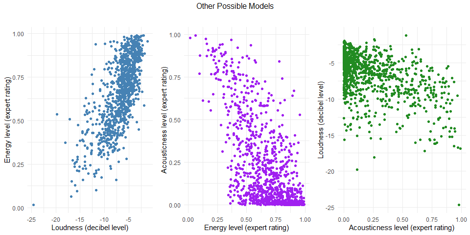
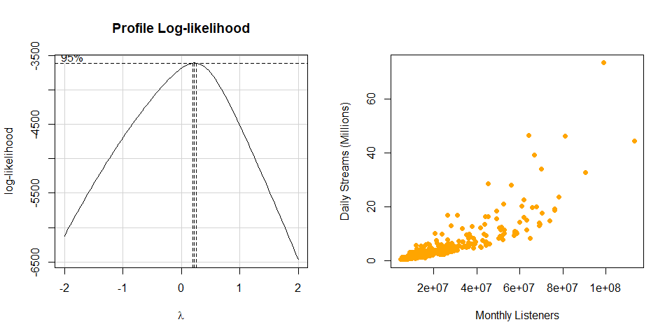
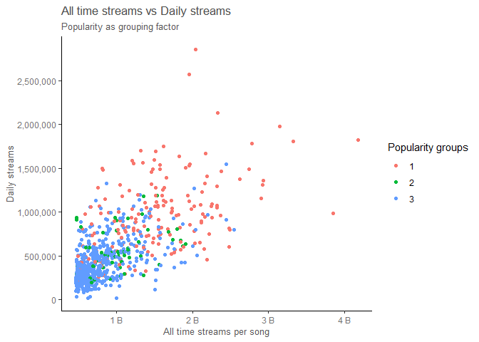
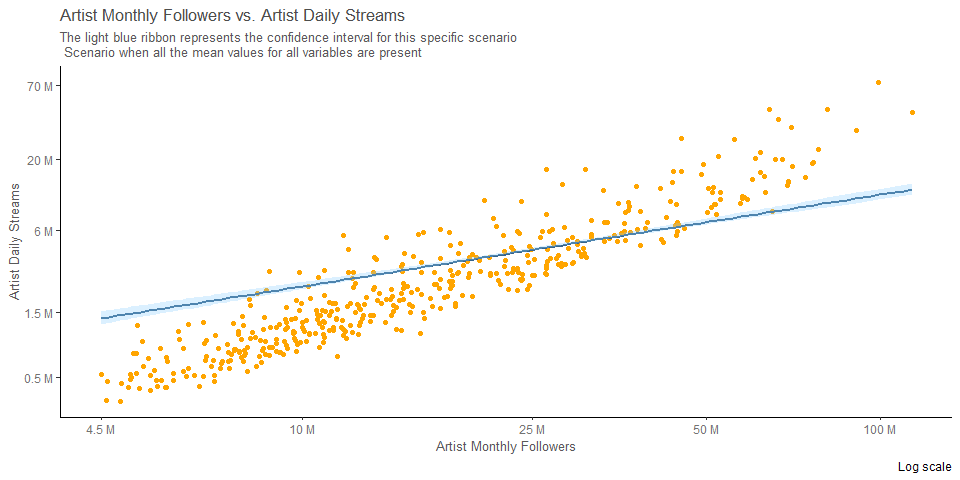
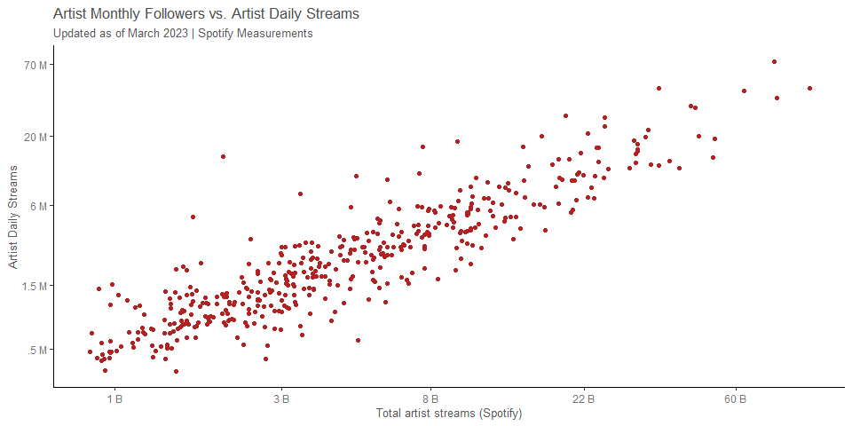

 

 

 
# {.tabset .tabset-fade .tabset-pills}
 
##  Introduction

### {.tabset .tabset-fade .tabset-panel}

#### Actual Model Representation
 
<br>
 


<br>
 
This analysis explains the relationship between daily streams an artist can have on Spotify; Because Spotify does not share all their information to public, only some variables were available to perform a regression model on this data. This is why more research was needed in order to find variables. By looking up related Spotify data I came across with data that not only had information on how the song was made (duration, decibel levels, etc..), but it also had Monthly followers for more than 3000 artists as well as daily streamings, and other interesting variables.(See model selection tab) 

The analysis will try to prove if there's any correlation between monthly followers of an artist and daily streams. The follower count of an artist does not necessarily mean that all their followers listen to their music; Spotify users that don't follow an artist can listen to their music as well. So, if this is proven to be true, then an artist can focus their efforst on getting more followers so their streams go up and thus their [earnings](https://dittomusic.com/en/blog/how-much-does-spotify-pay-per-stream#:~:text=Spotify%20pays%20artists%20between%20%240.003,holders%20and%2030%25%20to%20Spotify.).

Thus, this analysis will consider the next hypothesis:

<br>

$$
\left.\begin{array}{ll}
H_0: \beta_1 = 0 \\  
H_a: \beta_1 \neq 0
\end{array}
\right\} \ \text{Slope Hypotheses}
$$

<br>

The null being zero will help us test the slope of the model against it. IF the slope of this model was zero, then no correlation would be found between these two variables. A T-test will be performed to test for a significant difference between zero and the actual slope of the model. If the results are significant at the $alpha level of .05$, Then it would be safe to assume that correlation has been found between these two variables and in the model as well.

This is a multiple linear regression. The actual model (1st graph) and their near to infinite possible scenarios are being used; From this point on in this analysis, all details for the scenario being considered will be disclosed in the different tabs of the analysis. 

Continuing with the hypothesis, such can be tested by using the slope coefficient of the model summary. However, it's crucial to understand that even when there are almost infinite lines in this model, all of them share the same slope. So, for each specific scenario that we try to analyze there will be a single slope (as seen in the first graph). There's only one slope when we test monthly followers as the main predictor because all of these lines are only shifting in their intercepts.

There would be different slopes if we tested a null hypothesis on the rest of the variables. Since, Monthly followers is the best predictor in this model, we will stick to it and test the null at the $.05 \ alpha \ level$.

To start the hypothesis testing, a corresponding T value  is needed for the comparison between our selected line slope, and the slope that is being hypothesized which is of 0, meaning no correlation. After that, a P value for the slope in the model can be calculated while is tested against the null hypothesis.
 
<br>
 

| P. Value when 0 streams increase per new monthly follower is the null  |
|:----------------------------------------------------------------------:|
|                                   0                                    |

<br>

As we can see, there is a significant difference between the model's estimated slope for this correlation and zero. It is then safe to assume that, it is reasonable to explain the amount of monthly streams per artist (which can lead to more earnings) by their monthly followers. 

Spotify's follower count increases their monthly streams. What I mean by this is that the slope of these lines actually mean streams per one follower gained in a month. So, in this case there is an increase of **2** streams per follower in a monthly basis. This slope is being tested to the 0 or no additional stream per new monthly follower, and the results indicate that the slope of the model is of significant value.

Keep on reading to see more on how the data was worked up in order to get to these results.
 
<br><br><br><br>

#### Simple Idea
 
<br>
 

 
<br>

While this is not the actual model being used, it gives an idea as to how linear the data is and looks when worked on. But, originally this wasn't the case. A series of transformations where made to get to this point which made the model work better.

<br><br><br><br>

###
 
## Model Selection

<br>

### {.tabset .tabset-fade .tabset-panel}
 
#### Data Collection
 
<br>
 
I found many interesting data variables for Spotify, some of them I found in [Kaggle](https://www.kaggle.com/code/adrianograms/spotify-regression/input) and the rest I found in [Kworb's Project](https://kworb.net/) on the Spotify section. Here are the variables I was able to find that are available in Spotify, other than artist's name, albums, and songs;

**Kaggle:**

1. <span style="color: #0047AB;">**key** - if certain Keys were present in the song</span>

2. <span style="color: #0047AB;">**loud** - song's decibel level</span>

3. <span style="color: #0047AB;">**mode** - major or minor scale</span>

4. <span style="color: #0047AB;">**words** - are there too many words in the song?</span>

5. <span style="color: #0047AB;">**acoustics** - level of acoustics</span>

6. <span style="color: #0047AB;">**instrumental** - level of instrumentality</span>

7. <span style="color: #0047AB;">**live** - crowd noises present</span>

8. <span style="color: #0047AB;">**valence** - level of joy</span>

9. <span style="color: #0047AB;">**tempo** - beats per minute</span>

10. <span style="color: #0047AB;">**time_signature** - 3/4, 4/4, etc..</span>

11. <span style="color: #0047AB;">**track_genre** - genre</span>

<br>

**Kworb's Project:**

<br>

12. <span style="color: #0047AB;">**daily** - Monthly streams per song</span>

13. <span style="color: #0047AB;">**daily1** - daily streams per artist</span>

14. <span style="color: #0047AB;">**monthly_listeners** - number of followers per artist</span>

15. <span style="color: #0047AB;">**peak_monthly_listeners** - max number of followers the artist had</span>

16. <span style="color: #0047AB;">**months_sincepk** - number of months since peak monthly listeners</span>

17. <span style="color: #0047AB;">**daily_average** - amount of followers the artist is getting or losing</span>

<br>

More variables were included in the final data set, and after mutating more were found. By pure logic we can infer that number of followers will be important, as well as number of streams. But to be sure about this, multiple pairs plot were used. Here are a couple of them.

<br><br><br><br>
 
#### Model Selection
 
<br>
 
##### {.tabset .tabset-fade .tabset-pills}
 
###### Original Pairs Plot

<br>

Take a look to the following pairs plot to understand more about the process of selecting this final model. Consider which variables have a larger correlation; Since no monetary values were available, I looked for other types of correlation and tried to keep my model business/industry related. I looked for variables which were related in order to get good insights for spotify artists.

Originally, not many correlations were visible. A little on daily and monthly_listeners can be visible but, it's not too obvious. But was enough to get me started on trying to find something there. At the same time, the relation between streams and daily looked good to me. This is why I tried both models. Take a look at my alternative model if you're curious about it.

<br>


 
<br><br><br><br>

###### Wrangled Pairs Plot

<br>

After wrangling the data, and creating new variables such as current_trend, peaked_last_year and others in where I create some on-off switches, as well as multiple categorical variables I got many good insights as to what to do next. This pairs plot helped me view the correlation between daily1 and monthly_listeners and that got me my first raw R^2^ of around .7 Then I tried transforming the data.


<br><br><br><br>

###### Variables Selected

<br>

After considering multiple variables within all the options available in the pairs plots; and after getting all the data that I got. I found the most significant model as compared to others I tried in the process of finding correlations in this data set.

These are the variables I used.

<br>

**Response:**

<br>

1. <span style="color: #0047AB;">**daily1** - Max count of daily streams per artist</span>

<br>

**Explanatory:**

<br>

2. <span style="color: #0047AB;">**explicit** - 1-0 categorical variable. Songs in 0 group (no curse words) tend to have higher streams</span>

3. <span style="color: #0047AB;">**monthly_listeners** - Monthly followers count updated in march 2023 (Main explanatory variable)</span>

4. <span style="color: #0047AB;">**artist_streams** - Monthly artist streams updated in march 2023 </span>

5. <span style="color: #0047AB;">**streams** - Song specific max streams count </span>

6. <span style="color: #0047AB;">**daily** - Song specific daily streams </span>

<br>

When considering all this variables in the model its significance got really high up. It was also maintained even when validations where run. 

Other than my alternative model which I added in this html, I could've also analyzed some plots like `loud~energy` `energy~acoustics` `loud-acoustics`. I did not venture into those ones; While I was trying to predict more on a industry level type of scenario probably business related, I cannot deny that these graphs are also useful scenarios because they may increase a song's quality. But that's pay for another check.




<br><br><br><br>

###### Final Dataset Used

<br>


```{=html}
<div class="datatables html-widget html-fill-item" id="htmlwidget-a7eab0d33aa67deca949" style="width:100%;height:auto;"></div>
<script type="application/json" data-for="htmlwidget-a7eab0d33aa67deca949">{"x":{"filter":"none","vertical":false,"data":[["1","2","3","4","5","6","7","8","9","10","11","12","13","14","15","16","17","18","19","20","21","22","23","24","25","26","27","28","29","30","31","32","33","34","35","36","37","38","39","40","41","42","43","44","45","46","47","48","49","50","51","52","53","54","55","56","57","58","59","60","61","62","63","64","65","66","67","68","69","70","71","72","73","74","75","76","77","78","79","80","81","82","83","84","85","86","87","88","89","90","91","92","93","94","95","96","97","98","99","100","101","102","103","104","105","106","107","108","109","110","111","112","113","114","115","116","117","118","119","120","121","122","123","124","125","126","127","128","129","130","131","132","133","134","135","136","137","138","139","140","141","142","143","144","145","146","147","148","149","150","151","152","153","154","155","156","157","158","159","160","161","162","163","164","165","166","167","168","169","170","171","172","173","174","175","176","177","178","179","180","181","182","183","184","185","186","187","188","189","190","191","192","193","194","195","196","197","198","199","200","201","202","203","204","205","206","207","208","209","210","211","212","213","214","215","216","217","218","219","220","221","222","223","224","225","226","227","228","229","230","231","232","233","234","235","236","237","238","239","240","241","242","243","244","245","246","247","248","249","250","251","252","253","254","255","256","257","258","259","260","261","262","263","264","265","266","267","268","269","270","271","272","273","274","275","276","277","278","279","280","281","282","283","284","285","286","287","288","289","290","291","292","293","294","295","296","297","298","299","300","301","302","303","304","305","306","307","308","309","310","311","312","313","314","315","316","317","318","319","320","321","322","323","324","325","326","327","328","329","330","331","332","333","334","335","336","337","338","339","340","341","342","343","344","345","346","347","348","349","350","351","352","353","354","355","356","357","358","359","360","361","362","363","364","365","366","367","368","369","370","371","372","373","374","375","376","377","378","379","380","381","382","383","384","385","386","387","388","389","390","391","392","393","394","395","396","397","398","399","400","401","402","403","404","405","406","407","408","409","410","411","412","413","414","415","416","417","418","419","420","421","422","423","424","425","426","427","428","429","430","431","432","433","434","435","436","437","438","439","440","441","442","443","444","445","446","447","448","449","450","451","452","453","454","455","456","457","458","459","460","461","462","463","464","465","466","467","468","469","470","471","472","473","474","475","476","477","478","479","480","481","482","483","484","485","486","487","488","489","490","491","492","493","494","495","496","497","498","499","500","501","502","503","504","505","506","507","508","509","510","511","512","513","514","515","516","517","518","519","520","521","522","523","524","525","526","527","528","529","530","531","532","533","534","535","536","537","538","539","540","541","542","543","544","545","546","547","548","549","550","551","552","553","554","555","556","557","558","559","560","561","562","563","564","565","566","567","568","569","570","571","572","573","574","575","576","577","578","579","580","581","582","583","584","585","586","587","588","589","590","591","592","593","594","595","596","597","598","599","600","601","602","603","604","605","606","607","608","609","610","611","612","613","614","615","616","617","618","619","620","621","622","623","624","625","626","627","628","629","630","631","632","633","634","635","636","637","638","639","640","641","642","643","644","645","646","647","648","649","650","651","652","653","654","655","656","657","658","659","660","661","662","663","664","665","666","667","668","669","670","671","672","673","674","675","676","677","678","679","680","681","682","683","684","685","686","687","688","689","690","691","692","693","694","695","696","697","698","699","700","701","702","703","704","705","706","707","708","709","710","711","712","713","714","715","716","717","718","719","720","721","722","723","724","725","726","727","728","729","730","731","732","733","734","735","736","737","738","739","740","741","742","743","744","745","746","747","748","749","750","751","752","753","754","755","756","757","758","759","760","761","762","763","764","765","766","767","768","769","770","771","772","773","774","775","776","777","778","779","780","781","782","783","784","785","786","787","788","789","790","791","792","793","794","795","796","797","798","799","800","801","802","803","804","805","806","807","808","809","810","811","812","813","814","815","816","817","818","819","820","821","822","823","824","825","826","827","828","829","830","831","832","833","834","835","836","837","838","839","840","841","842","843","844","845","846","847","848","849","850","851","852","853","854","855","856","857","858","859","860","861","862","863","864","865","866","867","868","869","870","871","872","873","874","875","876"],[12.82120152625292,13.4291272291685,12.26511483949723,12.70129009297845,13.91748394376886,12.85157513062085,13.95424327521675,14.39257325950342,13.59633288215948,13.84687355690641,13.93294686685121,13.94072458197676,13.89554834254877,13.70756670837084,12.46202021311503,13.29811674412023,12.35089134614262,13.72133393544106,12.52075198987688,13.98702981274735,13.22512752541486,13.50543698998696,13.61692058518541,13.51367682140556,12.5892205674873,12.99388206875578,13.2101123156621,13.64720195945484,13.68910798056196,12.82155013392015,12.94552118145696,12.5975503849024,12.5192908771259,13.25356355485706,12.8280137930812,12.83771137631279,13.08185799942243,13.4286017125272,13.1458630836428,13.0492333884076,13.45099495624638,13.21882743668815,13.23948308199419,13.32295861547419,13.10331102857885,12.25513420144096,13.12668402992766,13.13708448818572,13.57502754327336,12.36478433668499,12.27354903440506,13.61123537413201,13.09555522864449,13.33099087881473,13.74971898541893,12.96579377433976,12.28085075023777,12.78185701462718,12.65059819753893,12.99075014393571,13.10643316263122,13.20614002830403,13.13430380590681,12.64238698505382,12.4444279098449,13.07717143187475,12.17465937482443,13.03962069474319,12.52769951872238,12.14958694654331,13.14921755456884,13.35927254635752,12.79164018332341,12.91570814359492,13.53328424243505,12.89700236934916,12.76465075240364,12.75920172590935,13.02907854519818,12.60343501493515,14.23940545603369,14.14464522606562,12.23463094743813,12.84437021549979,12.94650171052017,13.46277498735257,12.49626905438728,12.72262285255803,12.74360348937903,13.64767635090293,12.45096203292605,12.57320917574736,13.64152258023982,13.79488020820035,13.25920976934205,13.63016724024594,13.36248675212054,13.39114240781176,13.06939499663208,12.11000217677944,13.03002437926495,13.52519836310422,13.0040211854492,13.43670831534484,13.12600075412161,12.59091999421221,12.78908682912748,12.8350412401681,12.68099229631652,12.41778308721792,13.58576777957129,14.25840695865444,13.56329086291016,13.63763789017145,12.46834459804474,13.22368996771465,12.68755081471913,13.22368996771465,13.06639813380651,12.22898318336328,12.79447301096848,12.1131401368243,12.87321203653354,12.28210269787514,12.39423958473965,12.51072244839952,12.98367815515795,12.33674119412451,12.58664720479321,13.17676633178362,12.41769811771585,12.64091854650965,13.32486494125815,13.98974197767133,12.45021027094859,13.60163641265721,13.66476789756937,13.62604111579599,13.00081927780571,12.30425596663553,13.74486596599491,12.56592304237747,12.74039406842996,13.11177552337644,13.68148075543988,13.73696830737511,12.26669726734661,12.49879449693456,12.73436876752743,12.18925196779983,12.20901830281874,13.03861648436586,12.60162882192821,13.11114468251747,12.77643335660891,12.97798017342945,13.02549338171948,14.57282759796442,12.30243681514659,14.2174052998939,14.28445675332381,13.54948690609847,13.94435485831337,12.62852924384607,12.68143066441283,11.63485101964561,12.36356772660782,12.36698328241845,12.40773920858791,12.87541881590417,12.84656507903054,12.19867031576341,12.74265080777146,13.59624946016429,12.86678960526924,13.00322166917023,13.23215904322721,12.55212031954418,11.88214144040327,13.78859146861301,11.80029748936208,13.67057726718662,13.11810432048395,13.12675969940343,13.03405006235194,12.48654126346365,13.74700256890284,12.54220196621958,12.66455073518262,13.53011387202617,13.05449558706188,13.25987409201457,13.20830618367557,13.72704539747058,13.3707925361844,12.82258983015248,12.82518569736375,13.19789191151054,13.88190672760396,13.81108076088489,13.84766017589984,12.82864445310793,12.72914892267465,12.73903053382025,13.70755334045918,13.05026784048225,13.54164986204582,12.76474799138854,12.64654769082779,13.99556204008732,13.32390078806941,12.37082408113066,13.61820408603962,12.79285602953651,13.57103228129081,12.34963171750154,12.64807859709506,13.90494441504489,13.32528626205608,12.95372458320657,13.1044885706674,13.75445928264418,12.51067820452729,13.53629785229272,13.53629785229272,12.49330961894007,12.42561371569424,12.43427537758032,12.27329662010773,13.23037078694578,12.87952974246066,13.30268126151954,13.61224928763655,13.15340457549964,10.95786926629082,12.9683843495107,12.70872798322284,12.95233633241623,13.50290307916109,13.13335079406044,12.32688220774225,12.47087624010368,12.09760174207201,12.96476877407451,13.0705794363536,12.88943460660532,13.26651566808078,12.95718444263909,11.67147502694187,13.16028324482456,12.7011773405233,12.9843947261211,13.19315915601042,12.49474547701809,13.11364346927057,13.01672726821854,12.51683505594605,12.61909578628278,12.66794014102155,13.31799923750983,13.26187137449464,12.9228875233903,12.10373533316235,13.70871901888067,13.06091979533147,13.17727192886761,13.60020868020371,12.07772209485165,12.1527351579395,13.4159534631254,13.53915081204274,13.88340282400719,12.03050423482885,13.40064944533571,13.59517431247709,11.99144274998117,13.40876563123753,12.70872798322284,12.06137052052253,14.05589974476549,11.73401089981497,13.19133144858375,12.5273043327351,12.76495673726978,13.05817039656083,13.55543587041402,12.38388404684624,12.5334104326622,13.75403188404915,12.74479452522462,12.21085120998315,13.00045785596828,11.95620003447394,12.59958662251858,12.14753210051624,14.22689941928343,11.74057883176227,12.39726722041096,13.12673779567034,11.64029793027917,12.80711550203448,12.41352574296173,13.28324677014073,12.59771600517605,13.92315795671049,13.09440413518428,12.86891782274304,12.27167778512798,11.65158244927792,13.7893944827315,13.20203924857081,12.84862365707525,12.48897456121521,13.27262823146596,12.90751284376411,12.89491306529529,13.63500135785933,12.72182013700893,12.24558177862489,12.55622234630043,13.41632916589526,12.50706573204163,13.1976081317477,12.7647737295372,12.8485815802693,13.21922144951409,12.97010923135276,11.40998424268298,11.61955317739498,11.5267494715633,13.37124952646688,11.29746482436876,11.95083840194425,12.61705251932636,11.18579545355134,11.98440300747196,12.16100205516127,12.49090566327721,11.738617765462,13.21215837652054,12.55258361079467,12.57837730658712,13.30323722009908,13.92670213986312,13.36865298014582,12.34103613721115,12.60660561059278,12.29658497037728,12.2703705127129,12.56408968845103,13.52591198352855,13.30782499903048,12.83824029755174,11.52026843922549,12.36968272950232,12.49435953504324,13.15011083140684,13.98025520870586,12.12395653985181,13.23959159250958,11.81419234466594,12.15317279816931,12.98472986830716,13.78834797250081,11.7369006703643,11.72559030586337,12.52087243640516,13.74758390358008,12.00726188598103,13.28388000476509,11.96037668974545,12.25594793502382,12.12383169014626,12.18996358859699,11.50346081615444,11.65510188145976,12.01774710081851,13.21961712180822,11.71856470583355,12.11708841465255,13.26443222205051,13.99663640017639,12.78871834048505,13.35790337430309,12.29471061556643,12.54972617767045,13.49237124161631,13.02856465477291,13.1427501477812,13.39522314016428,11.91250662991942,12.04348312530564,12.55757423069491,13.24236439596153,13.27302569424778,12.64946596520453,12.78323361268134,12.12384797577447,13.3255931592463,12.73785611142761,10.49479578720404,13.01300153376699,12.42210295763801,11.53215930308553,12.1581998104857,12.73512023624202,13.50954366576345,13.1427501477812,12.93219753448732,14.76018231138987,13.79919924891755,13.33470964730398,13.78522556210796,14.25059013019525,13.32927998105366,13.6164936054263,13.69400936853323,12.91886557833695,8.758726607842037,12.5703927903026,13.17451550289085,13.73055161873708,12.63885780579327,12.92665258349136,13.17215304190684,12.11232224863177,12.5373313150985,12.65327772668735,12.96574231536074,11.73757188640919,12.34441183714486,11.84735275496977,13.36907031861102,12.66549865346722,13.71408119408293,12.35104706626197,12.46131545870438,11.95000551244764,13.04938830174251,12.0124090098509,12.57134056388693,12.04410650439323,13.38580705909138,12.95942553664607,12.6618220391476,14.09798660253861,13.18069832108376,12.33137842536988,12.8705193803552,12.96076872651181,13.49991860305519,14.86486887492086,14.02252310133102,14.24527080130517,14.05839085205139,13.23207122968577,12.83167412123793,12.50659196678345,13.13547109470036,12.99552723576813,13.58572122226396,12.89318666310743,12.88307265944924,13.20201339259965,12.54114747766494,12.3502206074178,13.32493680697383,12.78910636640111,13.26659185169718,13.7865502266033,13.81392229734586,13.02774056131143,12.9091949091122,13.98790298368034,13.46242914953567,12.53397613218995,12.5053954509832,12.7424432014858,13.28077809613956,13.18650557001412,13.70233962021447,13.18949852438917,12.8849662244343,12.80651499940397,12.45709981033266,13.12527712830623,12.49306573068471,13.53876710672371,12.32204515428254,12.93596391725308,12.49306573068471,12.2519490449977,13.43000835842421,13.04347383791005,12.59756052570748,13.30793630941128,14.11113847838753,12.5764838140808,11.62524471239477,13.49448815563274,12.84709724056729,13.85379910601741,13.5918743853321,12.30749140265527,12.15045950772422,12.57263405689671,12.94025859711265,12.86338019064625,14.09620728963232,13.54830278261283,13.75643124154819,14.07534624365386,12.38289159068724,12.34606064930805,11.87467550877571,12.54054287948071,13.77016899054359,13.39306051912187,12.62979670642173,12.119015812962,11.8351973521903,13.78302868771902,11.56130602145236,12.95487447094714,13.84024609646258,12.36975065303743,12.19838819562874,12.58210207714984,12.13377610865954,11.23738274485681,12.22460485834837,12.95051637047239,12.25810516662233,13.75197846354273,14.08458838976767,12.42281173197139,13.87634974499524,12.63020575055675,13.5973545481611,13.02383281773864,13.71900956942858,13.68782603901166,12.13037340798496,13.10433178090687,13.57016229666187,12.9998069673015,13.57915511267783,13.06220564657733,12.61453658597586,13.35929306178394,13.05208253398036,13.29681571965289,12.83471863758901,13.33742475577123,13.54122633219445,12.56477104090955,14.2069511135047,12.30279092440661,13.87128957643127,12.62735532696097,10.52094088872687,12.24158456653153,12.34636488205714,13.74977345214431,11.45932424621502,14.34539323703907,13.9363573399975,13.94239956370114,12.735482507599,13.0896314862366,12.82844590519015,12.2524408314577,13.21597028928925,12.57349661118459,12.95711838262354,12.64492094876825,8.983314293397749,12.40511201109697,9.825039406206987,12.57454522290849,9.286282375551339,9.539787993660431,13.26356775722709,12.78994610827867,12.98562226771624,12.49007043935479,13.25977473322729,13.36735295704415,12.7721163018133,12.86824760043615,13.04374864968194,12.23444141958062,12.31821759478374,12.17242795741395,12.70962286762783,12.08453757980406,12.5277683883721,12.30801984243785,12.568108195711,12.24881599306901,12.54942118609082,12.02717920602187,12.34880408761716,12.21233797728461,12.21407057664124,12.2499411945868,13.50860760896653,13.80859268456084,11.34411620452319,12.55406752648379,12.31656696065954,12.9418721445451,13.21944471505489,13.44564181452455,13.13932864988035,14.37341230634425,13.38533822465897,12.45368244235225,12.73936499179608,13.29196943378516,13.29703575366667,13.32444017475081,13.49803297525782,13.34964555278718,13.08035734885903,12.96483198941759,12.66056281085316,12.68613179811596,13.37360446966288,13.06912714410123,13.11141971335906,12.02211374902684,12.34844422332114,11.97216511994475,12.08582971180386,13.43735804193502,12.14857064325872,12.1749534264713,13.1087450677342,11.7575016868869,12.01806093044781,12.96218523553606,12.41493875754624,11.56894656564801,12.79380653126172,12.53372755206752,13.02785487616985,12.6323398812676,12.33580621052835,11.54577012499931,12.47020457752169,12.60703094655598,13.8696606179086,13.46439300025156,13.14696232707188,12.45051574241484,12.99119946579799,14.34175509693843,13.35615562951602,14.19922277825391,12.22396167836591,12.54899900939118,12.88618777661621,14.09087685159546,13.0766063087466,12.5795550494519,12.00599843879991,12.65853265649644,13.33417091825467,12.70472446836446,12.8602502813914,12.53194244586654,13.81453207941023,13.19806251155954,12.66670437035192,12.8077485183784,14.41769146030337,13.46708293971838,14.18921458058436,14.2153807101226,13.95996927927164,13.79718669675438,13.70996224689622,14.05754573350205,14.49896996320033,12.90757978405959,13.87618788427416,14.26215535661184,13.44059744803563,14.15864625860102,13.58002237424319,13.3881632717923,14.06190333922972,13.77364322560208,13.82387646596538,14.13474870861807,13.98965124248945,13.70445273230267,13.29168074506303,11.0176942800776,13.84919771999347,13.494817571584,13.65824252423443,10.53326885747425,12.2531088915316,11.86516558961885,13.5882435167389,13.16566230179948,13.19007436095724,13.77463439531028,13.79577508841296,14.40721232661389,13.24844962357919,12.86993003766111,14.32652176450872,13.83825102245039,14.08631906921443,13.01537709646157,13.8634880110211,13.8828439198933,12.96022555174785,13.49702145122003,13.89128571102783,13.31329278016332,13.80531879796944,13.41100099317914,14.28541480727199,13.41477027029183,13.57766952588948,11.98467132564901,13.68741010533686,13.88922838259177,13.87543469920735,13.61230687942961,14.27407146829956,13.75966269673967,13.55790107160211,13.20921607513841,13.97990657463111,13.3816027645243,13.19513417021783,12.90120285858086,13.60861922103573,13.57766952588948,11.98467132564901,13.65084815640014,14.21318338495397,13.85432253374966,12.84544186853462,12.69097104488617,12.38072318851978,12.11808806786162,12.62025960745021,12.81063175222152,13.36677358184494,12.23168191103659,12.84846585992316,12.92648230447662,12.56860937558242,12.75129679745857,13.27880457484925,12.44531393027346,12.56955536389767,13.09424987022053,12.27900707220583,12.58265805408769,13.35911314293632,12.77192040291354,13.14053526400067,13.06128340193015,12.71055016263599,12.67151275273091,12.40173810841571,13.43015097245135,12.7547892525966,12.33949278196596,13.62843853555457,11.99943585492952,12.40775555580275,11.83750584433793,12.79620655350064,13.69774902207677,12.72494084093935,13.10971978297062,13.37075977459284,12.31575182233202,13.72475070968077,12.074733134691,12.909640343418,12.34363652175303,13.08821903763731,13.51032146130217,14.06000377458814,13.88488082489527,14.1204294688895,14.03288147966642,13.5252625295949,14.15759487450729,13.07551492688822,12.97245402375693,13.15261320297017,12.86597064777955,13.37702264989605,13.29119941191294,13.74813494943088,13.59888322987786,13.36482316323512,12.65105329512035,13.20440408774054,13.69191025979857,13.45537821553406,14.24931819497277,13.42238944825341,12.5111131842781,12.14062170826758,12.45512952746986,13.62731900641192,12.86926306967532,12.37678962896599,12.55159664817137,12.85374117281109,13.40041320840714,13.48540799185074,13.85265315178409,13.63017205476074,13.7513687581224,13.40256000367721,13.72400254077002,12.78800889675412,12.65159145309551,13.18569304317058,12.72814380061892,13.30816055389518,12.44833623829066,13.76674354352689,14.04048922442421,14.3057560562607,13.51296929925245,12.64993120162521,12.43038751058853,12.54956305421045,11.87265374273731,12.84163043704075,13.57109485012452,13.30709369746398,13.86451212835726,14.27475463527576,12.66397206348676,13.59046895649197,12.43808871934798,13.22791907401311,13.55170906117303,12.85954821129597,13.2371624097925,12.9123112581196,13.80525009902636,13.30966418380098,12.87231614589035,13.21346653828332,13.22450110545653,12.30893153472815,13.04237600153329,12.9995062402407,13.58395169704872,12.54034961717664,13.29283331370559,12.57471469714103,13.07916564638896,13.14464528169296,13.72807836517137,12.86503202655287,13.16404835944371,12.81332146583114,14.21438734399558,13.19735395994289,13.01156588592166],[-0.7852624694677509,0.4743690867553755,0.4743690867553755,-1.090644119018933,2.198224077669303,0.9643187008847367,2.198224077669303,2.198224077669303,2.198224077669303,0.5504308783583501,1.958967388211961,0.3126185577418125,1.250760965824695,1.929054603416227,1.250760965824695,1.250760965824695,1.929054603416227,2.198224077669303,1.083498650858062,1.775799449649326,-0.2613647641344075,1.775799449649326,0.4034631054374914,0.6606239888543852,0.7304429653036423,0.7304429653036423,0.6606239888543852,0.1345308929576061,1.958967388211961,1.929054603416227,0.7742662318447373,-0.07796154146971181,0.4510756193602167,0.4510756193602167,0.521765563804325,-0.3495574761698684,0.09984533496971612,0.1906203596086497,0.08892620919440149,1.958967388211961,1.929054603416227,-0.0932123817221787,0.2941610385494901,1.929054603416227,-0.2613647641344075,0.521765563804325,0.5658818295140691,0.4291816347254804,1.443855471644422,0.07973496801885352,-0.6161861394238169,0.1475575643576147,1.929054603416227,1.929054603416227,1.290333969973979,1.775799449649326,1.929054603416227,1.958967388211961,-0.8627499649461253,0.9643187008847367,1.443855471644422,1.334474612390094,0.9643187008847367,1.929054603416227,1.290333969973979,-0.3092462503676215,0.8073683246499682,0.3001045924503382,1.178039422299431,1.250760965824695,0.9854435905624717,-0.4246479275249383,1.463023893978564,1.178039422299431,1.334474612390094,1.443855471644422,-0.2033409240180301,1.443855471644422,0.8073683246499682,-0.6812186096946715,2.605057250918462,2.605057250918462,0.3527673191077154,1.461633717665706,1.302369126182129,2.605057250918462,1.080787703755558,1.066433390303875,0.7687183674070194,0.6280751838162305,2.605057250918462,0.5641767992629853,1.461633717665706,1.700192275702564,2.605057250918462,2.605057250918462,2.605057250918462,2.605057250918462,2.605057250918462,-0.2021161841221342,2.605057250918462,1.700192275702564,1.461633717665706,1.700192275702564,1.700192275702564,1.302369126182129,1.327605364771211,1.700192275702564,1.327605364771211,1.302369126182129,1.770365576540383,1.770365576540383,1.770365576540383,0.935308737709917,0.3597701488460348,0.6392188385343897,0.2639015437863775,0.6392188385343897,-0.3396773675701613,-0.02429269256904459,0.6392188385343897,-0.6871651088823978,-0.1984509387238383,0.1204461530758671,-0.08338160893905101,-0.8580218237501793,0.8020015854720274,-0.7256703722655053,-0.3974969384589874,0.2949059175411005,0.1552928844060353,-0.2357223335210698,2.229046189659175,2.229046189659175,2.229046189659175,2.229046189659175,2.229046189659175,2.229046189659175,2.229046189659175,2.229046189659175,2.229046189659175,2.229046189659175,2.229046189659175,-0.1450257720502577,1.537297234656418,1.609637892436767,1.609637892436767,1.609637892436767,2.229046189659175,2.270991221402867,2.229046189659175,-0.4975803970159701,0.3562748639173926,-0.4094731295057031,1.537297234656418,0.02858745685191247,0.1873090983049937,1.251047211711865,0.6471032420585384,2.821616953307136,1.780192832856589,1.780192832856589,1.780192832856589,0.6349882663864131,0.6349882663864131,0.3520643313810491,0.1831545430978465,0.08434114843375096,-0.2797139028026041,-0.2119563619236453,0.05638033343610769,0.8899467565345531,-0.04082199452025517,1.863614906328483,0.2437301849225982,2.281667844738657,1.08417524087034,-0.7381445464906811,0.7251302264129961,2.821735965506027,0.3520643313810491,2.821735965506027,-0.2057949129795968,1.08417524087034,2.821735965506027,1.123304901258481,2.734042781376464,2.240177632865429,1.311570814923954,3.48926930718244,0.8750519838575576,1.598983454530241,3.48926930718244,2.701226975754084,2.930179905313755,2.930179905313755,2.307373609725843,2.307373609725843,2.307373609725843,1.807304680563517,1.919566173715711,2.701226975754084,1.311570814923954,1.545432582458188,1.919566173715711,1.333157262706762,2.865395771825987,2.930179905313755,2.701226975754084,2.865395771825987,1.713617731343764,0.08065790301745454,2.100958385142086,2.100958385142086,2.100958385142086,1.598983454530241,3.48926930718244,1.807304680563517,1.919566173715711,1.759752673092968,2.332046803143665,2.332046803143665,2.332046803143665,2.332046803143665,2.332046803143665,2.332046803143665,2.701226975754084,2.307373609725843,1.598983454530241,2.240177632865429,2.332046803143665,2.240177632865429,2.240177632865429,1.759752673092968,1.892660054163788,1.767125188269694,1.218171523725749,3.48926930718244,3.48926930718244,2.930179905313755,1.393269974856316,1.919566173715711,1.919566173715711,1.09861228866811,1.077388652216483,2.930179905313755,1.128494663149979,1.823258136287426,1.594121208322207,1.218171523725749,2.184702052337329,1.892660054163788,1.185401418740501,2.512764977916397,-0.3133418192323586,0.5116253039365549,3.48926930718244,1.35815205517361,1.773255997663495,0.08065790301745454,1.807304680563517,1.128494663149979,0.1079571415050924,1.633349732480413,1.633349732480413,1.633349732480413,-0.1042500213737991,1.759752673092968,-0.6405547304407747,1.83290141255923,2.701226975754084,2.865395771825987,1.892660054163788,0.8633118070832684,2.930179905313755,1.598983454530241,1.702746089567752,1.218171523725749,1.218171523725749,2.865395771825987,2.11553236182419,3.48926930718244,-1.072944541919532,2.930179905313755,1.919566173715711,2.307373609725843,1.393269974856316,2.701226975754084,1.327605364771211,2.100958385142086,0.1578580846155803,3.162686353216824,0.1204461530758671,3.48926930718244,0.7006191953986464,2.865395771825987,1.311570814923954,3.48926930718244,1.623735217134925,1.032828548122107,1.650579855765276,1.892660054163788,2.240177632865429,1.702746089567752,0.8721298360883852,1.231101471714189,-0.5327304591540407,0.151862349309246,-0.03666398437159147,0.7843580606133294,-0.03666398437159147,-0.4124897230451288,0.8721298360883852,0.2342812957246657,1.231101471714189,-0.4079682383262829,0.7843580606133294,-0.7550225842780328,-0.9014021193804044,-0.363843433417345,1.305626458052436,-0.2903523010076598,0.03825871211709027,1.545432582458188,1.807304680563517,1.571736045250089,0.5038010088290262,0.5098251234324072,-0.8722738464573808,1.327605364771211,1.571736045250089,1.327605364771211,0.8437200390393197,-0.2731219211204512,0.5098251234324072,0.5038010088290262,-0.05762911283663642,1.671661255614232,0.7884573603642703,0.1106465200870636,0.7884573603642703,-0.1221676339742075,2.982950939189258,1.072268313328508,1.620575656844556,1.620575656844556,2.982950939189258,2.982950939189258,2.982950939189258,2.982950939189258,2.982950939189258,2.982950939189258,1.001734213691623,-0.05762911283663642,1.072268313328508,1.671661255614232,2.982950939189258,2.982950939189258,2.982950939189258,0.6312717768418578,0.6312717768418578,0.1204461530758671,2.982950939189258,0.5624688569178291,0.1204461530758671,0.1204461530758671,0.7006191953986464,2.549991896443935,-0.08773891430800675,2.982950939189258,1.713617731343764,2.982950939189258,2.982950939189258,2.982950939189258,0.7884573603642703,1.713617731343764,0.6312717768418578,2.549991896443935,0.5624688569178291,2.982950939189258,2.533379303238778,2.533379303238778,2.533379303238778,2.533379303238778,2.533379303238778,2.533379303238778,2.533379303238778,2.533379303238778,2.533379303238778,2.533379303238778,2.533379303238778,2.533379303238778,2.533379303238778,1.473159894141473,1.251905458081239,1.473159894141473,1.473159894141473,1.343647786398418,1.343647786398418,1.473159894141473,-0.53785429615391,1.343647786398418,1.722230739909223,0.4421184257561999,1.473159894141473,1.251905458081239,1.722230739909223,2.533379303238778,1.473159894141473,1.15310047395218,0.1906203596086497,1.182033896807182,0.4114471797857118,0.9711576333149952,1.182033896807182,0.8180161626058146,1.493578026339565,0.8180161626058146,0.4898062565419152,0.2175278125285741,-0.02942881069081217,1.493578026339565,-0.6577800367226539,-0.7360546815712219,0.3583735005743139,0.9368773654825434,-0.1266976530459575,-0.1827216368152944,1.493578026339565,0.9711576333149952,0.5458065926612362,0.9711576333149952,0.3030631744900833,0.4485245975686114,0.8821132800725685,-0.5041810810473222,0.4485245975686114,0.4485245975686114,0.2919230667090355,-0.6329932577401982,1.675412901357633,1.196041433999656,0.739076112448345,0.739076112448345,1.511604552085337,0.9400072584914712,-0.1381133021296343,0.2366519013390019,0.9400072584914712,1.083498650858062,1.083498650858062,2.50020568707717,2.50020568707717,2.50020568707717,2.50020568707717,2.50020568707717,2.50020568707717,2.50020568707717,2.50020568707717,0.5653138090500605,0.7035924384214839,-0.2484613592984996,0.1587116911548208,0.9854435905624717,-0.7507762933965817,-0.6539264674066639,0.6344581842112657,1.553713763661739,0.953586516617852,1.553713763661739,1.914714293286832,1.553713763661739,1.553713763661739,1.914714293286832,1.914714293286832,0.6070444815065336,-0.6674794338113675,1.553713763661739,1.553713763661739,1.914714293286832,1.914714293286832,0.01783991812833102,0.4427608928518613,0.3285840637722067,0.01783991812833102,0.1248689820458693,0.2700271372130602,1.28536844252993,-0.2797139028026041,0.3321773123383321,0.2700271372130602,1.28536844252993,1.28536844252993,1.061948304296518,-0.3368723166425527,1.061948304296518,2.992125777959879,2.440170755946609,2.440170755946609,3.839237235702493,-0.5041810810473222,2.992125777959879,3.831485175201665,1.061948304296518,1.061948304296518,0.3625576070968879,2.992125777959879,1.878548599300446,2.792084930045284,3.529062752660051,3.109774989594651,3.529062752660051,1.367366351234372,1.364304343228275,1.578978704949392,2.992125777959879,2.102425378070211,3.529062752660051,1.409766717305033,0.3625576070968879,0.3625576070968879,2.124414907322567,-0.8370175509796473,3.529062752660051,3.529062752660051,3.529062752660051,3.529062752660051,3.529062752660051,0.7925399244379802,-0.4525567156420149,3.529062752660051,-0.07580171341628185,0.5193888544264785,1.07329448068382,1.07329448068382,1.492454556948281,1.492454556948281,-0.4200712604975265,1.738007013228808,1.210153663401017,0.08709470685093373,0.6141039732194925,0.2390169004704999,1.492454556948281,1.738007013228808,-0.4200712604975265,0.8821132800725685,0.05448818528406978,-0.06720874969344999,0.29266961396282,-0.3038114543816646,0.0695260626486103,0.2390169004704999,0.3133498192003588,2.244426178820514,1.210153663401017,2.002830439307996,-0.353821874956326,2.002830439307996,-0.2294131643278051,1.713617731343764,1.738007013228808,0.8821132800725685,2.002830439307996,1.545432582458188,0.6785410281705831,0.4252677354043441,0.6836017677164139,0.2110709700799406,0.6956440607585325,-0.04709160753385057,0.5199835615507563,0.5510074133988225,1.100277567987171,0.7333289701927771,0.6749832099322741,0.6749832099322741,0.6173454671436635,0.6749832099322741,0.1552928844060353,0.02761516703297339,-0.0534007767271153,0.2143046026470055,1.600598963766896,0.2143046026470055,2.5644107509006,2.5644107509006,1.807796846925679,1.807796846925679,2.5644107509006,1.807796846925679,2.5644107509006,1.807796846925679,2.5644107509006,2.5644107509006,2.5644107509006,1.807796846925679,2.5644107509006,1.807796846925679,1.807796846925679,1.807796846925679,2.5644107509006,-0.7465479572870606,0.2358623237219845,1.704202488878523,1.878548599300446,3.353721353637454,3.353721353637454,2.438426315905459,2.438426315905459,2.438426315905459,1.753884516799129,1.839278985196031,2.440170755946609,1.931521411603214,2.119383148772784,3.668727765903083,0.9005677714089187,0.8359479791916166,1.193012964089594,1.193012964089594,3.668727765903083,0.8294247988524931,3.668727765903083,2.602837822619679,3.668727765903083,-0.2626643094764931,3.668727765903083,2.796671392755739,2.282178283216383,1.761643845323432,2.282178283216383,3.668727765903083,2.282178283216383,3.668727765903083,1.112186408695228,2.282178283216383,1.669968412174133,2.796671392755739,2.497246861872605,2.497246861872605,2.497246861872605,3.668727765903083,1.669968412174133,3.668727765903083,3.668727765903083,3.668727765903083,3.668727765903083,3.668727765903083,2.282178283216383,3.668727765903083,1.331574148919658,1.44078254640396,1.44078254640396,1.44078254640396,1.44078254640396,1.07840958135059,2.236658942877879,0.2654364635044613,2.236658942877879,2.236658942877879,2.236658942877879,2.236658942877879,0.8166913666514003,0.4047982191204607,2.236658942877879,2.236658942877879,2.236658942877879,2.054251930606176,0.8166913666514003,-0.5942072327050416,0.4047982191204607,2.054251930606176,2.054251930606176,2.054251930606176,1.493578026339565,3.789697166849855,1.077729077751686,2.229046189659175,0.7979575449122904,2.626912449642571,2.626912449642571,1.219058441743977,1.219058441743977,2.374719690753245,-0.25489224962879,3.789697166849855,4.29544698265943,4.29544698265943,4.29544698265943,1.393766375958592,3.789697166849855,2.946909608856422,4.29544698265943,3.789697166849855,2.374719690753245,3.789697166849855,3.789697166849855,2.693207254232436,2.693207254232436,2.229046189659175,2.626912449642571,2.43089035314697,2.946909608856422,2.946909608856422,2.946909608856422,2.946909608856422,2.626912449642571,2.229046189659175,2.946909608856422,3.007166651179654,1.73853448576851,-0.320205264157341,-0.6217571844732723,3.789697166849855,3.789697166849855,4.29544698265943,0.4675004990276171,2.356504934983476,3.007166651179654,4.29544698265943,2.43089035314697,1.478417649995696,3.32891338607699,3.32891338607699,2.982950939189258,3.32891338607699,3.32891338607699,2.982950939189258,2.982950939189258,3.007166651179654,3.007166651179654,2.649290505895288,2.626912449642571,2.693207254232436,2.693207254232436,1.147402452837542,2.229046189659175,4.29544698265943,3.32891338607699,0.3555743384946994,4.29544698265943,2.229046189659175,2.982950939189258,2.982950939189258,3.007166651179654,1.922349038931657,0.2437301849225982,0.2615947376884624,1.411718413460049,1.411718413460049,1.411718413460049,0.5452270504833231,1.334737874205489,1.334737874205489,-0.2218943319137778,1.334737874205489,1.082821602761786,0.01291622526654623,-0.5638748448558062,1.082821602761786,-0.01918281941677399,1.334474612390094,1.668084107866834,1.668084107866834,1.668084107866834,1.668084107866834,1.668084107866834,1.668084107866834,0.490418813988328,1.668084107866834,0.5816568045265821,1.349889679226091,0.9932517730102834,-0.1827216368152944,-0.8462983600541201,3.042615859452841,3.042615859452841,3.042615859452841,1.519294362581134,1.519294362581134,0.08250122151174377,0.2070141693843261,2.057323736426217,2.057323736426217,2.057323736426217,2.057323736426217,-0.1996711951290677,2.057323736426217,1.266665873664359,1.266665873664359,-0.3285040669720361,0.3499523981779056,2.771463088952271,2.771463088952271,2.771463088952271,2.771463088952271,2.771463088952271,2.771463088952271,1.270602886623699,2.771463088952271,-0.1827216368152944,1.805662374397046,1.805662374397046,1.805662374397046,2.771463088952271,2.771463088952271,1.270602886623699,0.07788653865707119,0.07417939817425147,1.270602886623699,1.242712632641866,2.304882452042729,2.771463088952271,1.028189824371564,-0.8675005677047231,1.044859832668863,-0.6577800367226539,1.805662374397046,2.304882452042729,-0.5395680926316447,0.03440142671733232,-0.1755445725149309,1.028189824371564,1.157824148299956,1.157824148299956,-0.009040744652149071,2.314118328807719,2.304882452042729,2.771463088952271,1.03140353897466,0.4233050262364954,1.028189824371564,2.314118328807719,1.028189824371564,0.5074198306311578,0.7979575449122904,0.8624679251766485,1.078749659571858,0.1587116911548208,1.107241615366164,1.107241615366164,2.906354462402774,2.906354462402774,1.07329448068382,1.056052674249314,2.468692575924973,2.468692575924973,2.468692575924973,-0.2294131643278051,0.05069311431551816,2.468692575924973,2.468692575924973,2.468692575924973,2.229046189659175,2.468692575924973,2.468692575924973,1.40903384808938,1.40903384808938,-0.4400565528777834,2.008482452739342,1.40903384808938,-0.3038114543816646,0.3777512695406486,0.5636078092049601,1.761643845323432,-0.1232982163444936,0.4643627493556498,1.729174594036434,1.729174594036434,1.729174594036434,0.05921185963184603,0.1222176327242491,0.9589670061545914,-0.05762911283663642,-0.5905905922348531],[15.40030612654451,16.66714108329352,16.66714108329352,15.39652883106431,17.42064553839867,16.66708910686978,17.42064553839867,17.42064553839867,17.42064553839867,16.54579389433601,17.27112923504716,16.6065121554774,17.01680318038985,17.32036894192922,17.01680318038985,17.01680318038985,17.32036894192922,17.42064553839867,16.40353869365273,17.07451956417539,16.02635134585909,17.07451956417539,16.59889659137701,16.68226477101093,16.51173929339858,16.51173929339858,16.37475157689531,16.24098270558742,17.27112923504716,17.32036894192922,15.97655051964637,16.13273467565738,16.34901417865791,16.34901417865791,16.48202114600852,15.87620687560001,16.22519677088523,16.30916937885441,15.86631095497603,17.27112923504716,17.32036894192922,16.19920695670827,16.07462797219996,17.32036894192922,16.03102234477839,16.48202114600852,16.3111396826697,16.20995707244452,16.9218622697704,15.62487645375452,15.45869886398358,16.0571194173337,17.32036894192922,17.32036894192922,16.82226659593641,17.07451956417539,17.32036894192922,17.27112923504716,15.57735723397004,16.66708910686978,16.9218622697704,16.81085225525328,16.66708910686978,17.32036894192922,16.82226659593641,15.83706355167404,16.52296117935449,16.09049863216067,16.51173855134445,17.01680318038985,16.31838498280152,15.88607834407575,16.30021010297423,16.51173855134445,16.81085225525328,16.9218622697704,15.78557477740959,16.9218622697704,16.52296117935449,15.65858430469307,17.59074888456641,17.59074888456641,16.38784145088983,16.95679912806551,16.4119860120434,17.59074888456641,16.10757692259789,16.78312294753712,16.14307358869326,16.46875695918137,17.59074888456641,16.11513427039614,16.95679912806551,16.91717624803705,17.59074888456641,17.59074888456641,17.59074888456641,17.59074888456641,17.59074888456641,15.55492705928322,17.59074888456641,16.91717624803705,16.95679912806551,16.91717624803705,16.91717624803705,16.4119860120434,16.66728833515823,16.91717624803705,16.66728833515823,16.4119860120434,16.97490687262541,16.97490687262541,16.97490687262541,16.70388259552962,16.3627354534014,16.62691468286475,16.20161495441705,16.62691468286475,15.94663854173897,15.91220097870318,16.62691468286475,15.43966268344897,15.96263271049357,15.96241294818298,15.97030687457326,15.572553315778,16.40314270479584,15.43565969981361,15.73180164724831,16.1797860575655,16.2419532656104,15.88949322707404,17.76316345263189,17.76316345263189,17.76316345263189,17.76316345263189,17.76316345263189,17.76316345263189,17.76316345263189,17.76316345263189,17.76316345263189,17.76316345263189,17.76316345263189,16.05669088115557,16.70906618640561,17.21254689447316,17.21254689447316,17.21254689447316,17.76316345263189,17.41468954089534,17.76316345263189,15.9356038796787,16.19240744519605,15.83242235955424,16.70906618640561,16.14779910293176,15.46313461010352,17.19625686813575,16.15215073751358,17.24453329857532,17.40065692144561,17.40065692144561,17.40065692144561,16.52141318801902,16.52141318801902,16.22665611132765,15.88414301641865,16.08216552587682,15.44685828777402,15.84877752433784,16.08273600229294,16.33083066085693,16.01425442503958,16.88924485841843,16.11750977936907,16.99019446649868,16.95579839653852,15.56000859391815,16.42465256750734,17.08944576858686,16.22665611132765,17.08944576858686,16.05849425546723,16.95579839653852,17.08944576858686,16.20545182683131,17.70866199013089,17.86264952991635,17.1054905652664,18.32211937274828,16.71279735179384,17.37459355019394,18.32211937274828,17.95956408435201,18.1471191992734,18.1471191992734,17.88809219977051,17.88809219977051,17.88809219977051,17.45215561709965,17.61072384391013,17.95956408435201,17.1054905652664,17.46294477650859,17.61072384391013,17.25067726011686,18.06721343575945,18.1471191992734,17.95956408435201,18.06721343575945,17.60896626528262,16.29086969159171,17.73089947235989,17.73089947235989,17.73089947235989,17.37459355019394,18.32211937274828,17.45215561709965,17.61072384391013,17.42337573466694,17.86947691606548,17.86947691606548,17.86947691606548,17.86947691606548,17.86947691606548,17.86947691606548,17.95956408435201,17.88809219977051,17.37459355019394,17.86264952991635,17.86947691606548,17.86264952991635,17.86264952991635,17.42337573466694,17.61349355635609,17.10269842527459,17.13655163105611,18.32211937274828,18.32211937274828,18.1471191992734,17.23043979137635,17.61072384391013,17.61072384391013,16.82609769960031,16.64355432747185,18.1471191992734,16.96697260677496,17.64072631102249,17.55424969934196,17.13655163105611,17.74606854442722,17.61349355635609,17.15101241163672,17.75500862333459,15.9884440365371,16.55809460857753,18.32211937274828,17.22756845019974,17.61238157848447,16.29086969159171,17.45215561709965,16.96697260677496,16.49685881411926,17.54604111079657,17.54604111079657,17.54604111079657,16.11265035219241,17.42337573466694,15.4358314355199,17.48299960993442,17.95956408435201,18.06721343575945,17.61349355635609,16.71561898252491,18.1471191992734,17.37459355019394,17.36121382906114,17.13655163105611,17.13655163105611,18.06721343575945,17.98748729408721,18.32211937274828,15.34087662329976,18.1471191992734,17.61072384391013,17.88809219977051,17.23043979137635,17.95956408435201,17.1294109945934,17.73089947235989,16.27552289982276,18.17347659403486,16.12314896145081,18.32211937274828,16.75500787351464,18.06721343575945,17.1054905652664,18.32211937274828,17.40447972799935,17.03515448776434,17.33972124392067,17.61349355635609,17.86264952991635,17.36121382906114,16.90750737395548,17.1479204399064,15.793261093095,16.19988520124428,16.29379533144339,16.97516541043911,16.29379533144339,15.82274652831635,16.90750737395548,16.34615430334888,17.1479204399064,15.76375498048221,16.97516541043911,15.77043056748054,15.51495186683031,15.50820483949524,17.04273491664197,15.89211959187889,16.20067292850959,17.46294477650859,17.45215561709965,16.74686195128805,16.6383974733926,16.29858569822885,15.47295547083227,17.1294109945934,16.74686195128805,17.1294109945934,16.5358354492087,15.86715866572254,16.29858569822885,16.6383974733926,15.95207046407098,16.45235157623211,16.57667672803972,16.24381343418861,16.57667672803972,16.01798013399274,18.0015647348195,16.86699442291408,17.17245663423544,17.17245663423544,18.0015647348195,18.0015647348195,18.0015647348195,18.0015647348195,18.0015647348195,18.0015647348195,16.77863270421573,15.95207046407098,16.86699442291408,16.45235157623211,18.0015647348195,18.0015647348195,18.0015647348195,16.45382561216129,16.45382561216129,16.12314896145081,18.0015647348195,16.72937377374891,16.12314896145081,16.12314896145081,16.75500787351464,18.04907433560175,15.48361258343747,18.0015647348195,17.60896626528262,18.0015647348195,18.0015647348195,18.0015647348195,16.57667672803972,17.60896626528262,16.45382561216129,18.04907433560175,16.72937377374891,18.0015647348195,17.44708439034489,17.44708439034489,17.44708439034489,17.44708439034489,17.44708439034489,17.44708439034489,17.44708439034489,17.44708439034489,17.44708439034489,17.44708439034489,17.44708439034489,17.44708439034489,17.44708439034489,17.03010037099195,16.59413745120264,17.03010037099195,17.03010037099195,16.86162244612754,16.86162244612754,17.03010037099195,15.66592125216101,16.86162244612754,16.57958646126038,16.10554289372926,17.03010037099195,16.59413745120264,16.57958646126038,17.44708439034489,17.03010037099195,17.09089241725257,16.34664186159035,16.9241265964343,16.54780754871534,16.99470228233186,16.9241265964343,16.66235701792807,17.23545550073205,16.66235701792807,16.49491598697209,16.18754671079429,16.08821514197471,17.23545550073205,15.68923503989923,15.60281746255564,16.40558958071237,16.71631778753962,15.82140848744012,15.89490647360326,17.23545550073205,16.99470228233186,16.3659917545299,16.99470228233186,16.25561786963254,16.19784049889143,16.65260512502651,15.48738453291794,16.19784049889143,16.19784049889143,16.25605178993847,15.31752627538389,17.26940376833607,16.76025985739745,16.55448180455427,16.55448180455427,16.94948274663214,16.99217721830329,16.10074031460127,16.20853051113631,16.99217721830329,16.59068337605062,16.59068337605062,17.73471291009781,17.73471291009781,17.73471291009781,17.73471291009781,17.73471291009781,17.73471291009781,17.73471291009781,17.73471291009781,16.43250631077701,16.59283896761872,16.09338186564381,15.99360090457755,16.31838498280152,15.34419037356169,15.51567835848148,15.90924250369021,17.21411444609426,16.89996645843763,17.21411444609426,17.40068850838758,17.21411444609426,17.21411444609426,17.40068850838758,17.40068850838758,16.5068166218176,15.72539715179147,17.21411444609426,17.21411444609426,17.40068850838758,17.40068850838758,16.2766786648926,16.17529313625719,15.96635838982522,16.2766786648926,16.28258117044975,16.13547043145737,16.92755189251865,15.46131299313581,15.88155146081826,16.13547043145737,16.92755189251865,16.92755189251865,17.08651485436248,15.73674489071673,17.08651485436248,18.03124605435737,17.75143175319548,17.75143175319548,17.9761889350693,15.75527672852155,18.03124605435737,18.2096318564286,17.08651485436248,17.08651485436248,16.47404756357289,18.03124605435737,17.60253319785612,17.597150876957,18.06402554267589,17.94299452705903,18.06402554267589,17.13841099056253,17.01572652552587,17.11667907431605,18.03124605435737,17.40554282192118,18.06402554267589,16.52512080822342,16.47404756357289,16.47404756357289,17.41522642073589,15.54040168301246,18.06402554267589,18.06402554267589,18.06402554267589,18.06402554267589,18.06402554267589,16.47265658194545,15.79771530260411,18.06402554267589,16.04989218209683,16.34076012753455,16.88935557030709,16.93594644243301,17.17669426416162,17.17669426416162,15.58097618748845,16.98231779851165,16.51862901799857,16.1254691994109,16.41818172471867,16.05714513854531,17.17669426416162,16.98231779851165,15.79873410790319,16.64475592234431,16.17180995732988,15.74157799320567,16.05149153127353,15.96926739851845,15.92086335962592,16.05714513854531,16.35971176895954,17.37549130056786,16.51862901799857,16.87810223544759,15.57925062446712,16.87810223544759,15.96097880975395,17.60896626528262,16.98231779851165,16.64475592234431,16.87810223544759,17.46294477650859,16.6960343164379,16.48120947077238,16.79369257273461,15.66401812538284,16.20685853483051,15.87765358942806,15.91390461079197,16.24905522679533,15.98882590745082,15.93930062862567,16.47716290104941,16.47716290104941,16.0961129931214,16.47716290104941,16.11982914758447,15.86268546076986,15.62991289822062,15.84532242068073,17.32075538358281,15.84532242068073,17.15531607146845,17.15531607146845,16.66811594907705,16.66811594907705,17.15531607146845,16.66811594907705,17.15531607146845,16.66811594907705,17.15531607146845,17.15531607146845,17.15531607146845,16.66811594907705,17.15531607146845,16.66811594907705,16.66811594907705,16.66811594907705,17.15531607146845,15.53689137452545,15.72377461635451,16.2806314203143,17.60253319785612,17.62821767544089,17.62821767544089,17.78161861818789,17.78161861818789,17.78161861818789,16.60083576325673,17.16333325257304,17.75143175319548,17.33237196138747,17.46241511363623,18.01463648817056,16.52084193307308,16.32162905405107,17.08850537118386,17.08850537118386,18.01463648817056,16.40491430076803,18.01463648817056,18.05301451655725,18.01463648817056,15.82805386323375,18.01463648817056,17.62833723227414,17.58478985597101,16.70290405189861,17.58478985597101,18.01463648817056,17.58478985597101,18.01463648817056,16.7077405882024,17.58478985597101,17.06711212618307,17.62833723227414,17.54488222422624,17.54488222422624,17.54488222422624,18.01463648817056,17.06711212618307,18.01463648817056,18.01463648817056,18.01463648817056,18.01463648817056,18.01463648817056,17.58478985597101,18.01463648817056,16.40447139553526,17.21875231513269,17.21875231513269,17.21875231513269,17.21875231513269,16.32383445456382,17.76019262282754,16.27912674918386,17.76019262282754,17.76019262282754,17.76019262282754,17.76019262282754,16.70813372398254,16.32856757524939,17.76019262282754,17.76019262282754,17.76019262282754,17.76743646687788,16.70813372398254,15.64576579815133,16.32856757524939,17.76743646687788,17.76743646687788,17.76743646687788,17.23545550073205,18.54517712349257,16.9800639578894,17.60724504413169,16.93944944136605,18.05270469670655,18.05270469670655,17.16415504525825,17.16415504525825,17.86840883361416,16.01544834011807,18.54517712349257,18.40966206061386,18.40966206061386,18.40966206061386,16.79697644889935,18.54517712349257,18.15125418105844,18.40966206061386,18.54517712349257,17.86840883361416,18.54517712349257,18.54517712349257,18.12077324457791,18.12077324457791,17.60724504413169,18.05270469670655,17.96220910101379,18.15125418105844,18.15125418105844,18.15125418105844,18.15125418105844,18.05270469670655,17.60724504413169,18.15125418105844,17.92358947071691,17.39011759759888,15.88936200413387,15.60466513741092,18.54517712349257,18.54517712349257,18.40966206061386,16.34753422696324,17.87888652181577,17.92358947071691,18.40966206061386,17.96220910101379,17.09510696239776,17.83874840897075,17.83874840897075,18.0015647348195,17.83874840897075,17.83874840897075,18.0015647348195,18.0015647348195,17.92358947071691,17.92358947071691,17.91145081305773,18.05270469670655,18.12077324457791,18.12077324457791,16.96019709044928,17.60724504413169,18.40966206061386,17.83874840897075,16.40113757455125,18.40966206061386,17.60724504413169,18.0015647348195,18.0015647348195,17.92358947071691,17.49307400185935,16.44947206877815,16.38851324628383,16.73824489689102,16.73824489689102,16.73824489689102,16.337511623475,16.78406334296364,16.78406334296364,15.85099355065073,16.78406334296364,16.73820175925517,15.77181549354314,15.53005379349735,16.73820175925517,15.93162509897507,16.81085225525328,17.19250229927916,17.19250229927916,17.19250229927916,17.19250229927916,17.19250229927916,17.19250229927916,16.05441350968948,17.19250229927916,16.22668553658333,16.56186554006143,16.18151532767283,15.99189639809444,15.70766317588561,17.77319992021884,17.77319992021884,17.77319992021884,17.02278688805573,17.02278688805573,16.48767904125871,16.02764892536453,17.08898691029077,17.08898691029077,17.08898691029077,17.08898691029077,15.64735495014206,17.08898691029077,16.77567689552312,16.77567689552312,16.25921163272998,16.40017302136967,17.94093942492375,17.94093942492375,17.94093942492375,17.94093942492375,17.94093942492375,17.94093942492375,17.09296105552646,17.94093942492375,15.99868275029328,17.11319068707786,17.11319068707786,17.11319068707786,17.94093942492375,17.94093942492375,17.09296105552646,16.08732845790659,16.31636265076643,17.09296105552646,17.19188016540214,16.84533097245176,17.94093942492375,16.86838067570222,15.42804666602995,17.09204219739262,15.77013151467708,17.11319068707786,16.84533097245176,15.82885142564754,16.34446758543114,16.18367653489698,17.04160943367973,16.97501363209835,16.97501363209835,16.20825339793051,17.78053955228107,16.84533097245176,17.94093942492375,16.71612275864247,16.23463150921219,16.86838067570222,17.78053955228107,16.86838067570222,16.72653931663772,17.01337628844122,17.02061284161561,16.30294126962632,16.01576598208506,16.51557966133374,16.51557966133374,17.71407319776836,17.71407319776836,16.73398423211607,16.99521074066348,17.31735741574303,17.31735741574303,17.31735741574303,15.85288010544968,16.58801952702386,17.31735741574303,17.31735741574303,17.31735741574303,17.76316345263189,17.31735741574303,17.31735741574303,17.23957273643737,17.23957273643737,15.95704834397511,17.56629538984707,17.23957273643737,16.04202097688282,16.18064744986959,16.23660784293783,16.70290405189861,15.72989347726659,16.25912261893804,17.26963995890394,17.26963995890394,17.26963995890394,16.14698656030614,16.05277709233727,16.98794135867136,16.09235508695863,15.89830895908171],[6.829253050827179,8.622543707024063,8.622543707024063,7.313686944901944,9.36356776856576,8.460326499727127,9.36356776856576,9.36356776856576,9.36356776856576,7.743919966377007,9.264970592627298,7.940761810552253,8.931181870465279,9.60778674915697,8.931181870465279,8.931181870465279,9.60778674915697,9.36356776856576,8.949456011909779,9.052270354904506,7.271217139609844,9.052270354904506,8.087394406292621,8.232812330630837,8.295997741320043,8.295997741320043,7.84986969086575,7.425000254550311,9.264970592627298,9.60778674915697,8.315982350101576,7.615396905692535,7.973189891844233,7.973189891844233,8.466005154646805,7.323368718142117,7.510540019461691,7.505767264427043,7.522183874830677,9.264970592627298,9.60778674915697,7.412643310081374,7.72903178725261,9.60778674915697,7.363850128041624,8.466005154646805,8.236658846322776,8.083236011906823,8.973592196002928,7.690697458658297,7.252691594015479,6.992096427415888,9.60778674915697,9.60778674915697,8.736392976296626,9.052270354904506,9.60778674915697,9.264970592627298,6.840867333440506,8.460326499727127,8.973592196002928,8.611939575954239,8.460326499727127,9.60778674915697,8.736392976296626,7.432187906154344,8.564172192610233,7.811406467309828,8.579078195088245,8.931181870465279,8.554411901898845,6.756932389247553,8.905973207660795,8.579078195088245,8.611939575954239,8.973592196002928,7.659642954564682,8.973592196002928,8.564172192610233,7.285232350550133,9.830739424605778,9.830739424605778,8.217195593241808,9.097753811226617,8.895739210173138,9.830739424605778,8.542314980190017,8.734672732466006,8.091933455979893,8.095659675129008,9.830739424605778,8.26970571671251,9.097753811226617,8.972920395743165,9.830739424605778,9.830739424605778,9.830739424605778,9.830739424605778,9.830739424605778,7.527632597614307,9.830739424605778,8.972920395743165,9.097753811226617,8.972920395743165,8.972920395743165,8.895739210173138,8.570165076182343,8.972920395743165,8.570165076182343,8.895739210173138,8.462272272516481,8.462272272516481,8.462272272516481,8.391924709580953,8.189633123181601,8.15113147208284,7.416318345093869,8.15113147208284,7.150858308035951,7.350130741110399,8.15113147208284,7.253328829849695,7.38330599465699,8.094286865688129,7.793999089503996,6.793129753140834,8.258500179646072,6.922939414307177,7.292405247376381,7.852050207265889,8.005467162407083,7.460547841569434,9.922363279804935,9.922363279804935,9.922363279804935,9.922363279804935,9.922363279804935,9.922363279804935,9.922363279804935,9.922363279804935,9.922363279804935,9.922363279804935,9.922363279804935,7.514908746375106,8.658658030864885,9.115623016416837,9.115623016416837,9.115623016416837,9.922363279804935,9.837075277016746,9.922363279804935,7.714900563595494,7.782640512797621,7.058328137461511,8.658658030864885,7.041499149031733,7.268711047104344,8.386628821395121,8.604562837553145,8.936600651647108,8.900985123842908,8.900985123842908,8.900985123842908,8.056585283810865,8.056585283810865,8.45512628000002,8.292348193462271,7.663736403713449,7.641708453934336,7.525855585219171,7.936695894400928,8.617979260227674,7.366318718085317,8.723865839074023,8.191047452512327,9.286940236784883,8.093278939639543,6.872024469026338,8.657893823519091,9.5967789515456,8.45512628000002,9.5967789515456,7.347557399494751,8.093278939639543,9.5967789515456,8.811384035780844,10.35152352499981,9.853698389533486,8.978143462408578,10.72936768204927,9.18594521514146,9.517332303274888,10.72936768204927,9.97601749454066,10.328196308211,10.328196308211,10.07342861969824,10.07342861969824,10.07342861969824,9.709222960772294,10.06676644319026,9.97601749454066,8.978143462408578,9.418337797642975,10.06676644319026,9.219052312578205,10.35456317189634,10.328196308211,9.97601749454066,10.35456317189634,9.923275473841823,7.580750771331229,10.0500567079573,10.0500567079573,10.0500567079573,9.517332303274888,10.72936768204927,9.709222960772294,10.06676644319026,9.122361254149132,9.954009549550319,9.954009549550319,9.954009549550319,9.954009549550319,9.954009549550319,9.954009549550319,9.97601749454066,10.07342861969824,9.517332303274888,9.853698389533486,9.954009549550319,9.853698389533486,9.853698389533486,9.122361254149132,9.949277983907317,9.255848967206948,9.533474044158215,10.72936768204927,10.72936768204927,10.328196308211,9.582641587305913,10.06676644319026,10.06676644319026,8.816942165086157,8.793141693988817,10.328196308211,9.231162087668482,9.832082846341262,9.552560344385329,9.533474044158215,9.499039427125712,9.949277983907317,9.192023640190286,10.4406678215848,7.896068953703489,9.036879443614424,10.72936768204927,9.228720419257613,9.740350785157007,7.580750771331229,9.709222960772294,9.231162087668482,8.418653803326558,9.227285980702325,9.227285980702325,9.227285980702325,7.103568742624391,9.122361254149132,7.91363074059838,9.258330215974846,9.97601749454066,10.35456317189634,9.949277983907317,8.607289804167674,10.328196308211,9.517332303274888,9.382274835883651,9.533474044158215,9.533474044158215,10.35456317189634,9.813316644024829,10.72936768204927,6.844282856026563,10.328196308211,10.06676644319026,10.07342861969824,9.582641587305913,9.97601749454066,9.182002623944427,10.0500567079573,8.583448987193302,10.13541639987826,8.691448973797826,10.72936768204927,8.947988107436693,10.35456317189634,8.978143462408578,10.72936768204927,9.133664490178266,8.797095076549056,9.236446619060661,9.949277983907317,9.853698389533486,9.382274835883651,8.238986089326975,8.504067424197309,7.062020237993567,7.848465415397036,7.991558451996538,7.789620183841275,7.991558451996538,7.096307385526727,8.238986089326975,7.380692102205314,8.504067424197309,6.999513704221678,7.789620183841275,6.879664398815612,6.821107472256465,7.158980814423303,8.639056779173078,8.129469764784231,7.890170773247736,9.418337797642975,9.709222960772294,8.637284671674058,8.607271527142808,8.833768796322994,7.900970014269496,9.182002623944427,8.637284671674058,9.182002623944427,8.417969363271137,7.516977224604321,8.833768796322994,8.607271527142808,8.35854909797664,9.020595329165985,9.25540933534376,7.485547723179054,9.25540933534376,7.879783415540794,10.40577079382431,8.548885638148727,9.401877666443449,9.401877666443449,10.40577079382431,10.40577079382431,10.40577079382431,10.40577079382431,10.40577079382431,10.40577079382431,8.336150816120663,8.35854909797664,8.548885638148727,9.020595329165985,10.40577079382431,10.40577079382431,10.40577079382431,8.867624685521127,8.867624685521127,8.691448973797826,10.40577079382431,8.294124637289668,8.691448973797826,8.691448973797826,8.947988107436693,10.09308259329658,7.653732073186615,10.40577079382431,9.923275473841823,10.40577079382431,10.40577079382431,10.40577079382431,9.25540933534376,9.923275473841823,8.867624685521127,10.09308259329658,8.294124637289668,10.40577079382431,10.33966936830632,10.33966936830632,10.33966936830632,10.33966936830632,10.33966936830632,10.33966936830632,10.33966936830632,10.33966936830632,10.33966936830632,10.33966936830632,10.33966936830632,10.33966936830632,10.33966936830632,9.303694093709392,8.781248333236862,9.303694093709392,9.303694093709392,8.907395750458418,8.907395750458418,9.303694093709392,8.509644773658907,8.907395750458418,9.299092732573973,8.846237912208654,9.303694093709392,8.781248333236862,9.299092732573973,10.33966936830632,9.303694093709392,8.163228856170477,7.335307983554306,8.841997623169767,8.375790904411145,8.676143761886951,8.841997623169767,8.509906709365264,8.652982034081976,8.509906709365264,8.322248294460707,7.791233521109742,7.960916821412862,8.652982034081976,6.950239890588293,7.180450609125595,7.772078805231039,8.596078306260731,7.503895841599932,7.69083456704269,8.652982034081976,8.676143761886951,8.17847042424987,8.676143761886951,7.242297082086402,8.70552995386498,8.145404609667457,7.38168867656372,8.70552995386498,8.70552995386498,7.933115639242912,7.156020619070127,9.23467194378942,8.706804777921539,8.252263639410431,8.252263639410431,9.143409658493393,8.010293185652719,7.556689304865757,8.031710375322042,8.010293185652719,8.247927164485249,8.247927164485249,9.790817050578935,9.790817050578935,9.790817050578935,9.790817050578935,9.790817050578935,9.790817050578935,9.790817050578935,9.790817050578935,8.085887061548247,8.199711487725937,7.297429701183978,7.85755815338874,8.554411901898845,6.74252679961436,7.209857874095148,7.956511835965343,9.127697620449538,8.662591394105593,9.127697620449538,9.342674798522545,9.127697620449538,9.127697620449538,9.342674798522545,9.342674798522545,8.07355881719057,7.030415291718024,9.127697620449538,9.127697620449538,9.342674798522545,9.342674798522545,7.276694705740852,8.037898533929594,7.927288284622999,7.276694705740852,7.66204459448432,7.990305934102897,8.94884572927805,7.355065857680196,8.215466283723869,7.990305934102897,8.94884572927805,8.94884572927805,9.325809621782296,7.958576903813898,9.325809621782296,10.75358506167548,10.30203881500018,10.30203881500018,10.49079910459001,7.442785591444945,10.75358506167548,11.48424097041031,9.325809621782296,9.325809621782296,8.651007044145148,10.75358506167548,9.172046429238501,10.08315141411812,10.70082130995731,10.42331949736178,10.70082130995731,9.251098364448351,9.743794039551958,9.483598923762239,10.75358506167548,9.482411220913745,10.70082130995731,9.285132395827471,8.651007044145148,8.651007044145148,9.25487387033699,7.158124816549939,10.70082130995731,10.70082130995731,10.70082130995731,10.70082130995731,10.70082130995731,7.476359124467482,8.142383371567689,10.70082130995731,8.194698807845688,8.037220031133012,8.028976710511106,8.743037093499314,9.044864132769009,9.044864132769009,7.23439360654433,8.78097183978646,8.486507154083872,7.277662291689587,7.850220451825755,7.896850276410896,9.044864132769009,8.78097183978646,7.269686385066573,8.209526075031373,7.848114038189992,7.339018079911442,7.306665618119627,7.44734327141578,6.878944197128018,7.896850276410896,7.444131683592134,8.702260973878218,8.486507154083872,8.13038299340524,8.004565945703618,8.13038299340524,7.628323055118075,9.923275473841823,8.78097183978646,8.209526075031373,8.13038299340524,9.418337797642975,7.382373245778618,6.890812558251825,8.3654396361887,7.578656850594762,7.314819108453999,7.832926462662229,7.933259095829609,8.797790224144789,8.126429486160966,7.357492423366405,9.152425201279746,9.152425201279746,8.210314707882091,9.152425201279746,7.864381487045695,8.041992078623176,8.008531890479624,7.625838944832114,7.421955203387077,7.625838944832114,10.56450144470718,10.56450144470718,9.459775257244461,9.459775257244461,10.56450144470718,9.459775257244461,10.56450144470718,9.459775257244461,10.56450144470718,10.56450144470718,10.56450144470718,9.459775257244461,10.56450144470718,9.459775257244461,9.459775257244461,9.459775257244461,10.56450144470718,6.884589000950298,8.09040229659332,9.013010755554953,9.172046429238501,9.87777479477457,9.87777479477457,10.626877767217,10.626877767217,10.626877767217,9.150664674788327,9.400547423044127,10.30203881500018,10.02184819912097,9.439871479348433,11.27127292424941,8.685787627590191,8.439318132693272,8.414274137408396,8.414274137408396,11.27127292424941,7.994733486751879,11.27127292424941,9.90375251742983,11.27127292424941,7.392585942471042,11.27127292424941,10.09494640348784,10.12739880908925,8.931948346431495,10.12739880908925,11.27127292424941,10.12739880908925,11.27127292424941,8.661968632136222,10.12739880908925,9.912982334097917,10.09494640348784,10.49320568428799,10.49320568428799,10.49320568428799,11.27127292424941,9.912982334097917,11.27127292424941,11.27127292424941,11.27127292424941,11.27127292424941,11.27127292424941,10.12739880908925,11.27127292424941,8.799043290925091,8.880585523102495,8.880585523102495,8.880585523102495,8.880585523102495,8.395206332061766,9.603273954144859,7.643770359769258,9.603273954144859,9.603273954144859,9.603273954144859,9.603273954144859,8.060887318092698,8.048660479840498,9.603273954144859,9.603273954144859,9.603273954144859,9.501934781247879,8.060887318092698,7.02384799796899,8.048660479840498,9.501934781247879,9.501934781247879,9.501934781247879,8.652982034081976,11.05603863317519,8.005467162407083,9.936099940263604,8.137337348814492,10.85077294851251,10.85077294851251,7.802740655028956,7.802740655028956,9.96614305190047,7.826562840980567,11.05603863317519,11.25495234529913,11.25495234529913,11.25495234529913,9.255820301454399,11.05603863317519,10.85933163454144,11.25495234529913,11.05603863317519,9.96614305190047,11.05603863317519,11.05603863317519,10.34151987804737,10.34151987804737,9.936099940263604,10.85077294851251,10.15828479765213,10.85933163454144,10.85933163454144,10.85933163454144,10.85933163454144,10.85077294851251,9.936099940263604,10.85933163454144,9.718566620291128,9.253993554897585,7.339927229918866,7.759102074215627,11.05603863317519,11.05603863317519,11.25495234529913,7.865571757684791,8.913805899058355,9.718566620291128,11.25495234529913,10.15828479765213,8.767282425008116,10.13360274538424,10.13360274538424,10.40577079382431,10.13360274538424,10.13360274538424,10.40577079382431,10.40577079382431,9.718566620291128,9.718566620291128,7.621146166019125,10.85077294851251,10.34151987804737,10.34151987804737,8.6815544228332,9.936099940263604,11.25495234529913,10.13360274538424,8.156079840878574,11.25495234529913,9.936099940263604,10.40577079382431,10.40577079382431,9.718566620291128,9.367489409376248,6.93078797809271,7.614657424774419,9.138758437470511,9.138758437470511,9.138758437470511,8.21172725259853,8.968192374734276,8.968192374734276,7.536577248985525,8.968192374734276,8.404517093127998,8.05258299144721,6.881103247984711,8.404517093127998,7.63983466954387,8.611939575954239,9.22700081286929,9.22700081286929,9.22700081286929,9.22700081286929,9.22700081286929,9.22700081286929,8.041284159553808,9.22700081286929,8.032944582500699,9.185832492321632,8.199024419692918,7.236123336705335,6.876470988942371,10.02499254200995,10.02499254200995,10.02499254200995,9.476006870370282,9.476006870370282,7.750959055748762,7.648119959151193,9.18208492000455,9.18208492000455,9.18208492000455,9.18208492000455,8.335599369758823,9.18208492000455,8.978118234728766,8.978118234728766,7.089076335442508,6.802728041114431,10.35101228897977,10.35101228897977,10.35101228897977,10.35101228897977,10.35101228897977,10.35101228897977,9.354492662652634,10.35101228897977,7.662091627854505,9.667562666857185,9.667562666857185,9.667562666857185,10.35101228897977,10.35101228897977,9.354492662652634,8.100161446936607,7.409620881376616,9.354492662652634,8.481690358373582,8.496745556147133,10.35101228897977,8.652423140676342,7.243084004901271,8.951595549419,7.254531390741622,9.667562666857185,8.496745556147133,7.319997371369325,7.472500744737558,7.682574608186107,8.462504666065437,8.207020081128924,8.207020081128924,7.793174347189205,9.993844576601854,8.496745556147133,10.35101228897977,8.485124441890731,8.323220017401807,8.652423140676342,9.993844576601854,8.652423140676342,7.935050568899204,7.920737055010272,8.202838547548621,8.856105306255204,7.848621543422333,9.265122074785829,9.265122074785829,9.164798925005805,9.164798925005805,8.704435952529261,9.157656637690739,9.632767475295571,9.632767475295571,9.632767475295571,7.767771911777115,8.022437747827741,9.632767475295571,9.632767475295571,9.632767475295571,9.922363279804935,9.632767475295571,9.632767475295571,9.01939776044996,9.01939776044996,7.106442189862356,9.550035979379997,9.01939776044996,7.776996331164631,7.406042626050023,8.475433257168007,8.931948346431495,7.542478539404365,7.754567307086233,8.978219141629623,8.978219141629623,8.978219141629623,7.07470935864497,7.698346724202935,8.004432363015736,7.352184657108443,6.820671172075023],[20.52908029456951,21.33247478683434,20.54778843738391,20.77085584502607,21.03747721399277,20.24658251937241,20.55834915749531,21.74449754904571,20.12106289934353,20.75016124014772,21.39459298874359,21.20307386684356,21.46500772686145,21.02673365481581,20.227912855424,20.47502295506203,19.98115185991847,19.97075160624519,20.46593414203091,21.18853090756042,20.7011777738703,20.29098873896613,21.18443756514438,20.997505297489,19.98082968043112,20.41390147742434,20.30167697036816,20.33477159902156,20.93753744792733,20.76387533721136,20.31802562604697,20.41543905413471,20.26875605493396,20.63212489338541,20.46177669105094,20.50778079052472,20.35170569610809,20.61297082667053,20.31170343154348,20.35082852124745,20.86205437354193,20.7818579607551,20.57289405474985,21.02356304417867,20.74426329426647,20.29671558279638,20.81870018722308,20.59504686610266,20.83040543429948,20.0902559670155,20.1161783254791,20.08624689944933,20.69340270641171,20.59395342560525,20.69926173080607,20.06591972922897,19.95247652335991,20.19872954675238,20.21075156154378,20.46397543541788,20.4433553381005,20.6498511859285,20.39367005899696,20.36966334817959,20.07352272440394,20.53409920559262,20.07429839170037,20.15849602582264,20.19968547456587,20.0843268346692,20.08976209299809,20.53838812236299,20.1216634596863,20.03732093757985,20.56378763621417,20.14869125936363,20.26766273420328,20.24302446519674,20.14525582326157,20.8288653909323,21.39314950826117,21.22557835423132,20.13738946726797,20.46636697800372,20.388806454175,20.52903281346891,20.14572042948511,20.1804094621895,20.02658196967641,20.79569311237746,19.9522801776145,20.08132305632302,21.02975887898789,20.9740813544587,19.97886201606399,20.29368024992318,20.26911926381085,20.13835245620698,20.11919820423561,19.96610822191991,19.97859931539968,20.59212904241061,20.14367842392049,20.10521347016606,20.01452231732334,20.16961813823492,20.4431016012777,20.15164770695969,20.41629964602951,20.03136329749927,20.20373022949524,20.92336339119451,20.15021441297427,20.58894448438568,19.98084280559038,20.96332840468951,19.99828448758068,20.96332840468951,20.66051601273626,19.9889430826978,20.26074596797908,20.0149253971326,20.00409403456555,20.35400115522544,20.17526728534951,20.10150628375525,20.07994809175502,20.10757719782287,20.0958485169723,20.40323356333499,20.18786901530232,20.12039498395288,20.36391440870267,21.14877200601469,20.24688720729755,21.23809727690671,21.35119109436949,20.28424504251666,20.95308602344445,20.12694170395631,21.28285627998923,20.77118121288588,21.14873749992213,20.41423409354328,20.6649002294472,20.86024538247785,20.15363063868939,20.19510511313333,20.19709278154527,20.16430523308102,20.27153239238664,20.54228728991099,20.24830878855146,20.34720170600471,20.05442687120304,20.12321956664193,20.36003294085423,21.56711911141057,20.23300216976019,20.51606950632173,21.1227133824539,20.52406310716189,20.98000461491692,20.0465076835816,20.14514070714057,20.03396685058032,20.57290480216831,20.15562611241086,20.12279480836517,20.37148905739037,20.33594275162307,20.21508350327569,20.31316990661282,20.62781538400427,20.18260626207223,20.48867221682156,20.2512408252831,20.09835229279406,19.99799405878544,20.19027282373693,20.20214473280334,20.32046978473744,20.5062453662542,20.17396170665697,20.47096745002265,20.10478230312447,20.89855884207192,20.03768657531108,20.31254183808033,21.52086951331134,21.28469212151468,21.29218115447656,21.06369267310681,21.16219243451708,21.43034923474377,20.64067722763047,21.28648857201985,20.31442495933458,20.9205408785141,21.26708478811725,21.40818136018735,20.86997663565153,20.05691665110367,21.13766614169139,21.4702615830311,21.1326136449437,20.49549056952655,20.66402317940231,20.57418733186462,20.9910801413904,21.41767719309956,19.99922907795495,21.33009263645131,20.52422412008899,21.42431427370656,20.18050133076049,20.68537122325444,21.53765285287351,21.34777038735632,20.65268635495843,20.14799365936928,20.92934335154641,20.20428822079688,20.89182595973386,20.89182595973386,20.5135866651757,20.10809015350662,20.65504082879123,20.51673115409005,20.5795458559105,20.01850465217591,20.7525522593775,20.81335764744192,21.21611547180406,20.03944425748317,20.23768322549259,20.48077400655423,21.34065457338048,21.07512203344808,21.44502381713733,20.37450284225566,20.72480752693145,20.60696984072364,21.05084790789071,20.65142308769849,21.16941522257228,21.28593744254011,20.88050007628511,20.31497693217455,20.49606342458894,20.87789899607609,20.90523007157507,20.98293003335483,20.09712825689103,20.99786239933278,21.05713151157742,20.77264126124629,20.48168090636738,20.54846678979568,20.53107704389884,21.03465307071655,20.3093380774011,20.13936162077711,21.03795308887015,20.33570401234598,20.691565425466,20.60783708852971,20.04137296836975,20.11357155198456,20.26804424190432,20.74545063833699,21.42421600238233,20.27680430504359,21.03851242266774,21.65835370921555,20.33282090903127,20.52292591032977,20.48077400655423,20.85924024609945,21.42397592498839,20.13250761152833,21.01296637068392,20.3899899082861,20.88432666858598,21.00501590052198,21.24247697242893,20.74767803851797,20.89170675604845,21.03866002479572,20.33706397098653,20.50589127297868,20.46661413845937,20.75428707416282,20.9975052260349,20.11613530479763,21.36852067070327,20.2712896508777,20.68510952383836,20.5213321869595,19.97409586712782,20.27699802163199,20.7735316441998,20.60241989638217,20.0593260765122,21.14530277200322,20.71554015759009,20.51970373528414,19.95964321858385,21.12779450139471,20.80926357571169,20.64146465673257,20.18555563486251,20.116782408795,20.41254980534447,20.39154986454644,20.01225990801285,20.46033378942062,20.27723284421684,20.02703834308888,20.20431847261984,20.74623857432577,20.72604173956126,20.99660000219948,20.45893869058611,20.70865099857311,20.36442437064922,20.58257323884552,20.07530240907411,20.45464819651589,19.9664702435183,20.26704368380121,20.15232312796216,20.04681001733655,20.22362210053798,20.25551501382633,20.57215043466676,20.51145495146157,20.49487968091406,20.36146312128627,20.41829543482141,20.94640643865627,20.13635573594987,21.63104927741697,21.22028643573659,21.36711903684271,20.39624368528417,20.48459252826149,20.72544010251698,20.25680042083559,20.55257330141415,21.1774647349366,20.65781871542316,19.99398947089317,19.98713435701917,20.05439405219792,19.96639037331736,20.65875845452403,21.02298395176092,19.97685647553973,20.60609046887268,20.22568694157405,20.18629379361629,20.78961619540249,21.01422665069663,20.17714800706189,20.40448496007154,20.90486731871523,21.08225111959617,20.03220278707654,20.26765328087576,20.25497812986382,20.46824027004417,20.02974809773809,20.01611304408328,20.23559507167506,20.12758408470054,20.21409542922089,20.71280930547533,20.0097352511114,20.05690402008389,21.48792160572271,20.97054432967401,20.11964150914564,21.16214538566648,20.66735648282413,21.02284546051358,21.05525212314945,21.50684484292033,21.05951018760359,21.33383643661917,20.0316233976952,20.09968874231977,20.05937319292642,20.8664282156271,20.62711583839302,20.46686932616132,20.36385720560105,19.96520871268007,20.47651660215156,20.25575990984406,20.28726919915072,20.43738994703113,20.43420113042986,19.9591097111307,19.94899489441758,20.43513257472383,20.86073275646581,21.05951018760359,20.14722981482834,21.3934366487766,20.48710331541757,20.93392022148122,21.51049270738656,21.61586902835595,20.93537141252814,20.808906187008,20.07521074155919,20.63081149275884,20.02106178849636,20.34284175584722,20.74493577757051,20.56226715481621,20.38001891085114,20.60196089741099,20.56790107875752,20.2571216783531,20.35799236712575,20.21377539309754,20.53585520836539,19.98393151391458,20.14704200706403,19.99621559988207,20.5192435963261,20.38131932518556,20.7219600637956,20.03898238323789,20.34140050401147,20.05471483505895,20.77458775637426,19.97297108225247,20.24728463998738,20.21347756328004,20.80527460757403,20.12770970394226,20.40483652790466,20.57938663969792,20.61657106823539,19.94740286704469,20.28668707116525,20.047068007154,20.21701210447344,21.43413921698822,21.47514637671849,21.17654926570847,21.20657244785327,20.73164222584214,20.13079145524833,20.1116908424268,20.53606480806771,20.38631891387941,21.06909393214188,20.26344161330432,20.18327233308552,20.39610680667349,19.98798580932431,20.00532841793084,20.13812025291778,20.36628212391484,20.81157643491617,21.32016963475358,21.08162768546122,20.76749427797415,20.6331042020098,21.13777354060835,21.12093419927149,19.97126603901739,20.19449703453757,20.12159249957995,20.85916967771396,20.32917495586597,20.80368212498396,20.35742596737164,20.29304740611755,20.23188845415978,20.25570527218688,20.51245807964795,20.37425683019784,20.82238875900254,20.04436065593023,20.34580012360271,20.37425683019784,20.41463079757145,20.71716329827701,20.76343987726968,20.82111052036307,21.35261348778069,21.44577592920338,20.012843309146,20.29587447839977,21.16363958933111,20.9321702430973,21.27297713640074,21.63383231207949,21.13802967422252,20.72221768983209,20.53837770250806,20.71032380396185,20.50225959870051,21.49498297198033,21.17625439172048,21.4924224569391,21.56288936079926,20.63495361968538,20.51221623437318,20.28038486592245,20.78147059018232,21.09310545791086,21.46312631982381,20.15119928721676,20.70436294164998,20.24007971357492,20.48109092390925,20.00890782884157,20.01167430429673,21.00154528721774,20.40364810952195,20.26850204126771,20.18404054147078,20.05552119838073,20.1692553929264,20.34066094165791,21.36554708810117,19.99168495969447,20.79729444845116,21.79461571255521,20.28769705762756,20.46897761259955,20.3936940195762,21.1615171214193,20.37170619465839,20.76452585104208,20.7676258998347,20.27496011703034,20.19363729271081,20.73006409434044,20.52278473884288,20.71580194527972,20.59038386197602,20.12653393080329,20.06135722566986,20.69109272651723,20.28214062630074,20.00181107681925,20.03717544061199,20.37023321597427,19.97844106922053,20.52214560834827,20.26294654991468,20.29246801151204,20.39657955153016,19.97020997272514,19.94597049720109,19.9713288787135,19.96385155090745,20.01728309387259,20.99632604683976,20.40422247327876,21.26553428377067,20.14781274230916,20.16011263322672,20.23248292930003,19.9541257445419,20.86800302830627,20.16576073070438,20.10403780157064,19.97731414489587,20.2385555205775,20.01415251316494,20.72235747350923,20.14046073264192,20.00727823253502,20.25173632573469,20.86669229936754,20.21786655226973,19.97734173565364,20.36941021355737,21.33318046484917,20.3688241203553,20.7358566163688,20.47249690442706,20.26212192107645,20.16162423117698,20.35003499882195,20.31423256400288,20.93713219991619,20.1308285749621,20.11789355531902,19.99916785592478,20.50480965149803,20.07456828452024,20.17551387939131,20.25031846794723,19.95501285610626,19.94934938883221,19.95520915755758,20.11448792758653,20.33854047131657,20.60505145089682,19.99011137364842,20.03822289614277,20.19763905446248,20.21027521626498,21.01440567692383,20.56829452882918,21.1076733431671,21.20585182650198,21.11139141791512,20.20069341895277,20.11198566946407,20.20255755687061,20.27137453665894,20.9499371336433,20.18353331398724,20.78961988526668,20.18485896863207,20.50844117626166,20.27813972417088,21.04504197656658,20.98253884069467,20.95085453952058,20.00541607654642,20.64196535443897,20.00068245122959,20.3809769837624,20.41527255061022,21.27594348584894,20.19298045429815,20.12209710121155,20.13996600852199,20.13511098527186,19.94407692768141,20.5260642235881,20.70094969381427,20.17278680816285,20.05180995588068,20.501482508859,20.57601224410477,20.36785951082884,20.37556547074085,20.22615291946065,20.45340858362227,20.24632655396264,21.15447209131857,20.78468135909518,20.55272246935524,20.05007848309088,19.97658490035386,21.13769440627377,20.89111929710076,21.59026543802831,20.2328308130117,20.4508911136081,20.12024653121458,21.09656555296746,20.87412416263313,20.22742058172718,19.96707091042452,19.96352384226017,20.78762024176061,19.98657389600113,20.45027449205741,20.0050091138929,20.74653059160827,20.56904875158102,20.41588860454363,19.98441997974129,22.1536031647219,20.78369890535884,21.09633892794085,21.10941747694053,21.78804468954995,22.07077848871675,20.69269539028516,20.66093933788309,21.86949757492339,20.75476388385055,21.53290878810358,21.01664069022921,20.518455696904,20.94095185498075,20.92102339497741,20.62727450971384,21.14010126460616,21.30026634483998,21.2692051710868,21.68792745577225,21.38152013496939,21.12899028542295,21.02315584415276,20.28861544564977,20.90773797291967,21.14593474931402,21.39999862189483,20.45417155090237,20.41941235593638,20.48019311105425,21.43617160657796,21.26733564881198,20.49612548405124,21.58581028304499,21.47848013583602,21.92539113969182,20.86092301803866,21.18018822676214,21.49878992650341,20.56733979359355,20.76319230388151,20.56942018559324,21.05527128014019,21.12920493270468,20.663446202728,21.00628270523589,21.20155603938661,20.2948800577319,20.31662535285445,20.10298287253912,21.02873949826438,20.25672045626002,20.96766947529912,20.00736435161319,21.47314511373586,21.15837424858016,20.30459031732217,21.6303385281295,21.51581134217461,21.33861653376522,20.8318776061468,20.81027943235025,20.78850583855152,20.28962059908589,20.77329439589316,20.58324409147535,20.92449067066378,20.96766947529912,20.00736435161319,20.80181988172636,21.7307851929429,20.48744960281428,19.98190277138718,20.36856262215726,20.18120852183986,20.00874702328418,20.08735755687617,20.45350125525263,20.78526989278846,20.16274165354473,20.36488761754296,20.37349364694704,20.10701019695934,19.9957471439517,20.3402736142903,20.00182763277388,20.14106908552574,20.47415832662961,20.15775897918365,20.39608071506155,20.75573473085787,20.31740185529877,20.64497461411074,20.41061982073062,20.04397937526129,20.02084554568795,20.39161725616891,20.46098425136093,20.07353224215125,19.96780903500528,20.85318054800564,20.1958950859651,20.56564910496094,20.27655139771021,20.24780201273059,21.07845373568127,20.22510042838402,20.41590053854982,20.668240741728,19.96221014319906,20.59025306752791,20.40476066537984,20.07114188249829,19.95272471596296,20.56953927516838,20.77674655752193,20.43643951690074,21.56634294203616,21.79847763157098,20.87372114529123,20.9198339832685,21.50791790180317,20.75304290662802,20.38177700663415,20.65353432058563,20.78140019734,21.26995823531191,21.2387296188081,21.53794916276103,21.30611607828928,20.90215786963963,20.57561979336263,20.82884949250668,20.94284758135082,21.17370709080816,21.39693885697906,20.87126417558966,20.35163416819434,20.21373894279923,20.59947131420435,21.16163515101298,20.78205859274389,20.04262181115864,20.18428838117523,20.48949313330686,20.94215328629445,20.98762719358944,21.09456299858861,20.86840838741781,20.28923293150908,20.97261898428373,21.61489141304325,20.19673751019658,20.36688864724591,20.86771577521622,20.58736765597242,20.22295006733921,20.2209710651027,21.04422882524429,21.19985643999382,21.32344643762512,21.25319470820541,20.21350041097207,19.98867038246086,19.99156446345922,20.11647767196799,20.00685998026761,20.05579481245641,20.34887273948574,21.56545594451677,20.91153457912351,20.41494543577727,20.73587618424259,20.6577205873611,20.70175495699713,20.43077019115025,20.35123580182966,19.98447215512678,20.8042822356597,20.63676964795193,20.14972234121041,20.25665490997222,20.73911620257087,20.77564344899902,20.18558640735177,20.53680744081969,20.60398822621892,20.03383800303346,19.97607340198603,20.2033827142675,20.10972325949082,20.19902501038529,20.42994879516743,20.9459290665246,20.08973479055602,20.16043923862176,20.13176997587357,21.17380503411402,20.59146117666116,20.46512834915938],[1615,282,282,1945,87,435,87,87,87,507,129,466,189,82,189,189,82,87,341,177,821,177,408,332,440,440,635,798,129,82,1039,734,644,644,398,1170,802,679,1296,129,82,846,778,82,928,398,624,737,231,1330,1770,1016,82,82,324,177,82,129,1248,435,231,309,435,82,324,1177,488,958,534,189,695,1275,636,534,309,231,1128,231,488,545,66,66,85,54,543,66,815,275,790,498,66,694,54,276,66,66,66,66,66,1373,66,276,54,276,276,543,435,276,435,543,218,218,218,407,550,389,708,389,1125,1032,389,1096,204,791,937,1656,621,1439,1367,536,546,946,31,31,31,31,31,31,31,31,31,31,31,579,386,138,138,138,31,78,31,295,722,1356,386,906,2123,122,666,138,98,98,98,352,352,388,770,600,1424,1070,822,592,778,268,663,210,262,1657,486,160,388,160,983,262,160,601,25,23,107,3,257,58,3,5,3,3,8,8,8,69,45,5,107,51,45,61,7,3,5,7,48,525,7,7,7,58,3,69,45,85,22,22,22,22,22,22,5,8,58,23,22,23,23,85,22,157,98,3,3,3,77,45,45,119,129,3,205,57,37,98,38,22,171,18,1101,227,3,78,57,525,69,205,545,57,57,57,905,85,1034,59,5,7,22,322,3,58,66,98,98,7,11,3,1796,3,45,8,77,5,162,7,675,6,428,3,309,7,107,3,96,194,113,22,23,66,285,158,1260,308,13,246,13,1314,285,676,158,1465,246,1331,1567,1784,175,749,594,51,69,318,338,350,1009,162,318,162,440,1043,350,338,513,257,259,516,259,463,8,251,100,100,8,8,8,8,8,8,339,513,251,257,8,8,8,321,321,428,8,317,428,428,309,13,1259,8,48,8,8,8,259,48,321,13,317,8,67,67,67,67,67,67,67,67,67,67,67,67,67,129,389,129,129,251,251,129,1064,251,387,584,129,389,387,67,129,193,480,212,422,117,212,291,141,291,79,680,958,141,1117,1640,348,326,1102,1077,141,117,575,117,717,629,438,1858,629,629,592,1823,71,114,325,325,189,242,685,630,242,477,477,41,41,41,41,41,41,41,41,514,417,966,874,695,2308,1794,778,135,201,135,99,135,135,99,99,475,1240,135,135,99,99,749,805,924,749,506,615,202,1719,1158,615,202,202,61,756,61,10,22,22,22,924,10,3,61,61,105,10,29,45,6,28,6,50,103,99,10,91,6,275,105,105,89,1094,6,6,6,6,6,568,826,6,614,617,110,132,67,67,1361,134,452,711,521,856,67,134,1183,304,753,1159,951,1078,1106,856,463,71,452,290,1504,290,844,48,134,304,290,51,415,421,345,1492,808,1222,1008,710,760,584,13,13,671,13,331,69,40,534,87,534,63,63,173,173,63,173,63,173,63,63,63,173,63,173,173,173,63,1429,1034,499,29,53,53,29,29,29,344,102,22,64,66,3,404,440,159,159,3,622,3,3,3,750,3,34,56,295,56,3,56,3,270,56,128,34,40,40,40,3,128,3,3,3,3,3,56,3,475,143,143,143,143,683,39,424,39,39,39,39,314,691,39,39,39,16,314,1662,691,16,16,16,141,1,150,58,224,2,2,82,82,13,530,1,1,1,1,116,1,3,1,1,13,1,1,7,7,58,2,21,3,3,3,3,2,58,3,18,66,847,968,1,1,1,473,26,18,1,21,167,25,25,8,25,25,8,8,18,18,31,2,7,7,145,58,1,25,360,1,58,8,8,18,69,585,552,258,258,258,161,268,268,1215,268,354,1081,1918,354,835,309,104,104,104,104,104,104,916,104,788,268,717,768,1112,21,21,21,137,137,554,1050,170,170,170,170,901,170,63,63,538,597,18,18,18,18,18,18,165,18,820,120,120,120,18,18,165,836,705,165,144,231,18,305,1876,183,1345,120,231,1178,655,841,208,246,246,783,30,231,18,331,553,305,30,305,310,231,221,419,841,327,327,53,53,145,107,110,110,110,1043,475,110,110,110,31,110,110,117,117,784,56,117,150,793,519,295,1142,672,105,105,105,858,860,238,937,900],[0,0,0,0,0,0,0,0,0,0,0,0,0,0,0,0,0,0,1,1,0,0,0,0,0,0,0,0,0,0,0,0,0,0,0,0,0,0,0,0,0,0,0,0,0,0,1,1,0,0,0,0,0,0,0,0,0,0,0,0,0,1,0,0,0,0,0,0,0,0,0,0,0,0,0,0,0,0,0,1,0,0,0,1,0,0,0,0,0,0,0,1,0,0,0,0,0,1,0,0,0,0,0,0,0,0,0,1,1,0,0,0,0,0,0,0,0,1,0,0,0,0,0,0,0,0,0,0,0,0,0,0,0,0,0,0,0,0,0,0,1,0,0,0,1,0,0,0,0,0,0,0,0,0,0,0,0,1,0,0,0,0,0,0,0,0,0,0,0,0,0,0,0,0,0,0,0,0,0,0,0,0,0,0,0,0,1,0,0,1,0,0,1,1,0,0,0,0,0,0,0,1,0,0,0,0,0,0,0,0,1,0,0,0,0,0,1,0,0,0,0,0,0,1,0,0,1,0,0,0,0,0,0,0,0,1,1,1,0,0,0,0,0,0,0,1,0,0,0,0,0,0,1,1,0,0,1,0,0,0,0,0,0,0,0,0,0,0,0,0,1,0,0,0,0,0,0,0,1,0,0,0,0,0,0,0,1,1,0,0,0,1,1,0,0,0,0,1,0,0,0,0,0,0,0,0,0,0,0,0,0,0,0,0,0,0,0,0,0,0,0,0,0,0,0,0,0,0,0,0,0,1,0,0,0,0,0,1,1,1,1,0,0,0,0,0,0,0,0,0,0,0,0,1,0,0,0,0,0,0,0,1,0,0,1,0,0,0,1,0,0,0,0,1,1,1,1,0,0,0,1,1,1,1,1,0,1,1,1,1,0,1,0,0,0,0,0,0,0,0,1,0,1,1,0,0,1,0,0,0,0,0,0,0,0,0,0,0,0,0,0,0,0,0,0,0,0,0,0,0,0,0,0,1,0,0,0,0,0,0,0,0,1,1,1,0,0,0,0,1,1,0,0,0,0,0,0,0,0,0,0,0,0,0,0,0,0,0,0,1,0,1,0,0,0,0,0,0,1,0,0,0,0,0,0,0,1,1,1,0,0,0,1,1,0,1,1,0,0,1,1,1,1,0,0,1,1,1,1,1,1,1,1,1,1,1,1,1,0,1,0,0,1,1,0,1,1,1,0,0,1,1,0,0,0,0,0,0,0,0,0,0,1,1,1,0,0,0,0,0,0,0,0,0,0,0,0,0,1,0,0,1,0,0,0,0,0,0,1,0,0,0,1,0,0,0,0,0,0,0,0,0,0,0,0,0,0,0,0,0,0,0,0,0,0,0,0,0,0,0,0,0,0,0,0,1,1,0,0,0,0,0,0,0,1,0,0,0,0,0,0,0,0,1,0,0,0,1,1,0,1,0,0,0,0,0,0,0,1,0,0,0,1,0,0,0,1,1,1,1,0,1,0,0,0,0,1,0,0,0,0,0,0,0,0,0,0,0,0,0,0,0,0,0,0,0,0,0,0,0,0,0,0,0,0,0,1,0,0,0,0,0,0,0,0,0,1,1,0,0,0,0,0,0,0,0,0,0,0,0,1,0,0,0,0,0,0,0,1,0,0,0,0,1,0,0,0,1,0,0,1,1,0,0,0,0,0,0,0,0,0,0,0,1,1,1,0,0,0,0,0,0,0,0,0,0,1,0,0,0,0,0,0,1,0,0,0,1,1,0,0,0,1,1,0,0,0,0,1,0,0,0,0,0,0,0,0,0,0,0,0,0,0,0,0,0,0,0,0,0,0,0,0,0,0,0,0,0,0,0,0,0,0,0,0,0,0,0,0,0,0,0,0,0,0,0,0,0,0,0,0,1,0,0,0,0,0,0,0,0,0,0,0,0,0,0,0,1,1,0,0,1,1,0,0,0,1,0,0,0,0,0,0,0,0,0,0,0,0,0,0,0,0,0,0,0],[4,4,4,4,4,4,4,4,4,4,4,4,4,4,4,4,4,4,4,4,4,4,4,4,4,4,4,4,4,4,4,4,4,4,4,4,4,4,4,4,4,4,4,4,4,4,4,4,4,4,4,4,4,4,4,4,4,4,4,4,4,4,4,4,4,4,4,4,4,4,4,4,4,4,4,4,4,4,4,4,4,4,4,4,4,4,4,4,4,4,4,4,4,4,4,4,4,4,4,4,4,4,4,4,4,4,4,4,4,4,4,4,4,4,4,4,4,4,4,4,4,4,4,4,4,4,4,4,4,4,4,4,4,4,4,4,4,4,4,4,4,4,4,4,4,4,4,4,4,4,4,4,4,4,4,4,4,4,4,4,4,4,4,4,4,4,4,4,4,4,4,4,4,4,4,4,4,4,4,4,4,4,4,4,4,4,3,4,4,3,4,4,3,4,3,3,4,4,4,4,4,4,4,4,4,4,3,3,4,3,4,4,4,4,4,4,3,4,4,4,4,4,4,4,4,4,4,4,4,4,4,4,4,4,4,4,4,3,3,3,4,4,4,4,4,3,4,4,4,4,4,4,4,3,4,4,3,4,4,4,4,4,4,4,4,4,4,4,4,4,4,3,4,4,3,4,4,4,4,3,4,3,4,3,4,4,4,4,4,4,4,3,4,3,4,3,4,3,4,4,4,4,4,4,4,4,4,4,4,4,4,4,4,4,4,4,4,4,4,4,4,4,4,4,4,4,4,4,4,4,4,4,4,4,4,4,4,4,4,4,4,4,3,4,4,4,3,3,3,3,3,3,4,4,4,4,3,3,3,4,4,4,3,4,4,4,4,4,4,3,4,3,3,3,4,4,4,4,4,3,3,3,3,3,3,3,3,3,3,3,3,3,3,4,4,4,4,4,4,4,4,4,4,4,4,4,4,3,4,4,4,4,4,4,4,4,4,4,4,4,4,4,4,4,4,4,4,4,4,4,4,4,4,4,4,4,4,4,4,4,4,4,4,4,4,4,4,4,4,4,4,4,4,4,4,4,4,4,4,4,4,4,4,4,4,4,4,4,4,4,4,4,4,4,4,4,4,4,4,4,4,4,4,4,4,4,4,4,4,4,4,4,4,4,4,4,3,3,3,3,4,3,1,4,4,4,3,4,4,3,3,3,4,4,4,3,4,3,4,4,4,4,4,3,3,3,3,3,4,4,3,4,4,4,4,4,4,4,4,4,4,4,4,4,4,4,4,4,4,4,4,4,4,4,4,4,4,4,4,4,4,4,4,4,4,4,4,4,4,4,4,4,4,4,4,4,4,4,4,4,4,4,4,4,4,3,3,4,4,3,4,3,4,3,3,3,4,3,4,4,4,3,4,4,4,4,4,4,3,3,3,4,4,3,4,4,1,4,4,4,4,1,4,1,4,1,4,1,4,3,4,3,1,3,1,4,3,4,4,3,3,3,1,4,1,1,1,1,1,3,1,4,4,4,4,4,4,4,4,4,4,4,4,4,4,4,4,4,4,4,4,4,4,4,4,4,2,4,4,4,2,2,4,4,4,4,2,1,1,1,4,2,2,1,2,4,2,2,3,3,4,2,3,2,2,2,2,2,4,2,4,4,4,4,2,2,1,4,4,4,1,3,4,3,3,3,3,3,3,3,4,4,4,2,3,3,4,4,1,3,4,1,4,3,3,4,4,4,4,4,4,4,4,4,4,4,4,4,4,4,4,4,4,4,4,4,4,4,4,4,4,4,4,4,4,4,4,4,4,4,4,4,4,4,4,4,4,4,4,4,4,4,4,3,3,3,3,3,3,4,3,4,4,4,4,3,3,4,4,4,4,4,4,3,4,4,4,4,4,4,4,4,4,4,4,4,4,4,4,3,4,4,4,4,4,4,4,4,4,4,4,4,4,4,4,4,4,4,4,4,4,4,4,4,4,4,4,4,4,4,4,4,4,4,4,4,4,4,4,4,4,4,4,4,4,4]],"container":"<table class=\"display\">\n  <thead>\n    <tr>\n      <th> <\/th>\n      <th>daily<\/th>\n      <th>daily1<\/th>\n      <th>monthly_listeners<\/th>\n      <th>artist_streams<\/th>\n      <th>streams<\/th>\n      <th>months_sincepk<\/th>\n      <th>explicit<\/th>\n      <th>popular_artist<\/th>\n    <\/tr>\n  <\/thead>\n<\/table>","options":{"columnDefs":[{"className":"dt-right","targets":[1,2,3,4,5,6,7,8]},{"orderable":false,"targets":0},{"name":" ","targets":0},{"name":"daily","targets":1},{"name":"daily1","targets":2},{"name":"monthly_listeners","targets":3},{"name":"artist_streams","targets":4},{"name":"streams","targets":5},{"name":"months_sincepk","targets":6},{"name":"explicit","targets":7},{"name":"popular_artist","targets":8}],"order":[],"autoWidth":false,"orderClasses":false}},"evals":[],"jsHooks":[]}</script>
```


<br><br><br><br>

#####

#### boxCox transformation

##### {.tabset .tabset-fade .tabset-pills}

###### Original View

<br>



<br>

After trying `daily1 ~ monthly_listeners` I got the above boxCox suggestions (left). To the right you can see the plot in its original format.

This suggestion is closer to a sqrt or log transformation. I tested both, but even though sqrt got me a higher R^2^, I went ahead and tried log. Next tab shows how the plot looked like after Y transformation. As a note log y transformation took me to .78 r^2^ while sqrt got me to .82 R^2^. 

<br><br><br><br>

###### Y transformation

<br>

This is how the data looked like after taking the log of Y.

<br>


<br>

This is how the data looked like after taking the log of Y.

For the first Y transformation discussed in the previous tab, I chose log even though sqrt had a higher R^2^ because, when I looked at the data plotted this way, it looked like it could support an x transformation. If I followed the path of sqrt I would have lost interpretability and the chance to support an x transformation. I tried a log x transformation. See next.

<br><br><br><br>

###### X transformation

<br>

This is how the plot looks after a double log.

<br>


<br>


--------------------------------------------------------------------
        &nbsp;           Estimate   Std. Error   t value   Pr(>|t|) 
----------------------- ---------- ------------ --------- ----------
    **(Intercept)**       -22.8       0.2932     -77.77       0     

 **monthly_listeners**    1.428      0.01722      82.89       0     
--------------------------------------------------------------------


--------------------------------------------------------------
 Observations   Residual Std. Error   $R^2$    Adjusted $R^2$ 
-------------- --------------------- -------- ----------------
     876              0.3896          0.8872       0.887      
--------------------------------------------------------------

Table: Fitting linear model: daily1 ~ monthly_listeners

<br>

So, in the **log world**, there is an awesome correlation between these two variables. I didn't need to take out outliers, nor filter many things to get to this point. And even though this is not the final model, this how it began to be formed. The numbers on the x Axis were later fixed to represent natural world quantities.

Continue to model summary to keep on reading about this model, or read about an alternative model where I tried `daily ~ streams`. where the daily streams by song (instead of by artist) was being explained by the total streams the song has had.  

<br><br><br><br>

#####
 
#### Alternative Model
 
##### {.tabset .tabset-fade .tabset-pills}

###### Introduction

<br>


<br>

This was my initial model. Before I found any data from Kworb's project, I found some data in Kaggle that was interesting to check. This dataset contained many variables that were available in SpotifyR (Tempo, Keys, Loudness, etc..). but since SpotifyR is not being maintained anymore; the get_all_artists function will only work for 50 artists, which is not much. this is why I looked up for more information. But before that I did some work and got a decent analysis on their data.

The model was trying to explain, song by song, what made a song more or less popular, not only in their streamings, but also because the model uses multiple variables. For example, song popularity, artist popularity, current artist trend, use or swear words or not, all of these, and others were useful for this model

Popularity had a big role in this model, Spotify offers an expert rating on song popularity 0-100. I worked that rating up so that 3 popularity groups were considered. I wont test hypothesis on this model, but feel free to check how it went overall in terms of significance.

<br><br><br><br>
 
###### Model Selection

<br>


<br>

Above is what the pair of daily ~ popularity looks like whe is plotted. I spent a while considering why there was a big leap on popularity from 20 to around 60. I found that many songs were duplicated. The way they were duplicated is that they had two versions (example, November Rain (original), November Rain (Remastered)). It was the case that the secondary versions of those duplciated songs where in the lower popularity groups. And since the information I have is considering only the most popular songs and artists for the last 10 years, I shouldn't be considering duplicates nor unpopular music. 

So I filtered songs that are popular above 60, which is were a normal trend is on sight. I focused on the popular songs because it's I found all of their information without NAs, However in my main model, I consider all of them without filters.

After filtering the daily~streams plot looked like this. This is colored by popularity group, where popularity 1 are the most popular songs and 3 the lowest. This is considering that they are all popular songs overall compared to the whole industry. And on the previous tab you can see how it looks like with a couple representations of my model with the popularity groups segregated.




<br><br><br><br>
 
###### Variables Used
 
<br>

This analysis, even when having a lower R^2^ was a little more involved when considering the final variables that were going to play a role in it. In a summary these were the variables.

<br>

**Response:**

<br>

1. <span style="color: #0047AB;">**daily** - Max count of streams per song</span>

<br>

**Explanatory:**

<br>

2. <span style="color: #0047AB;">**streams** - Total artist streams in Spotify for March 2023. (Main quantitative variable)</span>

3. <span style="color: #0047AB;">**popularity0** - 1-3 categorical variable. Originally a categorical variable 0-100, but then filtered to avoid duplicates, and then rounded in three groups, thus finding more significance.</span>

4. <span style="color: #0047AB;">**words** - 1-0 categorical variable. Expert rating where 1 means the song has too many words, 0 means it has less words on average.</span>

5. <span style="color: #0047AB;">**months_sincepk** - quantitative variable that counts the number of months since the max daily streams per song</span>

6. <span style="color: #0047AB;">**peak_last_year** - 0-1 categorical variable derived from months_sincepk, where the peak happened in at least 12 months before March 2023. One means the artist is on at least one year of popularity, 0 means the artist's popularity is fading (1 year span)</span>

7. <span style="color: #0047AB;">**current_trend**- 0-1 categorical variable. Mutation from average streams, where the numbers where positive or negative, meaning that the artist is losing or getting more streams daily as compared to their career daily average. 1 = postive trend, 0 means negative trend.</span>

8. <span style="color: #0047AB;">**popular_artist** - 0-1 categorical variable. Mutation Where the artist is above the 75^th^ percentile of total streams in Spotify.</span>

9. <span style="color: #0047AB;">**popular_artist** - 0-1 categorical variable. Mutation Where the artist is above the 75^th^ percentile of total streams in Spotify.</span>

10. <span style="color: #0047AB;">**monthly_listeners** - Numerical variable with the amount of followers the artist has on spotify as of March 2023</span>

11. <span style="color: #0047AB;">**genre** - 0-1 categorical variable. 1 means the song's genre is within this group, and 0 is where it's a different less current popular genre by distributions. 1 = "pop", "chill", "indie", "garage", "ambient", "folk", "indie-pop", "power-pop", "reggae", "soul", "synth-pop", "swedish", "country", "metal", "german", "funk", "alternative", "alt-rock". </span>

<br>

When considering all this variables in the model its significance got better a little by little. This model wasn't making much sense to me, but I worked on it so I figured that I could share it. And disregarding that, good insights can be made from this, such as what genres are the most popular ones today, as well as the importance of the amounts of words in a song, "less words being prefered by the current consumers". Also, songs that peaked one year ago or more start to lose popularity rather fast, most songs now are short lived instead of being classic "legend songs", this can lead to consumers wanting more songs, and too many being created that they are lesser in quality throughout generations.
 
<br><br><br><br>
 
###### Summary

<br>


$$\text{Math equation and model summary:} \\\ \\ \text{Song daily streams} = \text{Popularity} + \text{monthly listeners} \\ + \text{months since peak} \\ + \text{Popular artist influence} \times \text{Current trend} \\ + \text{popularity} \times \text{genre} \\ + \text{All time streams} \times \text{words} \\ + \text{All time streams} \times \text{popular artist} \\ + \text{All time streams} \times \text{Current trend} \times \text{Peak last year} $$
<br>


------------------------------------------------------------------------------
                  &nbsp;                     Estimate    Std. Error   t value 
------------------------------------------ ------------ ------------ ---------
             **(Intercept)**                  -45696       111643     -0.4093 

             **popularity0**                 -157760       16287      -9.686  

          **monthly_listeners**              0.008449     0.001296     6.517  

            **months_sincepk**                 3001        703.2       4.267  

     **popular_artist:current_trend**         35026         8091       4.329  

          **popularity0:genre**               28812        15368       1.875  

            **streams:words**               0.0001063    2.144e-05     4.959  

        **popular_artist:streams**          7.601e-05    7.928e-06     9.588  

 **current_trend:streams:peak_last_year**   -5.752e-05   3.105e-05    -1.853  
------------------------------------------------------------------------------

Table: Table continues below

 
------------------------------------------------------
                  &nbsp;                    Pr(>|t|)  
------------------------------------------ -----------
             **(Intercept)**                 0.6826   

             **popularity0**                1.241e-19 

          **monthly_listeners**             2.78e-10  

            **months_sincepk**              2.609e-05 

     **popular_artist:current_trend**       2.003e-05 

          **popularity0:genre**              0.06173  

            **streams:words**               1.152e-06 

        **popular_artist:streams**          2.615e-19 

 **current_trend:streams:peak_last_year**    0.06485  
------------------------------------------------------


-------------------------------------------------------------
 Observations   Residual Std. Error   $R^2$   Adjusted $R^2$ 
-------------- --------------------- ------- ----------------
     330              242552          0.664       0.6556     
-------------------------------------------------------------

Table: Fitting linear model: ((daily)) ~ popularity0 + popular_artist:current_trend + popularity0:genre + monthly_listeners + months_sincepk + streams:words + streams:popular_artist + streams:current_trend:peak_last_year

<br>

This model's summary looks decent for not 100% correlated variables. R^2^ of .69, and all significant values can help explain 69% of the variance in this relationship between all time streams and daily streams.
 
<br><br><br><br>
 
###### Diagnostics
 
<br>
 

 
<br>
 
Diagnostics look good, only problem to appear to be present is a little of right skewness.
 
<br><br><br><br>
 
###### Validation
 
<br>


|Model                   | Original $R^2$| Original Adj. $R^2$| Validation $R^2$| Validation Adj. $R^2$|
|:-----------------------|--------------:|-------------------:|----------------:|---------------------:|
|Monthly Followers Model |        0.68204|             0.67248|          0.52327|               0.44036|

<br>

Validations look decent in this model. Only problem I see is that the validation results have a lot of variance. Whereas in my actual model they're always close to .94 R^2^
 
<br><br><br><br>
 
###
 
####
 
## Model Summary

<br>

$$ \text{Math equation and model summary:} \\\ \\  \text{Artist Daily Streams} = \text{Monthly followers} + \text{Explicit} + \text{Artist streams} + \text{All time streams per song} + \text{Daily song streams} $$

<br>
 

----------------------------------------------------------------------
        &nbsp;           Estimate   Std. Error   t value    Pr(>|t|)  
----------------------- ---------- ------------ --------- ------------
    **(Intercept)**       -9.942      0.5391     -18.44    2.287e-64  

     **explicit**         0.1287     0.02505      5.136    3.457e-07  

 **monthly_listeners**    0.6716     0.03225      20.83    1.778e-78  

  **artist_streams**      0.5928     0.02221      26.69    4.012e-115 

      **streams**        -0.4569     0.02776     -16.46    3.462e-53  

       **daily**          0.3092     0.01817      17.01     2.97e-56  
----------------------------------------------------------------------


-------------------------------------------------------------
 Observations   Residual Std. Error   $R^2$   Adjusted $R^2$ 
-------------- --------------------- ------- ----------------
     876              0.2727          0.945       0.9447     
-------------------------------------------------------------

Table: Fitting linear model: (daily1) ~ explicit + (monthly_listeners) + (artist_streams) + (streams) + daily

<br>

After carefully considering the slope and intercept coefficients, and many tries of adding correlated variables to get a better fit, I ended up using the model above to try to predict daily streams per artist.

Multiple variables were used, and all of them are significant to the model. All the variables supported a log transformation, and these transformations brought the model pretty high up in significance.

This model abilitates the user to test the assumption of streams increase per follower gained, as well as test different scenarios and aim for goal setting, and insight gathering. (See interpretation)

<br><br><br><br>
 
## Diagnostics
 
<br>
 


<br>
 
All diagnostics look good. Normality may appear to be right skewed on the residuals; another curious thing is that the residual vs fitted plot shows some linear patterns, it is uncertain if this is is a concern for the model, and being that theres's a large sample size of almost a thousand unique songs an artists, we will proceed with the analysis. 
 
<br><br><br><br>
 
## Interpretation

### {.tabset .tabset-fade .tabset-panel}

<br>
 
Even when this is a High Dimensional model, it can still be interpreted in a scenario by scenario basis. Slopes may vary according to each scenario. They help predict with a high accuracy the amount of streams an artist can have for a given scenario. 

This tool can be useful to set goals (if you were the artist, how many followers would you need to meet certain goal on streams); Or for curious people that want to estimate streams in the industry, as well as competitors wanting to estimate others' streams and wit this, estimate their monthly earnings too.

Here are a couple examples on how to interpret this model, and how to think about it.

<br>

#### Predictions

<br>


<br>

<table class="table" style="color: black; width: auto !important; margin-left: auto; margin-right: auto;">
 <thead>
  <tr>
   <th style="text-align:center;"> Name </th>
   <th style="text-align:center;"> Predicted </th>
   <th style="text-align:center;"> LCL1 </th>
   <th style="text-align:center;"> UCL1 </th>
  </tr>
 </thead>
<tbody>
  <tr>
   <td style="text-align:center;"> Prediction 1 </td>
   <td style="text-align:center;"> 4.3 </td>
   <td style="text-align:center;"> 2.5 </td>
   <td style="text-align:center;"> 7.3 </td>
  </tr>
  <tr>
   <td style="text-align:center;"> Prediction 2 </td>
   <td style="text-align:center;"> 7.0 </td>
   <td style="text-align:center;"> 4.1 </td>
   <td style="text-align:center;"> 11.9 </td>
  </tr>
</tbody>
</table>

<br>

Recall to the first plot in this analysis, where the mean scenario (middle line in Introduction tab), as well as the 1st and 3rd quartiles scenarios where shown as examples. When the all average scenario is put in play all, predictions made based on that assumption will follow the same slope. Remember many scenarios can be predicted depending on variables like, the artist has curse words in their music or not, what is the max amount of streams the artist has had so far in a single month, what is the artist most popular song and its max streams count, and of course we need to predict for a certain a amount of followers to get an accurate daily streams prediction.

In the plot above, the bigger dots represent two stream predictions, and the colored lines represent their respective 95% prediction intervals.

For the light blue prediction, all the average values for each variable were used to predict the daily streams of an artist; such artist has Spotify's industry mean amount of followers as well as the mean in all the other mentioned variables. Keep in mind that this is not all Spotify's mean, rather recall that we are analyzing top 1000 songs and their artists.

The results are in the table above where the numbers are rounded to 1 decimal for simplicity, and they mean million streams.

If I predict for rather 50 Million followers (dark blue Prediction) instead of the average. The prediction follows the same trend. Be assured that when choosing your specifics for each variable, the predictions will follow the same line even when the x values are changed.

We can say that the slope of this line is of **1.9574411**, this means that for every follower gained in a month, we can expect around 2 additional streams. And, to be 95% certain that this prediction is accurate, the prediction interval is added and is quite large, but at the same time not too large.
 
<br><br><br><br>

#### Confidence Interval

<br>



<br>

Consider this graph to be a 2d representation of a higher dimensional model's confidence interval. You can see a ribbon representing a confidence interval for this situation. This confidence interval takes place when the mean of all other variables is used to get predictions; In reality, there is not a "one single confidence interval fits all lines" situation, but a confidence interval for each line; The lines then would go in the middle of each of those confidence intervals. However since the amount of lines is near to infinite, it suficeths to show one for the purpose of this analysis, still we should remember this is not the only confidence interval in existence.

This is an understandable representation because if this graphing tool were to graph every ribbon of every line (If it had the capacity to do so all at once), the plot would then be filled with infinite ribbons for all the lines that this model could portray; and almost all the area where the dots are (and even possibly the whole plot) would be filled with confidence interval ribbons. 

This would also be a good thing, it means that most data points can be explained by this model.
 
<br><br><br><br>

#### Total Artist Streams

<br>



<br>

As seen here, total artist streams (All time) is also a good predictor of daily streams; however, since these are the all time streams of an artist it's not as good as using the artist followers to predict streams. Interestingly enough, this variable also supported a double log transformation, and is included in the model as an explanatory variable.

<br><br><br><br>

###
 
## Validation

<br>
 

|Model             | Original $R^2$| Original Adj. $R^2$| Validation $R^2$| Validation Adj. $R^2$|
|:-----------------|--------------:|-------------------:|----------------:|---------------------:|
|Alternative Model |         0.9402|             0.93897|           0.9452|               0.94475|

<br>

Validations are satisfying. Even when using a sample size less than half of the original the R^2^ coefficient remained true to the model. This adds more assurance the the model is good for describing why the estimation of daily artists' streams in Spotify are this way. We could use the streaming results of this model to estimate how much an artist makes if we wanted to. However, spotify doesn't share this data and would be interesting to see the actual correlation between this variables and their revenue.

<br><br><br><br>

<!-- add datasets -->
