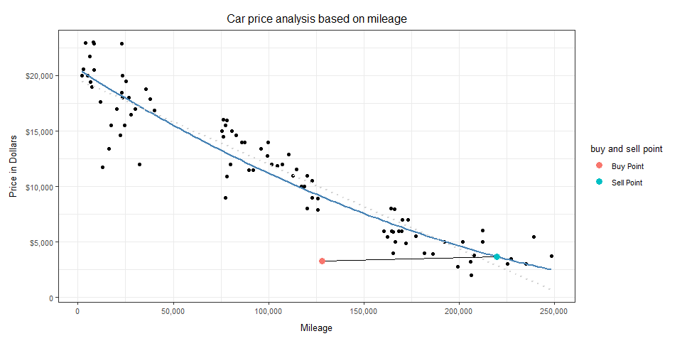
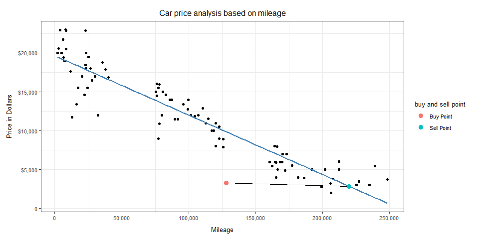
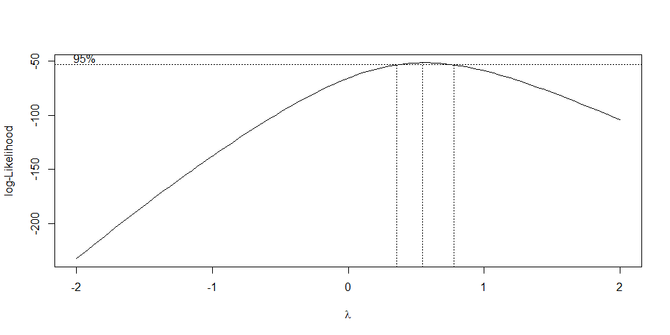
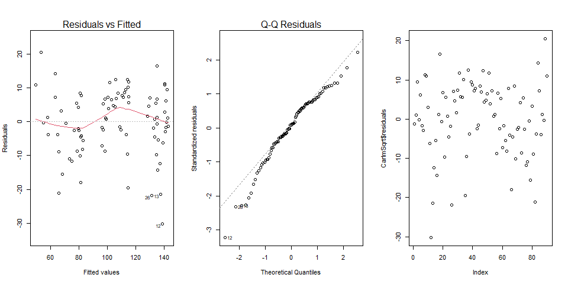
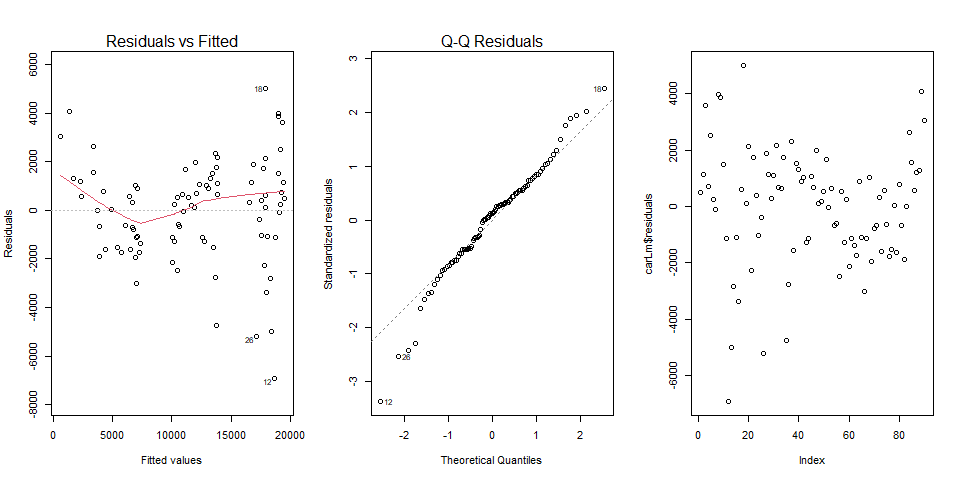

<br> 
This analysis will use a linear model to predict the selling price for my vehicle when it reaches 220,000 miles.This is assuming every year I’ve been using it for 20\~25 thousand miles. To know what price do I see myself selling it at, I'm going to use the linear model formula. After performing the regression model, we'll analyze it to see if it can be trusted or not.
<br>
$$
  \underbrace{{Y}_i}_\text{Predicted Price} = \overbrace{b_0}^\text{est. y-int} + \overbrace{b_1}^\text{est. slope} \underbrace{X_i}_\text{Mileage}
$$ 
<br> 
I did both the original linear model, and the transformation recommended by the Box Cox method (Diagnostics and formulas at the end of the analysis), check them out in the tabs below.

<br>

##  {.tabset .tabset-pills .tabset-fade}

### Transformed Linear Model

<br>




<br> <br>

Here is my transformed linear model graph. I originally did this
prediction with a simple linear model (take a look at it in the next
tab). After setting it up, I ran a Box Cox test to see if there were any
suggested transformations to the linear model. Surely enough I was
suggested to make a Square Root transformation (Lambda of .54), and then
I got the graph above, you can still see the original linear model as a
light grey line in the background.

<br> 

I want to emphasize the purpose of this model is to make a
prediction of the price in which I realistically could sell my car. A
good measurement of this is the slope in which my buying point and my
selling point meet. This slope represent an increase in dollars for each
mile driven of $0.0042$ dollars. This calculation was taken from taken
the difference from the selling point to the buying point in price and
diving it by the mileage difference. <br> This means that my predicted
selling price will be $3681.817$ Dollars! Amazing huh? This model is
saying that, even if I sell my car after driving it around 100K miles,
I'd still be getting 300 dollars in return. <br> This transformed model
makes sense to me because used cars don't usually go to complete zero,
you can sell it by parts even after it's considered junk and still get
some money back. <br> Let's take a look at the statistical summary of
the model. <br> <br>


```r
summary(CarlmSqrt) %>% 
  pander()
```


-----------------------------------------------------------------
     &nbsp;         Estimate    Std. Error   t value   Pr(>|t|)  
----------------- ------------ ------------ --------- -----------
 **(Intercept)**     143.4        1.744       82.24    5.171e-85 

   **mileage**     -0.0003762   1.396e-05    -26.95    2.737e-44 
-----------------------------------------------------------------


--------------------------------------------------------------
 Observations   Residual Std. Error   $R^2$    Adjusted $R^2$ 
-------------- --------------------- -------- ----------------
      90               9.52           0.8919       0.8907     
--------------------------------------------------------------

Table: Fitting linear model: sqrt(price) ~ mileage

<br> <br> 
In my opinion, things look good so far to make this model
trustable, R^2^ is close to $.90$ and both p values are low enough to
trust the model.

<br> <br>

### Original Linear Model

<br>



<br> <br> 

This is my original linear model. It's easy to spot some differences for
example, the slope in the line joining my buying and selling points is
negative here, with a negative slope of $-0.0048$ Dollars per mile. In
the end this leads us to a predicted selling point of $2849.73$ Dolars!
This is surely not a bad money, but it's also important to consider the
factors that made the data transformable, such as cars not going to
zero, and also a better fit as the data goes to larger mileage
quantities. <br> I find it interesting on how both predictions are
close, but even if they're close, there's a 600 dollars difference,
which could make a difference.

Let's see how the stat summary went for this model.
<br> <br> 


```r
summary(carLm) %>% 
  pander()
```


---------------------------------------------------------------
     &nbsp;        Estimate   Std. Error   t value   Pr(>|t|)  
----------------- ---------- ------------ --------- -----------
 **(Intercept)**    19646       380.3       51.66    1.305e-67 

   **mileage**     -0.07635    0.003044    -25.08    7.361e-42 
---------------------------------------------------------------


--------------------------------------------------------------
 Observations   Residual Std. Error   $R^2$    Adjusted $R^2$ 
-------------- --------------------- -------- ----------------
      90               2076           0.8773       0.8759     
--------------------------------------------------------------

Table: Fitting linear model: price ~ mileage

<br> <br> 

In my opinion this model isn't bad as well, it has a nice R^2^ of $.87$.
As well as really low P. values.

I still prefer the transformed model because of how it fits the data in
a better way.

<br> <br>

### Transformations and Diagnostic Plots

####  {.tabset .tabset-fade}

##### Box Cox Transformation Process

<br> <br>

To check for transformations possibilities I ran a Box Cox test on my linear model and got the next graph.
<br> <br>



<br> <br>

At simple view we can guess that there is a .5 (Square Root) transformation suggested. I went ahead and checked my Lambda value and got a $0.55$. This confirmed a Square Root transformation would be appropiate. 

To do this you have to Square Root your Y values in your linear model, and transform your model as shown below using the transformed Y intercept and slope.

$$
\sqrt{\hat{Y_i}} = 1.434 \times 10^2 - 3.762 \times 10^{-4}X_i
$$

<br>

This results are the ones you are going to use to plot your transformed line to fit your model.
However, to get your prediction results back to normal you must perform the inverse mathematical function to your linear model function as shown below:

$$
\hat{Y_i} = (1.434 \times 10^2 - 3.762 \times 10^{-4}X_i)^2
$$
As you can see, to undo the square rooting we did at first, we now turned the prediction results to their square values to get the accuracy needed. 
This will follow the transformed model and will allow you to get a better fit in your data and model.

<br> <br>

##### Transformed diagnostics

<br> 



<br> <br>

The Diagnostic Plots for the transformed model look good to me, we can see that only normality is being violated but independence and variance look good enough. I'd say this confirms more that the transformed model can be trusted this time.

<br> <br>

##### Original diagnostics

<br>



<br> <br>

The Diagnostic Plots for the original model look decent, however I do see a little more troubles in all diagnostics as compared to the transformed data. However, I wouldn't say this is a horrible untrustworthy diagnostic. I'd say this confirms more that the transformed model can be trusted this time, but that the original is good enough as well.

<br> <br>

### Conclusion

<br>


I originally bought this car for 3,300 USD. When I bought it in 2021 it had 128,000 miles. It’s currently sitting at 195,000 miles after 3 years. I’m expecting to use even if I leave Rexburg. I’ll probably take it with me after graduation and use it a while longer. However if the chance comes that I can sell it I would take this study in consideration. If the case is that I sell after 220,000 miles, the car would still be selling at 1 thousand even at 300k miles according to the transformed linear model; this means I would be recovering even 1 third of what I bought it for after >4 years of use.
As for me I can say that enough evidence was found to conclude that this models, preferring the transformed one, can be trusted in their predictions as far as data permits it at this moment. 

<br> <br>
