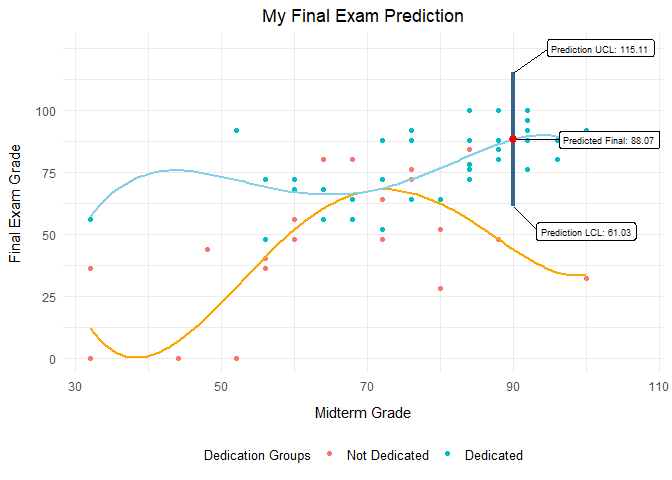

### **This is why I'll Keep my Midterm Grade!**


## {.tabset .tabset-pills .tabset-fade}

### Regression Model and Prediction

<br><br>



<br><br>

$$
\hat{y} = b_0 + b_1x_1 + b_2x_1^2 + b_3x_1^3 + b_4x_1^4 + b_5(x_1)x_2 + b_6(x_1^2)x_2 + b_7(x_1^3)x_2 + b_8(x_1^4)x_2 \\ ~ \\ where \\~\\  \underbrace{\hat{y}}_{\text{Final Exam Grade}} \quad \ \underbrace{x_1}_{\text{Midterm Grade}} \quad \ \underbrace{x_2}_{\text{Dedication Group}}
$$
<br>

This analysis will use the statements above and try and find a true prediction model for Final Exam Grades (response variable) by using Midterm Grade as an explanatory variable, and the count of the completed requirements for students as a secondary factor (If they got 100% in skills quizzes and attended almost always they have a 2 out of 5 for example).

I used the interactions of these two variables to form 2 regression models, In orange we see those who had less than 3 assignments done, and in blue wee see those who had more than 2 assignments done.

As you can see most of the ones who constantly keep on doing their tasks are on the upper half of the distribution taken as by the Y axis. While some of the orange group (those who weren't as dedicated) are in the lower half. It's important to know that these groups share some areas, however no orange dot went over 85 in their Final. I consider myself a blue group and throughout this analysis I'll use my Midterm grade (90) to predict my final exam grade. Eventually you'll see why I'll keep my midterm grade.

But first things first. Let's analyze some of the aspects of our data frame. Take a look at the statistics of this sample

<br>


-------------------------------------------------------------
 min   Q1   median   Q3   max   mean     sd     n    missing 
----- ---- -------- ---- ----- ------- ------- ---- ---------
  0    56     72     87   100   66.94   24.18   70      1    
-------------------------------------------------------------

Table: Summary statistics for the Final Exams


-------------------------------------------------------------
 min   Q1   median   Q3   max   mean     sd     n    missing 
----- ---- -------- ---- ----- ------- ------- ---- ---------
 32    64     76     87   100   74.17   17.12   70      1    
-------------------------------------------------------------

Table: Summary statistics for the Midterms

<br>

Some interesting observations from these statistics are that the median for both of them are a little similar, I think this also depicts the correlation between them. Also an interesting point is that no one who got a 100 in the Midterm has had 100 in the Final. It's just interesting because this says huge grades in the Midterm don't necessarily get you 100 in the final. It does mean that your chances are higher to get better grades, but if you were to stop working in your assignments then your grade can drop as low as 20.

So, the Midterm is not the only variable to take in consideration. Knowing this, let's jump in the summary of my regression model and my prediction with my actual Midterm grade and group.
 
<br><br>
 
#### Summary and Prediction

<br><br>


----------------------------------------------------------------------
        &nbsp;            Estimate    Std. Error   t value   Pr(>|t|) 
----------------------- ------------ ------------ --------- ----------
    **(Intercept)**        908.1        357.4       2.541     0.0137  

      **Midterm**           -65         25.28      -2.571    0.01269  

   **I(Midterm^2)**        1.624        0.631       2.575    0.01257  

   **I(Midterm^3)**       -0.01653     0.006655    -2.484    0.01584  

   **I(Midterm^4)**      5.912e-05    2.523e-05     2.344    0.02249  

       **allg**            -1452         529       -2.744    0.008031 

  **allg:I(Midterm)**      107.1        36.69       2.919    0.004962 

 **I(Midterm^2):allg**     -2.654       0.8968     -2.959    0.004435 

 **I(Midterm^3):allg**    0.02718      0.009279     2.93     0.00482  

 **I(Midterm^4):allg**   -9.851e-05    3.46e-05    -2.848    0.006055 
----------------------------------------------------------------------


--------------------------------------------------------------
 Observations   Residual Std. Error   $R^2$    Adjusted $R^2$ 
-------------- --------------------- -------- ----------------
      69               13.15          0.7464       0.7077     
--------------------------------------------------------------

Table: MY Linear Model Summary

<br><br>

Take a look at my lm summary. Interesting to note that my R^2^ is only explaining about 75% of the variability in my observations. Making some research I saw that for real life data even low R^2^ are considered good as long as your X variable is helping you predict (with sense) your Y variable. (See Appendix as to why I continued with this model).

Considering that this linear model might help us learn more about the true parameters (if any) of this regression; we will go ahead and predict what my own Final Exam grade would be.
As for me, these were my variables:

<br><br>

$$
\underbrace{\hat{y}}_{\text{Final Exam Grade}} \quad \ \underbrace{90}_{\text{Midterm Grade}} \quad \ \underbrace{1}_{\text{Dedication Group}}
$$

<br><br>


When applying this formula into my prediction equation we can see that I get a prediction interval ranging from 61 to 115 With an actual predicted value of 88

Now if I were to fall under dedication group two (orange line), even with a grade within the higher quantiles in this class. This is how my grades would look like: 14 - 43.8 - 73.7

We can see that dedication, as a variable in life, is not only a factor for inspiring quotes or amazing works; dedication can be an actual proven factor of success as seen by the difference in the range of grades I could fall to if I stopped being dedicated. It's my choice how dedicated I'm going to be in the future, and my prediciton is considering I'll perform as usual in this class in the future.

<br><br>

#### Conclusion

<br><br>
To me, this analysis helps me be more confident in my decision of keeping my midterm. Because even though I do not know yet my final place in either of the dedication groups, I know I will continue my current work pace for this class as usual. Which means the predictions for my finals will be based on my first prediction interval (61  - 115, 115 meaning 100 of course). Even if I had had a low Midterm grade and I had dedicate myself after that until the end of the course, I could have been one of those orange outlier dots in the higher percentiles of the class; even then I would be in a higher quantile for this class' final exam grade, and then my grades for both of my exams would've averaged with their respective weights (which would be good).

This analysis helps us see what our future grade could look like if we decide on what group we can fall in. In the end it is our choice how much we will invest into this class, thus bringing us closer to higher grades or lower grades. 
To conclude, I'll explain why I'll keep my midterm. I'll do it because it will give a more assured final exam grade when it averages with my midterm grade for my actual 30%, being that I have good chances of good grades I like those odds. However, even though I have a 100 final grade in my prediction interval, I also have a 61 possible, which wouldn't be horrible (I know I can do more), but to play it safe I will keep my midterm and have it offer its portion to my overall class grade.
<br><br>

### Diagnostic Plots

<br><br>

<!-- -->

<br><br>

In my opinion everything looks good here with the diagnostic plots. We can see that only linearity is a little off place, but not by much; this is not enough to throw this analysis off. So, this gives confidence to proceed with this model.

Just as an interesting fact, take a look at my diagnostic plots before I took out observation 45. See how normality was being violated (in my opinion) and also variance didn't look so good. Then it got corrected as stated above.

<!-- -->


### Data Translation to Numeric

<br><br>

#### Original data

This is my original data set. First I downloaded the CSV given by Br. Saunders. I took a while analyzing how I could work with this data set, then I figured It'd be a good idea to have all numeric values so I could use pairs() function. (Now I know that I can use as.factor, however I like it like this as well.)

<br><br>


```{=html}
<div class="datatables html-widget html-fill-item" id="htmlwidget-31b5985c28d669500cd4" style="width:100%;height:auto;"></div>
<script type="application/json" data-for="htmlwidget-31b5985c28d669500cd4">{"x":{"filter":"none","vertical":false,"data":[["1","2","3","4","5","6","7","8","9","10","11","12","13","14","15","16","17","18","19","20","21","22","23","24","25","26","27","28","29","30","31","32","33","34","35","36","37","38","39","40","41","42","43","44","45","46","47","48","49","50","51","52","53","54","55","56","57","58","59","60","61","62","63","64","65","66","67","68","69","70","71","72","73","74","75","76","77","78","79","80","81","82","83","84","85","86","87","88","89","90","91","92","93","94","95","96","97","98","99","100","101","102","103","104","105","106","107","108","109","110","111","112","113","114","115","116","117","118","119","120","121","122","123","124","125","126","127","128"],[80,88,96,44,72,36,60,48,60,48,76,44,56,16,56,72,72,60,88,72,48,88,36,null,64,68,48,80,84,52,56,56,64,92,68,52,76,64,60,60,52,76,64,76,64,72,40,28,28,84,88,44,68,64,100,68,48,52,72,80,80,56,52,96,88,60,92,92,92,48,76,72,88,76,92,0,76,56,88,32,0,80,80,68,60,92,68,68,88,76,64,68,0,76,84,100,80,72,72,94,78,40,68,88,32,43.73,88,36,52,52,84,100,64,52,40,88,92,56,84,52,80,0,68,0,72,24,72,0],[88,92,88,76,84,32,56,60,88,72,84,48,32,36,68,72,72,60,96,84,56,88,80,80,76,68,88,88,80,80,64,68,68,92,56,84,84,92,56,50,68,84,60,76,80,76,72,80,64,84,84,72,76,72,84,72,88,44,76,64,68,64,60,92,76,48,72,100,88,88,84,56,92,84,92,52,92,60,84,56,68,72,96,84,88,52,64,81,100,76,76,60,84,92,92,92,96,92,72,94,84,52,60,72,100,60,84,56,72,52,84,88,80,64,56,84,76,null,88,87,92,32,null,32,72,32,60,44],["Winter 2020","Winter 2020","Winter 2020","Winter 2020","Winter 2020","Winter 2020","Winter 2020","Winter 2020","Winter 2020","Winter 2020","Winter 2020","Winter 2020","Winter 2020","Winter 2020","Winter 2020","Winter 2020","Winter 2020","Winter 2020","Winter 2020","Winter 2020","Winter 2020","Winter 2020","Winter 2020","Winter 2020","Winter 2020","Winter 2020","Winter 2020","Winter 2020","Winter 2020","Winter 2020","Winter 2020","Winter 2020","Fall 2019","Fall 2019","Fall 2019","Fall 2019","Fall 2019","Fall 2019","Fall 2019","Fall 2019","Fall 2019","Fall 2019","Fall 2019","Fall 2019","Fall 2019","Fall 2019","Fall 2019","Fall 2019","Fall 2019","Fall 2019","Fall 2019","Fall 2019","Fall 2019","Fall 2019","Fall 2019","Fall 2019","Fall 2019","Fall 2019","Fall 2019","Winter 2023","Winter 2023","Winter 2023","Winter 2023","Winter 2023","Winter 2023","Winter 2023","Winter 2023","Winter 2023","Winter 2023","Winter 2023","Winter 2023","Winter 2023","Winter 2023","Winter 2023","Winter 2023","Winter 2023","Winter 2023","Winter 2023","Winter 2023","Winter 2023","Winter 2023","Winter 2023","Winter 2023","Winter 2023","Winter 2023","Winter 2023","Winter 2023","Winter 2023","Spring 2022","Spring 2022","Spring 2022","Spring 2022","Spring 2022","Spring 2022","Spring 2022","Spring 2022","Spring 2022","Spring 2022","Spring 2022","Spring 2022","Spring 2022","Spring 2022","Spring 2022","Spring 2022","Spring 2022","Spring 2022","Spring 2022","Spring 2022","Spring 2022","Spring 2022","Spring 2022","Spring 2022","Spring 2022","Spring 2022","Spring 2022","Spring 2022","Spring 2022","Spring 2022","Spring 2022","Spring 2022","Spring 2022","Spring 2022","Spring 2022","Spring 2022","Spring 2022","Spring 2022","Spring 2022","Spring 2022"],["F","M","M","M","M","M","M","M","F","M","M","F","F","M","M","M","F","M","M","M","F","F","M","M","M","M","F","M","M","F","F","F","M","M","M","F","M","M","M","M","F","F","M","M","M","M","F","M","F","M","M","M","M","M","M","M","F","M","M","F","F","M","F","M","M","M","M","M","M","F","M","M","F","M","M","M","M","M","F","M","M","F","F","M","M","M","F","F","M","M","F","M","F","F","F","M","M","M","M","M","M","M","M","F","M","M","M","M","F","M","M","M","M","F","F","F","M","M","F","F","M","F","M","F","M","F","F","M"],["Y","Y","Y","Y","Y","N","N","Y","N","Y","Y","N","Y","N","N","Y","Y","Y","Y","Y","Y","Y","Y","Y","Y","Y","N","Y","Y","Y","Y","Y","Y","Y","Y","Y","Y","Y","Y","N","Y","Y","Y","Y","Y","N","Y","N","Y","Y","Y","Y","Y","N","Y","Y","Y","N","N","N","N","Y","Y","Y","Y","N","Y","Y","Y","N","Y","N","Y","Y","Y","Y","Y","N","N","Y","N","N","Y","Y","Y","Y","Y","Y","Y","N","Y","Y","N","Y","N","Y","Y","N","N","N","Y","Y","Y","Y","N","N","Y","N","Y","Y","N","Y","Y","Y","N","Y","Y","Y","Y","N","N","N","N","N","N","N","Y","N"],["N","N","N","Y","Y","Y","Y","N","N","N","Y","N","Y","N","N","Y","N","N","Y","N","Y","Y","Y","Y","N","N","N","N","N","N","Y","Y","Y","Y","N","N","Y","Y","N","N","N","Y","Y","Y","Y","N","Y","N","Y","Y","Y","Y","N","N","Y","N","Y","N","N","N","N","Y","N","Y","N","Y","Y","Y","N","Y","N","Y","N","N","N","N","Y","N","Y","Y","Y","Y","N","N","N","Y","Y","Y","Y","N","Y","Y","N","Y","Y","Y","N","Y","N","N","Y","Y","N","Y","Y","Y","Y","N","Y","N","N","Y","Y","Y","N","Y","Y","N","Y","Y","N","Y","Y","Y","N","Y","Y","N"],[14.75,15,13,13.5,15,null,13.9,11,14.8,13,15,null,13.8,13,13.4,13,15,15,15,15,15,15,11,15,14.8,15,null,14,15,12,15,15,14.5,null,15,13.6,15,14,13.9,13.5,11,14.8,15,12,14.5,null,13.6,11.5,14,13.5,13,15,14.2,15,13,10,15,15,null,15,12,15,15,14.5,15,12,15,14.5,14.5,14.5,15,15,15,15,13.5,8,13,13,15,15,9.5,13,15,13.8,15,15,15,15,15,14.8,15,15,0,15,14.25,15,11.5,15,13,10,14,10,12.5,15,9,12.5,15,15,15,11,14.3,15,12.5,15,13.3,15,15,9,13.75,13,13.5,8,13.8,0,15,13,15,8],[13.4,12,13.5,13,12,null,13.5,10,12.5,12,15,null,10,11,12,7,15,13,15,15,14,15,13,15,12.8,14,null,14,12,13,13.5,15,13,null,15,10,11,14,14,13,11.5,12,15,10,13.5,null,14.25,11,11,14,12,15,13.4,6.5,13.1,9,14.5,13.5,null,15,13,10,12,14.5,14,12,14,14.8,13.5,9.5,15,10,15,15,14,12.5,13.8,0,15,14,11,13,15,13.5,13.9,15,15,15,12.5,13.5,13.6,15,0,13,14,14.3,8,11,13,13.5,13.5,12,11,14,10,10,15,8,13.7,11,12.5,14.5,13,13.5,7,14,15,10,14,13.8,11,14,13.9,10,15,0,15,5],[15,15,14,13.5,14,null,13,13.5,13.5,13.5,15,null,13,11,11,5,15,15,15,15,14,15,11,15,13,13.9,null,12,13,13.5,15,15,14,null,15,13.4,13.5,13.4,11,13.5,12,14.2,14.4,13.5,14.5,null,13.5,11.5,13,14.5,14,15,14.3,13.5,13,13.5,15,15,null,13.6,13,13.5,5.1,14,14.5,12,14.5,14,12,13.7,15,14,15,15,13.8,2,13.5,11,15,14.5,0,13.5,15,14.75,14,15,13.4,15,14,13.5,15,15,0,13.2,13.5,15,11,15,12.5,12,14,11,12,14,13.5,11,15,12.3,14.7,9.5,13.5,12.5,13,12.5,9,15,15,4,13,11,12.5,0,11,12,15,0,15,11],[13.4,13.5,12,9,13,null,6,10,13.5,8,14,null,12,9,10,13.8,14.25,10,15,15,7,15,10,15,5,13.5,null,10,11.5,14.5,9,14.5,12,null,14.9,9.5,13,15,6,10,9.5,12,8,0,12,null,6,12,9,13.5,13.5,14.5,7,0,14,3,8,8,null,13,10,13,0,13.5,12,0,13.75,13,10,0,15,11,15,14,12,0,15,5,13.5,8,0,12,13.5,13,14,13.4,15,13.5,11,13.5,12.5,13.25,0,10,14.2,15,14,13.6,8,10.5,12,0,12.5,12,0,11,13.75,10,10.8,9.5,13,14.5,12.5,12,0,13,13.5,0,14.5,9,13,0,8,0,13.55,0,11.5,0],[100,100,96.84,100,100,46.32,100,94.73999999999999,100,64.20999999999999,89.47,94.73999999999999,100,100,100,78.95,100,100,100,100,94.73999999999999,100,100,88.89,83.16,100,36.84,89.47,96.84,89.47,100,100,100,100,100,87.37,100,100,100,100,78.95,100,76.84,100,91.58,31.58,100,49.47,100,100,100,100,100,31.58,100,100,97.89,100,78.23999999999999,96.90000000000001,94.98,89.67,100,99.59999999999999,100,100,98.14,98.28,99.09,70,100,100,100,99.2,99.2,26.43,100,93.56,100,100,80,100,99.63,98.23999999999999,100,100,100,70,100,88.89,88.34999999999999,100,12.5,100,87.5,100,100,95.26000000000001,98.04000000000001,100,99.31,94.8,100,100,85.64,74.48,100,77.78,100,99.77,98.63,100,100,96.20999999999999,76.8,100,100,28.89,100,83.97,100,62.5,99.77,52.57,100,88.89,100,86.42],[60,73.33,86.67,46.67,66.67,20,46.67,46.67,26.67,40,53.33,0,46.67,20,33.33,26.67,60,53.33,66.67,66.67,60,73.33,40,86.67,66.67,66.67,26.67,73.33,66.67,40,73.33,46.67,13.33,60,46.67,53.33,80,40,20,6.67,33.33,80,46.67,60,40,60,46.67,46.67,40,86.67,66.67,40,46.67,40,66.67,20,80,86.67,33.33,40,33.33,60,40,93.33,66.67,33.33,46.67,86.67,86.67,26.67,60,53.33,86.67,53.33,80,13.33,60,40,46.67,40,13.33,53.33,73.33,26.67,20,66.67,13.33,46.67,73.33,26.67,66.67,20,6.67,53.33,73.33,53.33,73.33,60,80,53.33,66.67,46.67,53.33,46.67,13.33,33.33,66.67,26.67,73.33,26.67,46.67,80,26.67,33.33,20,86.67,80,40,73.33,60,73.33,6.67,40,6.67,66.67,6.67,46.67,40],["Y","Y","Y","N","N","N","N","N","Y","N","N","N","Y","Y","Y","N","Y","N","Y","Y","Y","Y","N","Y","Y","N","N","N","N","N","Y","Y","Y","Y","Y","N","Y","N","N","Y","Y","N","N","Y","N","N","N","N","N","Y","Y","N","N","N","Y","N","Y","N","N","Y","Y","Y","Y","Y","Y","Y","Y","Y","Y","N","Y","Y","Y","Y","Y","N","Y","Y","Y","Y","N","Y","Y","Y","Y","Y","Y","Y","Y","Y","Y","Y","N","Y","Y","Y","Y","Y","Y","N","Y","Y","Y","Y","N","Y","Y","N","Y","Y","N","Y","Y","Y","Y","Y","Y","N","Y","Y","Y","N","Y","N","Y","Y","Y","N"],["Y","Y","N","Y","Y","N","Y","N","Y","N","N","N","Y","Y","Y","N","Y","Y","Y","Y","N","Y","Y","N","N","Y","N","N","N","N","Y","Y","Y","Y","Y","N","Y","Y","Y","Y","N","Y","N","Y","N","N","Y","N","Y","Y","Y","Y","Y","N","Y","Y","N","Y","N","N","N","N","Y","N","Y","Y","N","N","N","N","Y","Y","Y","N","N","N","N","N","N","N","N","N","N","N","Y","Y","Y","N","Y","N","N","Y","N","Y","N","Y","Y","N","N","Y","Y","N","Y","Y","N","N","Y","N","Y","Y","N","Y","Y","N","N","Y","Y","N","Y","N","Y","N","Y","N","Y","N","Y","N"],[2,2,2,1,2,2,2,2,1,1,2,2,2,1,2,2,2,2,2,2,2,2,1,null,2,2,1,2,2,1,2,2,2,2,2,1,2,1,2,2,2,2,2,2,1,2,1,1,1,2,2,1,2,2,2,2,1,2,2,1,1,1,2,2,2,1,2,2,2,1,2,1,1,2,1,1,2,1,2,1,1,1,2,2,1,2,1,2,2,1,2,1,1,1,2,2,2,1,1,1,2,1,1,2,1,1,2,1,1,1,2,2,1,1,1,2,2,1,2,1,2,1,1,1,2,1,1,1]],"container":"<table class=\"display\">\n  <thead>\n    <tr>\n      <th> <\/th>\n      <th>FinalExam<\/th>\n      <th>Midterm<\/th>\n      <th>Section<\/th>\n      <th>Gender<\/th>\n      <th>AttendedAlmostAlways<\/th>\n      <th>SpentTimeInOfficeHours<\/th>\n      <th>Analysis_PredWeather<\/th>\n      <th>Theory_Residuals<\/th>\n      <th>Analysis_CarPrices<\/th>\n      <th>Theory_SamplingDists<\/th>\n      <th>SkillsQuizzes<\/th>\n      <th>AssessmentQuizzes<\/th>\n      <th>ClassActivitiesCompletedPerfectly<\/th>\n      <th>SkillsQuizzesCompletedPerfectly<\/th>\n      <th>MagicTwoGroups<\/th>\n    <\/tr>\n  <\/thead>\n<\/table>","options":{"columnDefs":[{"className":"dt-right","targets":[1,2,7,8,9,10,11,12,15]},{"orderable":false,"targets":0},{"name":" ","targets":0},{"name":"FinalExam","targets":1},{"name":"Midterm","targets":2},{"name":"Section","targets":3},{"name":"Gender","targets":4},{"name":"AttendedAlmostAlways","targets":5},{"name":"SpentTimeInOfficeHours","targets":6},{"name":"Analysis_PredWeather","targets":7},{"name":"Theory_Residuals","targets":8},{"name":"Analysis_CarPrices","targets":9},{"name":"Theory_SamplingDists","targets":10},{"name":"SkillsQuizzes","targets":11},{"name":"AssessmentQuizzes","targets":12},{"name":"ClassActivitiesCompletedPerfectly","targets":13},{"name":"SkillsQuizzesCompletedPerfectly","targets":14},{"name":"MagicTwoGroups","targets":15}],"order":[],"autoWidth":false,"orderClasses":false}},"evals":[],"jsHooks":[]}</script>
```

<br><br>

#### Numeric and clean data

I proceeded to transoform all the Yes or No answers into on or off switches (0,1). I added a column (assesg) in where I separated all the people with assessments grades above 50 and below 50. Above being 1 (on) and below being 2 (off).

Then I added two more columns (all, and allg), one counting all the 1s that one person had (0 min - 5 max), meaning that 0 is a not at all dedicated person, this person missed classess, missed class activities, missed assessment quizzes, missed skill quizzes, and didn't go to office hours. While 5 means they did all the stated; My second column was an on off switch type of column, where 0 includes those whose counts were 0-2, and 1 means those who had at least 3 (3 to 5) of these factors completed.  

<br><br>


```{=html}
<div class="datatables html-widget html-fill-item" id="htmlwidget-fc1fcba529fe45a1fa92" style="width:100%;height:auto;"></div>
<script type="application/json" data-for="htmlwidget-fc1fcba529fe45a1fa92">{"x":{"filter":"none","vertical":false,"data":[["1","2","3","4","5","6","7","8","9","10","11","12","13","14","15","16","17","18","19","20","21","22","23","24","25","26","27","28","29","30","31","32","33","34","35","36","37","38","39","40","41","42","43","44","45","46","47","48","49","50","51","52","53","54","55","56","57","58","59","60","61","62","63","64","65","66","67","68","69","70","71"],[80,88,72,36,48,48,44,56,72,88,72,48,88,null,48,52,56,56,64,92,76,76,76,72,28,84,88,64,100,72,80,80,56,96,88,92,48,76,72,88,0,76,56,92,68,88,76,64,68,76,100,80,78,68,88,32,88,36,52,84,100,64,40,88,92,56,84,0,0,72,0],[88,92,84,32,60,72,48,32,72,96,84,56,88,80,88,80,64,68,68,92,84,84,76,76,80,84,84,72,84,76,64,68,64,92,76,100,88,84,56,92,52,92,60,52,64,100,76,76,60,92,92,96,84,60,72,100,84,56,72,84,88,80,56,84,76,null,88,32,32,60,44],[14.75,15,15,null,11,13,null,13.8,15,15,15,15,15,15,null,12,15,15,14.5,null,15,14.8,12,null,11.5,13.5,13,15,13,null,15,12,15,14.5,15,14.5,14.5,15,15,15,8,13,13,15,15,15,14.8,15,15,15,15,11.5,14,12.5,15,9,15,15,15,14.3,15,12.5,13.3,15,15,9,13.75,8,0,15,8],[13.4,12,12,null,10,12,null,10,15,15,15,14,15,15,null,13,13.5,15,13,null,11,12,10,null,11,14,12,6.5,13.1,null,15,13,10,14.5,14,14.8,9.5,15,10,15,12.5,13.8,0,15,15,12.5,13.5,13.6,15,13,14.3,8,13.5,11,14,10,15,8,13.7,12.5,14.5,13,7,14,15,10,14,14,10,15,5],[15,15,14,null,13.5,13.5,null,13,15,15,15,14,15,15,null,13.5,15,15,14,null,13.5,14.2,13.5,null,11.5,14.5,14,13.5,13,null,13.6,13,13.5,14,14.5,14,13.7,15,14,15,2,13.5,11,15,13.4,14,13.5,15,15,13.2,15,11,14,12,14,13.5,15,12.3,14.7,13.5,12.5,13,9,15,15,4,13,0,12,15,11],[13.4,13.5,13,null,10,8,null,12,14.25,15,15,7,15,15,null,14.5,9,14.5,12,null,13,12,0,null,12,13.5,13.5,0,14,null,13,10,13,13.5,12,13,0,15,11,15,0,15,5,13.4,15,11,13.5,12.5,13.25,10,15,14,12,12.5,12,0,13.75,10,10.8,13,14.5,12.5,0,13,13.5,0,14.5,0,0,11.5,0],[100,100,100,46.32,94.73999999999999,64.20999999999999,94.73999999999999,100,100,100,100,94.73999999999999,100,88.89,36.84,89.47,100,100,100,100,100,100,100,31.58,49.47,100,100,31.58,100,78.23999999999999,96.90000000000001,94.98,89.67,99.59999999999999,100,98.28,70,100,100,100,26.43,100,93.56,100,100,100,88.89,88.34999999999999,100,100,100,100,99.31,100,100,85.64,100,77.78,100,98.63,100,100,76.8,100,100,28.89,100,62.5,52.57,100,86.42],[60,73.33,66.67,20,46.67,40,0,46.67,60,66.67,66.67,60,73.33,86.67,26.67,40,73.33,46.67,13.33,60,80,80,60,60,46.67,86.67,66.67,40,66.67,33.33,40,33.33,60,93.33,66.67,86.67,26.67,60,53.33,86.67,13.33,60,40,66.67,13.33,73.33,26.67,66.67,20,53.33,53.33,73.33,66.67,53.33,46.67,13.33,66.67,26.67,73.33,46.67,80,26.67,20,86.67,80,40,73.33,6.67,6.67,46.67,40],[1,1,1,0,1,1,0,1,1,1,1,1,1,1,0,1,1,1,1,1,1,1,1,0,0,1,1,0,1,0,0,0,1,1,1,1,0,1,0,1,1,1,0,1,1,1,0,1,1,1,1,1,1,1,1,0,1,0,1,0,1,1,0,1,1,1,1,0,0,1,0],[0,0,1,1,0,0,0,1,0,1,0,1,1,1,0,0,1,1,1,1,1,1,1,0,0,1,1,0,1,0,0,0,1,1,0,1,1,0,1,0,0,1,0,1,1,1,0,1,1,1,1,0,1,0,1,1,1,0,1,0,1,1,0,1,1,0,1,1,1,1,0],[1,1,0,0,0,0,0,1,1,1,1,1,1,1,0,0,1,1,1,1,1,0,1,0,0,1,1,0,1,0,1,1,1,1,1,1,0,1,1,1,0,1,1,1,1,1,1,1,1,1,1,1,1,1,1,0,1,0,1,0,1,1,1,1,1,0,1,0,0,1,0],[1,1,1,0,0,0,0,1,1,1,1,0,1,0,0,0,1,1,1,1,1,1,1,0,0,1,1,0,1,0,0,0,0,0,1,0,0,1,1,1,0,0,0,1,1,1,0,0,1,1,1,1,1,1,1,0,1,0,1,0,1,1,0,1,1,0,1,0,0,1,0],[2,2,2,2,2,1,2,2,2,2,2,2,2,null,1,1,2,2,2,2,2,2,2,2,1,2,2,2,2,2,1,1,1,2,2,2,1,2,1,1,1,2,1,2,1,2,1,2,1,1,2,2,2,1,2,1,2,1,1,2,2,1,1,2,2,1,2,1,1,1,1],[1,1,1,0,0,0,0,0,1,1,1,1,1,1,0,0,1,0,0,1,1,1,1,1,0,1,1,0,1,0,0,0,1,1,1,1,0,1,1,1,0,1,0,1,0,1,0,1,0,1,1,1,1,1,0,0,1,0,1,0,1,0,0,1,1,0,1,0,0,0,0],[4,4,4,1,1,1,0,4,4,5,4,4,5,4,0,1,5,4,4,5,5,4,5,1,0,5,5,0,5,0,1,1,4,4,4,4,1,4,4,4,1,4,1,5,4,5,1,4,4,5,5,4,5,4,4,1,5,0,5,0,5,4,1,5,5,1,5,1,1,4,0],[1,1,1,0,0,0,0,1,1,1,1,1,1,1,0,0,1,1,1,1,1,1,1,0,0,1,1,0,1,0,0,0,1,1,1,1,0,1,1,1,0,1,0,1,1,1,0,1,1,1,1,1,1,1,1,0,1,0,1,0,1,1,0,1,1,0,1,0,0,1,0]],"container":"<table class=\"display\">\n  <thead>\n    <tr>\n      <th> <\/th>\n      <th>FinalExam<\/th>\n      <th>Midterm<\/th>\n      <th>weath<\/th>\n      <th>resd<\/th>\n      <th>carp<\/th>\n      <th>dists<\/th>\n      <th>skill<\/th>\n      <th>assess<\/th>\n      <th>attend<\/th>\n      <th>offih<\/th>\n      <th>perfclass<\/th>\n      <th>perfskill<\/th>\n      <th>MagicTwoGroups<\/th>\n      <th>assessg<\/th>\n      <th>all<\/th>\n      <th>allg<\/th>\n    <\/tr>\n  <\/thead>\n<\/table>","options":{"columnDefs":[{"className":"dt-right","targets":[1,2,3,4,5,6,7,8,9,10,11,12,13,14,15,16]},{"orderable":false,"targets":0},{"name":" ","targets":0},{"name":"FinalExam","targets":1},{"name":"Midterm","targets":2},{"name":"weath","targets":3},{"name":"resd","targets":4},{"name":"carp","targets":5},{"name":"dists","targets":6},{"name":"skill","targets":7},{"name":"assess","targets":8},{"name":"attend","targets":9},{"name":"offih","targets":10},{"name":"perfclass","targets":11},{"name":"perfskill","targets":12},{"name":"MagicTwoGroups","targets":13},{"name":"assessg","targets":14},{"name":"all","targets":15},{"name":"allg","targets":16}],"order":[],"autoWidth":false,"orderClasses":false}},"evals":[],"jsHooks":[]}</script>
```

<br><br>

### Appendix

<br><br>

#### {.tabset .tabset-panel}

##### Final geom_smooth


<br><br>

##### Pairs


<br><br>

##### My Test Lm's


```
## 
## Call:
## lm(formula = FinalExam ~ Midterm + I(Midterm^2) + perfclass:I(Midterm) + 
##     perfclass:I(Midterm^2) + assess + skill, data = dat)
## 
## Residuals:
##     Min      1Q  Median      3Q     Max 
## -35.744  -7.179  -0.090   8.014  26.596 
## 
## Coefficients:
##                          Estimate Std. Error t value Pr(>|t|)  
## (Intercept)            -42.004640  25.509480  -1.647   0.1047  
## Midterm                  1.343597   0.836154   1.607   0.1132  
## I(Midterm^2)            -0.005962   0.006766  -0.881   0.3816  
## assess                   0.259975   0.099871   2.603   0.0115 *
## skill                    0.228809   0.123704   1.850   0.0691 .
## perfclass:I(Midterm)     0.401809   0.340076   1.182   0.2419  
## I(Midterm^2):perfclass  -0.002753   0.004073  -0.676   0.5016  
## ---
## Signif. codes:  0 '***' 0.001 '**' 0.01 '*' 0.05 '.' 0.1 ' ' 1
## 
## Residual standard error: 13.65 on 62 degrees of freedom
##   (2 observations deleted due to missingness)
## Multiple R-squared:  0.7125,	Adjusted R-squared:  0.6846 
## F-statistic:  25.6 on 6 and 62 DF,  p-value: 4.556e-15
```


<br><br>

##### Facet Wrap


<br><br>

####

In this section I'll explain why I did this linear model the way I did. Take a look at the above graph in which I transposed my model to a LOESS curve for both dedication groups. I liked how they very much match, that gave me confidence to take this as my final model. Now, for the actual steps I took.

In the beginning I analyzed my data with a pairs plot (see pairs tab, that was my first pairs plot). I got that plot with the original data brother Saunders gave us. I saw much correlation between some variables, specially the perfect in class activities group so I started with that one as a factor. See my plot in test lms tab (second plot).

After figuring out what variables I wanted in my first model, I started building some Lm's. Check out one of my first examples in test lms tab. In that example I would've loved to see the blue line a little higher. And also some of my interactions weren't significant in their p-values. Also in my code you can see as comments some other models I tried and many others are not there because I deleted them as well.

I did some linear models including everything (the yes or no as switches), however even though my R^2^ was literally .99, the predictions were so off that I didn't go through with that idea.Since I was finding too many variables and my predictions where going off when I tried using them all, I chose to make a new variable in which I summed the count of 1s each student had. Meaning that students that had perfect quizzes and perfect attendance had 2 out of 5, and then I made that a on off switch. Those whose counts were below 3 were a 0 and those above 2 were a 1, That's how the "dedication groups" were formed. This idea was inspired by heaven in my opinion, because at this time I already had spent many hours trying to make something work. So I took action and I added them all as a count of how many perfect scores or complete assignments each student had. This trying to find the level of dedication for each student. 

Honestly I felt like doing a third group, which I really think could've added more insight, and add more R^2^ to my prediction and significance, but I was very tired; I would've called this group the average, and I could've add another stat function in the graph. The groups would've been as followed 0-1 count = "Not dedicated", 2-3 count = "average", 4-5 = "dedicated", This would make sense because in the actual model I currently have, both dedication groups share an area in their models, so the average would go through the middle and take that area. However, in the end I figured two groups is ok.

I used those variables to start building my model and tried plotting these variables in facet wrap with a geom_smooth and divided by group (Also in the Facet Wrap tab). This was the beginning of my final model. I saw a quadratic or even cubic model fitting both of them, so that's what I tried doing for both on and off in the dedication groups by using x as my midterm grade.

In the end I think that this one (even though it doesn't contain all possibilities) works well enough for this matter. I was pleased to see I was able to finish up doing something with all significant p values.

<br>


```
## 
## Call:
## lm(formula = FinalExam ~ Midterm + I(Midterm^2) + I(Midterm^3) + 
##     I(Midterm^4) + allg + allg:I(Midterm) + allg:I(Midterm^2) + 
##     allg:I(Midterm^3) + allg:I(Midterm^4), data = dat)
## 
## Residuals:
##     Min      1Q  Median      3Q     Max 
## -34.285  -7.977  -0.823   6.363  28.370 
## 
## Coefficients:
##                     Estimate Std. Error t value Pr(>|t|)   
## (Intercept)        9.081e+02  3.574e+02   2.541  0.01370 * 
## Midterm           -6.500e+01  2.528e+01  -2.571  0.01269 * 
## I(Midterm^2)       1.624e+00  6.310e-01   2.575  0.01257 * 
## I(Midterm^3)      -1.653e-02  6.655e-03  -2.484  0.01584 * 
## I(Midterm^4)       5.912e-05  2.523e-05   2.344  0.02249 * 
## allg              -1.452e+03  5.290e+02  -2.744  0.00803 **
## allg:I(Midterm)    1.071e+02  3.669e+01   2.919  0.00496 **
## I(Midterm^2):allg -2.654e+00  8.968e-01  -2.959  0.00444 **
## I(Midterm^3):allg  2.718e-02  9.279e-03   2.930  0.00482 **
## I(Midterm^4):allg -9.851e-05  3.460e-05  -2.848  0.00605 **
## ---
## Signif. codes:  0 '***' 0.001 '**' 0.01 '*' 0.05 '.' 0.1 ' ' 1
## 
## Residual standard error: 13.15 on 59 degrees of freedom
##   (2 observations deleted due to missingness)
## Multiple R-squared:  0.7464,	Adjusted R-squared:  0.7077 
## F-statistic:  19.3 on 9 and 59 DF,  p-value: 1.528e-14
```

<br><br>
