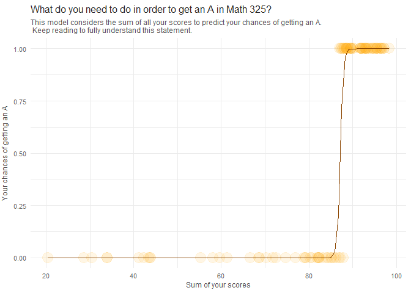

#  {.tabset .tabset-pills .tabset-fade}

## Introduction

<br>



<br><br>

This model will try to explain how the sum of the scores of all your assignments has an effect on your chances of getting an A in the class. I'm not sure if this sounds complicated to you or not. But let's think it through with simple logic. So, if you do your stuff for class, you get higher grades, correct? Then, on the other hand, if you don't do anything, will you expect to get an A? If we are all honest, the answer is no.

So, the more you do your assignments, especially in this class where most of them can be resubmitted, your higher chances of getting an A will be. So, this model takes a sum of all your scores and transforms them into their respective percentages for your final score; thus, this considers that analyses can contribute 41% of your final score when you have all 15, for example. 

This model's "explanatory variable" or "X variable" represents the sum of all of your assignments respectively weighted for your final score as a numeric value.

<br>

1. <span style="color: #B22222;">Analyses = 41 </span>

2. <span style="color: #B22222;">Skills Quizzes = 22 </span>

3. <span style="color: #B22222;">Final Exam = 15 </span>

4. <span style="color: #B22222;">Peer Reviews = 12 </span>

5. <span style="color: #B22222;">Assessment Quizzes | Class Activities = 5 each </span>

6. <span style="color: #B22222;">Total = 100 </span>

<br>

Take a look at the summary of the logistic model put at work here.

<br>


```r
pander(summary(myglm1))
```


--------------------------------------------------------------
     &nbsp;        Estimate   Std. Error   z value   Pr(>|z|) 
----------------- ---------- ------------ --------- ----------
 **(Intercept)**    -256.7      120.9      -2.123    0.03373  

      **x**         2.946       1.384       2.128    0.03334  
--------------------------------------------------------------


(Dispersion parameter for  binomial  family taken to be  1 )


-------------------- ---------------------------
   Null deviance:     132.72  on 96  degrees of 
                               freedom          

 Residual deviance:   11.23  on 95  degrees of  
                               freedom          
-------------------- ---------------------------

<br>

Most of it may look confusing, but hopefully you see that the P-values are low, which is a good thing. Then there are statistics for the Z score, Standard Error, and the estimated slope and intercept.

Let's break down what the slope and intercept mean in simpler terms. In a summary, these coefficients in a logistic model tell you about your chances of getting an A in Math 325. When you haven't done anything, your odds are around -256. YES, negative odds, sound crazy, but it kinda makes sense. This follows the same logic we talked about earlier, If you haven't lifted a finger, you can't really expect much in terms of grades, correct?

Now, here comes the interesting part. The intercept tells us that for every bump up in the sum of all your scores—every tiny bit of effort and every better grade you earn—your odds shoot up by about 3 each time. So, the more you put in, the better your odds get. But odds, they're like speaking a different language as compared to understanding probabilities; probabilities can only go from 0 to 1, but odds can go anywhere so what do they mean anyway? They're related, sure, but they are not the same thing. I repeat, odds and probabilities are not the same thing.. But we can calculate one or the other if we got either one of them. (Even though I don't get why would I prefer odds over probabilities?).

Anyway, to make things easier to understand, we can turn the odds as given in the coefficients into probabilities using this formula (Where $b_0$ is the intercept and $b_1$ is the slope:

<br>

$$ Probability \ of \ an \ A = \frac{e^{b_0 + b_1 \times x}}{1 + e^{b_0 + b_1 \times x}} $$

<br>

Let's give it a try. We will assume your total summed final score on a scale of 0-100 adds up to 90:

<br>

$$ Probability \ of \ an \ A = \frac{e^{-256.695787 + 2.945925 \times 90}}{1 + e^{-256.695787 + 2.945925 \times 90}} $$

<br>

Which would translate to this:


```r
data.frame( a = predict(myglm1, newdata = data.frame(x=90), type = "response")) |> 
  kable(col.names = "Probability of an A:",
        align = "c")
```


| Probability of an A: |
|:--------------------:|
|      0.9997835       |

<br>

Then if you worked hard on class, and the sum of all your work adds up to 90 in this case, you definitely have a reason to believe you'll get an A as seen by the probabilities of almost 1 that you have! Continue reading to understand the weight of all the variables used in this model that affect your grades and get more insights on where to focus your efforts.

<br><br>

## Variables To Consider

###  {.tabset .tabset-panel .tabset-fade}

#### Analyses

<br>

How will the sum of your analyses' scores affect your grade? We can know this by doing simple Math; Using proportions you can calculate your current or desired final score for your analyses, contributing to your final grade for the class.

You can do this by summing all your raw analyses scores (15 max each), and then diving that by 165; 165 because it's the total possible raw analyses points you can get (11 analyses * 15 possible points = 165); in practice it would look something like this:

Imagine you got 10 in all your analyses, thus you get 110. Then divide 110/165 and you'll get a proportion of .667. This number is then the proportion of how much of your analyses points you actually got right.

Now, you already know the weight that Analyses have overall in your final grade is 42%; and being that you just calculated the proportion for your analyses, you can now get what percentage of the actual final grade you'll be getting. This can be done by multiplying your calculated analyses proportion times 42. So if you do .667*42 you get 28. 28 being the final contribution from your analyses to your final grade.

You'll be able to do this by summing all your proportions for each variable in your final exam and then get your grade. For now, let's look at some examples:

<br>


```r
data.frame(
  a = 0,
  b = 0,
  c = 0,
  d = 15,
  e = 135,
  f = .878,
  g = .36) |> 
  kable(col.names = c("Analysis 1",
                      "Analysis 2",
                      "Analysis 3",
                      "... Analysis 11",
                      "Raw Sum",
                      "Raw / 165",
                      "Contribution to grade"))
```


| Analysis 1| Analysis 2| Analysis 3| ... Analysis 11| Raw Sum| Raw / 165| Contribution to grade|
|----------:|----------:|----------:|---------------:|-------:|---------:|---------------------:|
|          0|          0|          0|              15|     135|     0.878|                  0.36|

<br>

Imagine for a minute that you, for some reason, got overwhelmed at the beginning of the semester. Because of this you got 0 in the first three analyses and then said, well.. I'll let them go and instead, I'll commit to get 15 in the rest. And then you did that! you did get 15 in the rest, and average of 95 in all the other variables (Final Exam, quizzes etc.). But since the analyses are graded so heavily, missing 3 will take you off the chances of getting an A in this class. 

To know what your chances would be we can take a look at the prediction below. This prediction comes from the model used in the first tab of this file. It'll let you know what your chances are of getting an A considering that you lost 3 analyses (or 45 analyses points).

<br>


```r
data.frame( a = predict(myglm1, newdata = data.frame(x=85), type = "response")) |> 
  kable(col.names = "Probability of an A:",
        align = "c")
```


| Probability of an A: |
|:--------------------:|
|      0.0018474       |

<br>

Above you can see that, there's almost literally Zero chance of getting an A. This is because of how heavily the analyses are weighted. But now, consider the table below, and imagine that you got 15 in all your analyses instead. We will now predict what is your probability that you'll get a grade above 90% in the class. And, to add a little more spice to it we will predict for your final grade as if you got 30 in your Final Exam.

<br>


```r
data.frame(
  a = 15,
  d = 15,
  e = 165,
  f = 100,
  g = .42,
  h = 30) |> 
  kable(col.names = c("Analysis 1",
                      "... Analysis 11",
                      "Raw Sum",
                      "Raw / 165",
                      "Contribution to grade",
                      "Final Exam"))
```


| Analysis 1| ... Analysis 11| Raw Sum| Raw / 165| Contribution to grade| Final Exam|
|----------:|---------------:|-------:|---------:|---------------------:|----------:|
|         15|              15|     165|       100|                  0.42|         30|

<br>

If we predict with the same logic, you'll see there is no chance that you won't get an A. Even if we predict as if you got 30 in your exam. Look how likely you are of getting an A in this class. Did you realize how your chances of getting an A went from Zero to ONE HUNDRED? (basically). Then, we can consider the analyses as something you wouldn't want to take lightly.

<br>


```r
data.frame( a = predict(myglm1, newdata = data.frame(x=41+4.5+5+5+22+12), type = "response")) |> 
  kable(col.names = "Probability of an A:",
        align = "c")
```


| Probability of an A: |
|:--------------------:|
|      0.9990561       |

<br>

When I took M325 I thought it was useless, and I didn't care much about school back then. I recommend you to be better. Go and get your analyses done this weekend. All of them. Get them to 15, there is no way you won't get an A if you do this. Or at least you'll get reaaally close.

<br><br>

#### Skills Quizzes

<br>

Now, will your Skills Quizzes scores affect your grade? We can know this by the same logic of calculating how heavy are they in your grade, the proportions of your actual skills quizzes, and their contribution to your final grade.

Consider the following:

<br>

1. <span style="color: #B22222;">Skills Quizzes overall are weighted at 22% of your final grade. </span>

2. <span style="color: #B22222;">Max raw score per skill quiz is 10</span>

3. <span style="color: #B22222;">Max summed score is 140</span>

4. <span style="color: #B22222;">And they are also due the last day!</span>

<br>

I am almost begging you to do them :D. Just kidding, but you can get high scores on these if you go to office hours or ask help to the TA. Let me show you how important are they by considering this next table.

<br>


```r
data.frame(
  a = 5,
  d = 10,
  e = 120,
  f = .85,
  g = .187) |> 
  kable(col.names = c("Skill Quiz 1,2,3,4",
                      "... Skill Quiz 14",
                      "Raw Sum",
                      "Raw / 140",
                      "Contribution to grade"))
```


| Skill Quiz 1,2,3,4| ... Skill Quiz 14| Raw Sum| Raw / 140| Contribution to grade|
|------------------:|-----------------:|-------:|---------:|---------------------:|
|                  5|                10|     120|      0.85|                 0.187|

<br>

Now let's use these for a prediction as we've been doing. Let's consider the second prediction from the analyses where you got 30 in your Final but 15 in all your analyses. But to help you understand their importance, you sadly got 4 your skills quizzes to 5 (As seen in the table above) 

<br>


```r
data.frame( a = predict(myglm1, newdata = data.frame(x=41+18.7+4.5+5+5+12), type = "response")) |> 
  kable(col.names = "Probability of an A:",
        align = "c")
```


| Probability of an A: |
|:--------------------:|
|      0.0596902       |

<br>

If we remember, when we predicted that you got all your analyses to 15, even though your final was 30/100 the chances of getting an A were almost 100%; However, now the chances from getting an A went down from 100% to ~.05% because the skills quizzes went lower in their grade; I recommend you to don't miss the chance to get all your Skills Quizzes done to 100%. It's possible if you put the time into it, in the end you'll be glad to learn R and all that you can do with it, don't underestimate it. 

You can do this!

<br><br>

#### Final Exam | Peer Reviews

<br>

We now we'll read about how your final, and your peer reviews affect your grade. We read about these ones together because they have a weight of 15% and 12% respectively on your final. Because of this their effect on your final score it's around the same. Isn't that crazy? Peer Reviews are just button click saying yes, I did my peer review; This after spending a couple minutes reviewing your peers. Even so they're weighted almost the same as your final.

Consider the following:

<br>

1. <span style="color: #B22222;">Final Exam is weighted at 15% of your final grade. </span>

2. <span style="color: #B22222;">Peer Reviews are weighted at 12% of your final grade. </span>

3. <span style="color: #B22222;">Max raw score per peer review is 10</span>

4. <span style="color: #B22222;">Max summed score for all reviews of 110</span>

<br>


```r
data.frame(
  a = 5,
  b = 10,
  c = 100,
  d = .91,
  e = .11,
  f = 30,
  g = 4.5) |> 
  kable(col.names = c("Review 1 ,2",
                      "... Review 11",
                      "Raw Sum",
                      "Raw / 110",
                      "Contribution to grade",
                      "Final Exam",
                      "Final Exam Contribution"))
```


| Review 1 ,2| ... Review 11| Raw Sum| Raw / 110| Contribution to grade| Final Exam| Final Exam Contribution|
|-----------:|-------------:|-------:|---------:|---------------------:|----------:|-----------------------:|
|           5|            10|     100|      0.91|                  0.11|         30|                     4.5|

<br>

See what happens if you miss a few, let's say your first 2 peer reviews. We are considering the same 30 gradein your final, that you got 15 on your analyses and 10 in your skills quizzes. Even with this, your chances of getting an A are still as high as they can get.

<br>


```r
data.frame( a = predict(myglm1, newdata = data.frame(x=41+22+4.5+11+5+5), type = "response")) |> 
  kable(col.names = "Probability of an A:",
        align = "c")
```


| Probability of an A: |
|:--------------------:|
|      0.9823392       |

<br>

Even though the change is small, probabilities were dropped a little when 2 reviews were missed. They may seem little but do have an effect on your final grade. So if your teacher allows you to, get them done before the semster ends. Remember, by small and simple things are great things brought to pass" Alma 37:6. By small things, little efforts here and there. Consistent and planned work, these things will get you rewarding experiences and will bring you closer to be a great disciple of Christ and great student.

<br><br>

#### Assessment Quizzes | Class Activities

<br>

Now, speaking of small things. We have our last variables to consider for your final grade. These are, Assessment quizzes, and class activities. These are the lowest weighted variables with both at 5% of your final Score. Yet, interestingly, getting good assessment quizzes scores gets you better grades! You probably saw this in your predicted final exam analysis; how good are assessment quizzes for predicting it is just wild. 

So, let's jump in and see how these two affect your grade. Since class activities are mainly done in class, we'll focus on assessment quizzes.

<br>


```r
data.frame(
  a = "50%",
  b = "100%",
  c = .075 ) |> 
  kable(col.names = c("... all assessments",
                      "... all activities",
                      "Summed contribution to grade"))
```


|... all assessments |... all activities | Summed contribution to grade|
|:-------------------|:------------------|----------------------------:|
|50%                 |100%               |                        0.075|

<br>

Since getting all right in class activities get's 5 final percent in your score; assume you got 50% in your final proportional score for your assessment quizzes, thus getting 2.5 out of the 5% possible. (The other variables are as we've been doing, 30 in your final and so on..)

<br>


```r
data.frame( a = predict(myglm1, newdata = data.frame(x=41+22+5.5+12+5+2.5), type = "response")) |> 
  kable(col.names = "Probability of an A:",
        align = "c")
```


| Probability of an A: |
|:--------------------:|
|       0.927279       |

<br>

Now your chances of getting an A got lower. This is to show that even the smallest things will have an effect in your grade. This Idea can work for any class, let's not be comfortable with only fulfilling the requirements for any class, but since we are studying we better aim to get everything that we can right!

<br><br>

####

## Validations

<br>


| Success Rate |
|:------------:|
|     95%      |

<br>

After running validations on the success rate of this model. We can see that it is accurate 95% of the times when predicting final grades for Math 325 students. This while being proved in a different data set or environment.

<br><br>
