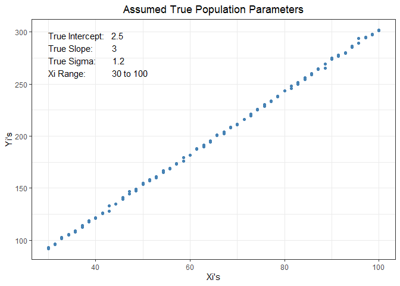
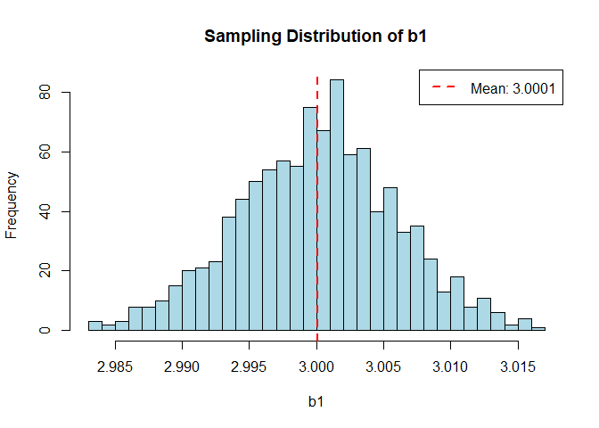
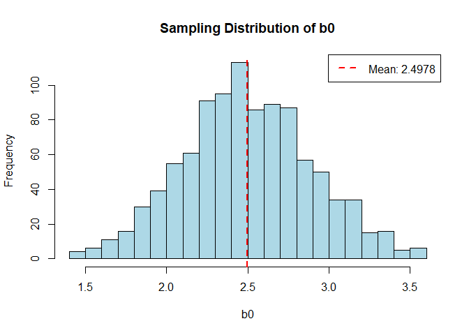

## {.tabset .tabset-fade .tabset-pills}

### Introduction

   
For this analysis we will be using a simulation data set generated by loop in R as we saw in class. Each point represent an observation in a sample of a whole population. Please note how neatly aligned they are. They're almost the regression model themselves (the points). This is is because of how the data was programmed to appear. For this model we set the True parameters **(\( \beta_0 \))** and **(\( \beta_1 \))**. For this analysis we will be using **1000** randomly generated data sets and calculate their slope and intercepts to use them in a sampling distribution process respectively. This is important because in the real world we never get to program the true parameters, but hopefully after today's reading you can see that statistics, in this case linear regression, is extremely close to the truth. We can get to that point because in this example we created the truth and we are going to see how a random sample approaches the truth using the same model we use in real life where we for a fact don't know the absolute true parameters. 

Here is an example of how 1 data set would look like. Check out the true parameters chosen for the experiment, find them in the next graph, top left corner. 
   

<!-- -->

   

### Sampling Distributions  {.tabset .tabset-fade} 

  

  Sampling distribution is a way to display/calculate the distribution of a certain statistic (Mean, Median, Mode etc.) within many samples. This is useful to compare how much they vary from each other. You can use this to see how much the mean of many samples vary from each other, or the median of many samples, or in this case we are going to use it to analyze the distributions of the slopes and y-intercepts of many linear regression models, and see the variability within them. 

With the parameters we created for the data in mind, let's take the Sampling Distribution for the **1000** the regression slopes and intercepts, follow the next steps to learn how to do each.

  
 

#### Sampling Distribution for Slope (\( b_1 \))

 

Follow these steps to get a Sample distribution for the slope when using LM models:

For each sample, we will apply a regression model to our data and obtain its slope **(\( \hat{b}_1 \))**.
Then we record them in R as a list or data frame in a column for example, something like this (but with actual slope values) **(\( \hat{b}_1^{(1)}, \hat{b}_1^{(2)}, \ldots \))**.
Then the recorded data frame would be the sample distribution of all our slopes. 
After that we can do many things, like calculating the mean, median, mode of the distribution. However the most common and probably useful, is the mean. **(\( \bar{b}_1 \))** The calculated mean will be expected to be close to the population (the true) slope **\( \beta_1 \)**. We can also calculate he standard deviation of this distribution or in more accurate words the standard error of the slope, **\( Sb_1 \)** which measures the variability of the slope estimates around the true population slope.

If we were to make a histogram of the **1000** recorded slopes it would look something like this.

 

<!-- -->

  

I would like you to take a really close look on where the normal distribution curve is centered. That's the mean of the distributed means. What number is it? can you tell? .. Now take a look back at our "true parameter" which we defined in the first graph and compared them.

Isn't it awesome ?! The true parameter which in a real world scenario is unknown, is extremely close to the slope distribution mean! That means (pun) that whenever we do a regression model, our parameters are somehow close to the unknown truth which can help us predict and trust the model even more.

To go a little more into why should we trust the model, we can take our estimated statistic and divide it into its standard error to get a t-value, which we are already familiar with. But, what is a standard error then? and how to calculate it?

Take a look below these tabs to get a deeper look into why is the Standard Error so amazing, and crucial to understand linear models and their power in statistical testing and inference.

   

#### Sampling Distribution for Intercept (\( b_0 \))

 

Similar to the slope, we will apply a regression model to our data and get the y-intercept estimate **(\( \hat{b}_0 \))**.
Then we record them in R as a list or data frame in a column for example, like this (but with actual slope values). **(\( \hat{b}_0^{(1)}, \hat{b}_0^{(2)}, \ldots \))**.
Then the recorded data frame would be the sample distribution of all our estimated y-intercepts.
After that we can do many things, like calculating the mean, median, mode of the distribution. However the most common and probably useful, is the mean. **(\( \bar{b}_0 \))** The calculated mean will be expected to be close to the population (the true) y-intercept **\( \beta_0 \)**. We can also calculate the standard deviation of this distribution or in more accurate words the standard error of the y-intercept, **\( Sb_0 \)** which measures the variability of the slope estimates around the true population y-intercept.

 

<!-- -->

  

I would like you to take a really close look on where the normal distribution curve is centered. That's the mean of the distributed y intercepts. tell what number is it? can you tell? .. Now take a look back at our "true parameter" which we defined in the first graph and compared them.

Isn't it awesome ?! The true parameter which in a real world scenario is unknown, is extremely close to the y intercept distribution mean! That means (pun) that whenever we do a regression model, our parameters are somehow close to the unknown truth which can help us predict and trust the model even more.

To go a little more into why should we trust the model, we can take our estimated statistic and divide it into its standard error to get a t-value, which we are already familiar with. But, what is a standard error then? and how to calculate it?

Take a look below these tabs to get a deeper look into why is the Standard Error so amazing, and crucial to understand linear models and their power in statistical testing and inference.

   

### Standard Error and its interpretation

 

The standard error of a statistic (mean, median, slope, y-intercept, etc.), as we stated above, is telling us how much each statistic in our sample distribution varies from our expected truth (true population slope and intercept).
We can calculate it this way:

\[ \text{Standard Error for } b_0: \frac{sb_0}{\sqrt{\sum_{i=1}^{n}(X_i - \bar{X}b_0)^2}} \] 

 

\[ \text{Standard Error for } b_1: \frac{sb_1}{\sqrt{\sum_{i=1}^{n}(X_i - \bar{X}b_1)^2}} \] 

Where sb0 or sb1 is the sample standard deviation for each statistic. The amazing result is that each model standard errors will most likely contain the true slope and intercept of that relation which we are modeling.

For example, take a look at the last of the **1000** models we calculated, these are its results.

 

----------------------------------------------------------------
     &nbsp;        Estimate   Std. Error   t value    Pr(>|t|)  
----------------- ---------- ------------ --------- ------------
 **(Intercept)**    2.205       0.4545      4.851    4.626e-06  

     **Xi**         3.005      0.006666     450.8    2.357e-164 
----------------------------------------------------------------

Table: Fitting linear model: Yi ~ Xi

  

Wouldn't it be awesome if I told you that the actual true standard deviation of the whole thousand samples? The true population parameters are (\(sb_0 = .4013 \))  and (\(sb_1 =.0060 \)). Now compared them both to their respective Std. Errors in the columns above. Amazingly, they're so close!

This helps build confidence in their use to check variance within the sample statistics. And also when calculating our respective P values.

**As a Note:**

Smaller Standard Error: A smaller standard error indicates less variability in the estimates and provides more confidence in the accuracy of the estimate.
Larger Standard Error: A larger standard error indicates greater variability, implying less precision in estimating the true population parameter.

In summary, the standard error measures the precision of the estimated coefficient and helps in understanding how much we can trust the sample estimate as an approximation of the population parameter.

   

### P values

 

In the context of linear regression, the standard errors of the sampling distributions for both the slope **(\( b_0 \))** and intercept **(\( b_1 \))** estimates are crucial in obtaining p-values for hypothesis tests, usual tests use the following as hypothesis, even though you can use other number different than zero according to your own based hypothesis for each model: 
\( H_0: b_0 = 0 \) (Hypothesis is there is no linear relationship; the intercept is zero) and 
\( H_0: b_1 = 0 \) (Hypothesis is there is no linear relationship; the slope is zero).

The test statistics are calculated as follows:
For the intercept **(\( b_0 \))**:
\[ t_{b_0} = \frac{\hat{b}_0 - 0}{Sb_0} \]

For the slope (\( b_1 \)):
\[ t_{b_1} = \frac{\hat{b}_1 - 0}{Sb_1} \]

These test statistics are then used to get The p-value. It's formula is a little complicated, and since it's based off of a standardized test like (T, Z, F, Chi, etc.) the results usually repeat, so you can get them easier in the internet or with different applets or tables so you get your P value. They reflect the probabilities of observing slopes or intercepts equal or more extreme than yours. You can think of it as the probability that your estimates are wrong. If it's very low then it means your chances of being wrong are low, which is a good thing. 

Take a look at the regression model we used for this analysis and see how their p-values behave.

 

----------------------------------------------------------------
     &nbsp;        Estimate   Std. Error   t value    Pr(>|t|)  
----------------- ---------- ------------ --------- ------------
 **(Intercept)**    2.205       0.4545      4.851    4.626e-06  

     **Xi**         3.005      0.006666     450.8    2.357e-164 
----------------------------------------------------------------

Table: Fitting linear model: Yi ~ Xi

 

You can see in the pandered table in the column Pr(>|t|) that the intercept's and slope's P values are super low. This is impressive because they're almost Zero!
The reason for this is the settings that I used for the data loop generator. It generated almost perfectly aligned data points without even using lines. 
This would mean, however, that you are almost 0% probable on being incorrect for both your slope and your intercept in this case.

Here is a visual on how they'd look drawn and shaded for their respective regions in a two tail T test. We'll be using random data for this visual representation because if we did with the 1000 samples we took, their P value (as shown in the table above) would be so extra small (meaning that we are certain our results are correct or close to the truth) that we couldn't be able to even see it! Check out the area that's the p value for that distribution and t test in the case of a two tailed.

   

<!-- -->

   

### Confidence Interval

 

A confidence interval is a tool that provides a range of values in which the truth can be found, along with a level of confidence associated with that interval.

For the true regression intercept **(\( \beta_0 \))**, the confidence interval is calculated as follows:
\[ \text{Confidence Interval for } b_0: \quad \hat{b}_0 \pm t \cdot Sb_0 \]

And for the true regression slope (\( \beta_1 \)):
\[ \text{Confidence Interval for } b_1: \quad \hat{b}_1 \pm t \cdot Sb_1 \]

Here, \( t \) is the critical value from the t-distribution, and it is chosen based on the desired level of confidence (Usually 95%).

A 95% confidence interval implies that if we were to conduct the same study multiple times and calculate a confidence interval for each study, approximately 95% of these intervals would contain the true parameter value. The level of confidence is related to the probability of capturing the true parameter value in the interval.

In summary, a confidence interval is a range of values that are likely to contain the true parameter for the slope and intercept. The use of standard errors in constructing these intervals reflects the precision of our estimates, and the chosen level of confidence determines how often, on average, these intervals will contain the true parameter values.

For example, I'll visualize a simple linear regression from the cars data so you take a look at the confidence interval for its respective linear model. I don't do it with the sample we've been analyzing so far because it's points are so tightly related to the true parameters in which I built it, that the truth is already there.

 

<!-- -->

 

In this case the grey ribbon is the confidence interval. In this case we don't know the true parameters, but after all we've learned we can trust that the true line (including the true slope, y intercept, and all parameters) should be within the graphed confidence interval. If many of us do the same study most linear models should reside within that zone, thus bringing us closer to the truth.

As our data gets closer to the our line, our confidence interval should decrease, and viceversa. This gives us another tool to know how much or little our model can be trusted, however we can transform it into a visual way of measure within the chart so it can be easier to see.

   

### Conclusion

 

In this analysis we applied to a simulated dataset using linear regression models a set of many techniques and knowledge. By generating 1000 random datasets and fitting linear models to each, we reviewed how the sampling distributions of both the slope (\( b_1 \)) and the intercept (\( b_0 \)) take place.

We concluded that the means of the sampling distributions for both the slope and intercept were really close to the true population parameters (\( \beta_1 \) and \( \beta_0 \)). This helps us understand more about linear regression models, and trust them more in estimating population parameters, even when dealing with real data.

Then, we reviewed the concept of standard error and its key role in measuring the variability of our estimates around the true population values. We really were able to test the accuracy of these measures within the two samples.

We also reviewed p-values and how to calculate them as well as what they mean according to our hypothesis.

Finally, we touched talked about confidence intervals. We saw how they offer a range of values likely to contain the true parameter values. This visual representation helps us understand how precise our data and models are.

My last remarks would be to emphasize the awesomeness of the regression models. And how most of them contain some truth in them. It's as we learn in the gospel of Christ, most truths form a big whole one. I'm amazed for these models and wish to continue learning abouyt them and use them in my career path.

