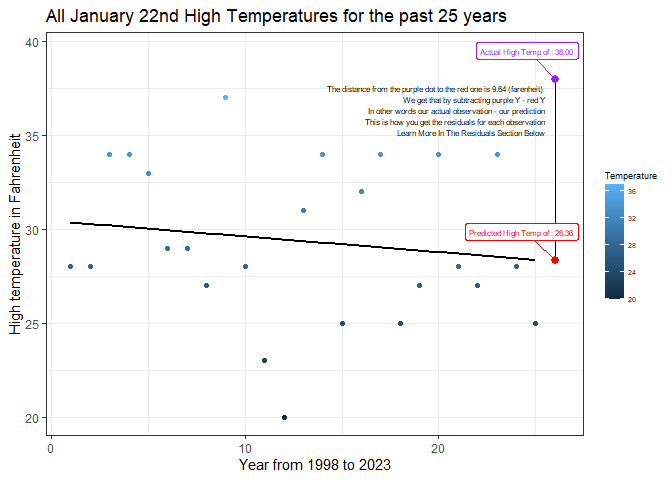
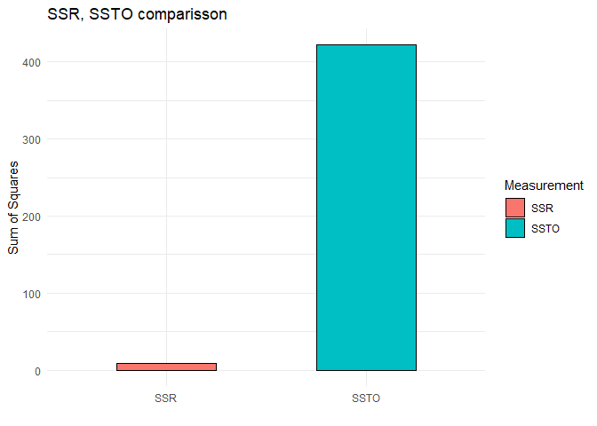
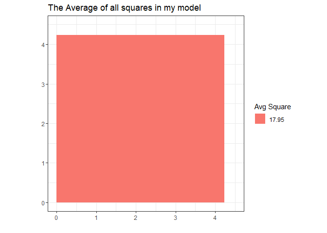

### **Introduction to Residuals and the Least Squares Method**


<br> <br>



<br> <br>

### Residuals

<br>

Let's start by accepting the fact that **residuals are important to
understand**. This is because they tell us how much our data is varying
from our linear model. This has effects on our predictions and they help
us know if our model is a good fit for the data. Measuring them serves
many purposes for example, understanding our data, double checking if
our linear model is a good fit for this data, revising if we need to
make changes. There are a few way to measure them, for example sum of
squares and looking for the least squares. We use squares to model
variability because they're helpful in giving equal importance to
"negative" and "positive" differences, as well as giving importance to
larger Errors. These are some reasons why we use squares and look to
have the least squares in our model.

The way to get one side of the squares is by calculating the residuals
with this formula.

<br>

$$r_i = \underbrace{Y_i}_\text{Jan 22nd Actual High Temps} -  \underbrace{\hat{Y}_i}_\text{Jan 22nd Predicted High Temps}$$
<br> You can calculate them by subtracting your predicted Ys from your
observed Ys and this will help you create your regression model (if you
were to make it by hand as shown in the first graph). R does this for
you automatically, however keep reading because it's crucial that you
learn how this work.

Also, isn't it interesting how your residuals will be the ones creating
your regression line? One can think is the other way around...

**but what if it's not?**

<br>

### Squares, Sum and least squares

<br> There are a few ways to measure residuals that we don't cover in
class because the sum of the least squares method serves perfectly the
same purpose. The idea is that we get a linear model that generates the
least residuals possibles. To actually know if the residuals are low or
not, we draw them as squares and kind of calculate their area and sum
them. In the end we want to get the smallest sum of squares possible,
meaning that our residuals are low and we can trust our linear model
with a little more confidence.

There are a few ways to get the sum of squares, these are **SSE, SSR,**
and **SSTO.** These three help us in getting other important values,
such as **R^2^** and **MSE**. To better know how to measure them and how
they work, take a look at each of them in the tabs below. I'll be using
my weather prediction as an example, so take my linear model and compare
it to the graphs provided in the tabs.

Consider my model's SSE, SSR and SSTO below, and remember how I took the
actual residual for this year's predicted high temperature. All the
following will be based on the same data and similar approach on their
calculations.

###  {.tabset}

<br>

#### SSE

<br>


<br> **The Sum of Square Errors (SSE)** is one way to determine how much
the data points are varying from the linear model by using squares. A
simple explanation on how we get the squares is that we draw a vertical
line up/down, beginning in each data point, and then continue draw until
it meets the regression model line.

Now, why do we call it squares? well each of those lines will be one
side of each square. Since squares have all sides equal we can create
squares by taking their sides and drawing them. Remember that this is
not just drawing lines. Try using this code to get your SSE in R `sum( (Y - mylm$fit)^2 )` which is based on this formula.

<br>

$$SSE = ∑(Yᵢ - Ŷᵢ)²$$

<br> Each one of the blue points is an observation, with a vertical line
towards the linear model. That blue line is one side of the square we
were talking about and they help us measure how good of a fit we have.
Remember that the linear model uses derivation (slope) to find the best
possible fit. Then these lines tells us how good that fit is. If our SSE is too low that'd mean that we have low variability in our data, also relating to a better fit within our model, if it's large (like in this case), then we would have too much variability meaning that our aimed fit may not be good for the given data. <br> <br>

#### SSR

<br> <br>


<br> **The Sum of Squares due to Regression (SSR)** is another way to
determine measure the (least) squares that formed the linear model, and
it actually can be a compliment to the SSE and viceversa. The way to
manually draw each square would be to take the average of the data. Then
draw it as a horizontal line that crosses through the linear model. You
will notice that some data-points are above the mean and others are
below the mean, and also that the linear model is now divided into two,
the left part and the right part (divided by the average line you drew).
<br> In this example SSR measurements were small because variability in
data points is huge. As you can see, all data points go to their
respective x coordinates, and on that same x value draw a line from the
linear model straight to the average line and stop there. These are the
lines that we see on the picture.

This is the formula to calculate the SSR. remember, we are getting this
squares to sum them and get our SSR measurement, which we want to be as close as SSTO as possible, this becuse if we get SSR as close as possible to SSTO we will then use it to calculate our R^2^ by dividing SSR over SSTO and if they're close together in magnituted then our R^2^ will be as close to 1 as it could be (Which is something that we are looking for). For R `sum( (mylm$fit - mean(Y))^2 )` : 
<br>

$$SSR = ∑(Ŷᵢ - Ȳ)²$$ 

<br><br>


#### SSTO

<br>


<br>

**The SSTO or SST stands for Sum of Squares Total**. To draw this grab
each data point and draw a vertical line straight to the average line
and that way you get to measure the squares. SSTO is also the sum of
SSE+SSR<br> Here you have the formula to calculate the sum of squares
total, and the R code to get it `sum( (Y - mean(Y))^2 )`. 

<br>

$$SSTO = ∑(Yᵢ - Ȳ)²$$ <br>

Which we can also get by summing SSR and SSTO like this

`sum( (weather$High - weatherLm$fit)^2 ) + sum( (weatherLm$fit - mean(weather$High))^2 )`

In this analysis the sum of my SSE and SSR is 421.76 as calculated by the code above.

And if we calculated it with this code of SSTO only `sum( (Y - mean(Y))^2 )` we also get 421.76

Since my SSE is 412.7877 and my SSR is 8.972308, and summed they get my SSTO, we can say that:

<br>

$$SSTO= SSE+SSR$$ 

<br> <br>

#### R^2^

<br>


```r
SSE <- sum((weather$High-weatherLm$fit)^2)
SSTO <- sum((weather$High-mean(weather$High))^2)
SSR <-SSTO-SSE
R2<-SSR/SSTO

SSR_formatted <- sprintf("%.2f", SSR)
SSTO_formatted <- sprintf("%.2f", SSTO)
R2_formatted <- sprintf("%.2f", R2)

# Create a data frame with SSR, SSTO, and R2 values
data <- data.frame(Measurement = c("SSR", "SSTO"), Value = c(SSR, SSTO))

ggplot(data, aes(x = Measurement, y = Value, fill = Measurement)) +
  geom_bar(stat = "identity", color = "black", width = 0.5) +
  labs(
    x = "",
    y = "Sum of Squares",
    title = "SSR, SSTO comparisson",
    fill = "Measurement"
  ) +
  theme_minimal()
```



In difficult words **R^2^** is The proportion of variability in Y than
can be explained by the regression. However, if we think about it, it’s
not so difficult to understand. Let’s look at it this way, variability
and proportion. Variability is how much our data varies in a data set,
and proportion (like probability) is just the chance is for our data to
variate from the linear model.

Understanding this helps us know that R squared is an important
measurement that basically works as a confidence coefficient (from 0 to
1) that let's us know how good our linear model explains why our data
varies from our predictions, 0 being not much confidence that the model
explains well the point, and 1 being perfect explanation.

The formula to know R squared is this simple one: <br>

$$R²=\frac{SSR}{SSTO}$$ <br>

For example, consider the bargraph above, it represents the SSR and SSTO
of my model. Let's think how it should look like if we want our R^2^ to
be as close to one as possible. The answer is, they both should look as
similar in height (Y being the sum of their squares) as possible, so
that when we apply the formula SSR/SSTO we get almost 1 as a
coefficient. Remember that even if your R squared is almost 1, doesn't
mean that your model will work perfectly all the time. <br> <br>

#### MSE

<br>


```r
ggplot(data = weather, aes(Year, High, col = High)) +
  geom_point() +
  geom_smooth(method = "lm", formula = y ~ x, se = FALSE, col = "black") +
  geom_rect(aes(xmin = 12.5, xmax = 6.95, ymin = 29.41, ymax = 21, fill = "= 17.95"), alpha = 0.5) +
  labs(
    x = "Year from 1998 to 2023",
    y = "High temperature in Fahrenheit",
    title = "This is how the MSE would look like in the model",
    subtitle = "This is the average of all the least squares",
    col = "Temperature",
    fill = "Avg Square"
  ) +
  theme_bw() +
  theme(
    legend.title = element_text(size = 7),
    legend.text = element_text(size = 5),
    legend.key.width = unit(.5, "cm"),
    plot.subtitle = element_text(colour = "grey50")
  )
```



**The Mean squared error (MSE)** is basically an average of all the
squares in SSE but a little different in the way that it’s divided by
degrees of freedom (2 in a simple linear model) and not the full number
of observations. MSE helps in knowing what can the error be between the
predicted value and the actual values. That's what the square above
represents, the mean of all the squares in the SSE graph for example.
It's formula is as follows, and it's also findable in the lm summary output as mean std. error (In my next section I have my lm summary output; I challenege you to find it!)

<br>

$$MSE = \frac{∑(Y_i−\hat{Y_i})^2}{n−2}$$ <br>

Ideally you want this square to be non existent, but one of your goals
when running a regression is that the average square gets as small as
possible. That means that the closer your model line is to your data
points (viceversa) the smaller the MSE will get, and the more assured
you will be that your model works fine. In this case my mean squared error would be how much I expect my temperatures to vary for any given x time used for prediction within my model. In contrast of R^2^ which is a coefficient on how much of the variability we are explaining (R^2^ being basically a probability type of number), and MSE being and actual variability number with the units of Y being measured. So, deegres in this case.

<br> <br>

:::

### Relational summary, and linear model statistical summary

<br>
Hopefully you can see how the distance from the data points to the
linear model form one side of the square, for now disregard their
rectangular form, this was to better fit them on the graph. The reason
why my squares were too big is that my data was too scattered and
probably not a good fit for a linear model. We can see this in my R^2^
values.

Take a look at my linear model summary, if you pander your linear model
summary, it'll look something like this.

<br> <br>


---------------------------------------------------------------
     &nbsp;        Estimate   Std. Error   t value   Pr(>|t|)  
----------------- ---------- ------------ --------- -----------
 **(Intercept)**    30.44       1.747       17.43    9.508e-15 

    **Year**       -0.08308     0.1175     -0.7071    0.4866   
---------------------------------------------------------------


---------------------------------------------------------------
 Observations   Residual Std. Error    $R^2$    Adjusted $R^2$ 
-------------- --------------------- --------- ----------------
      25               4.236          0.02127      -0.02128    
---------------------------------------------------------------

Table: Fitting linear model: High ~ Year

<br> <br>

-   **Pr(\>\|t\|) for Year:** These are your calculated P-values of the
    slope of your line, and your y intercept. By now you should know you
    want that to be as small as possible, at least smaller than your
    alpha so you can better trust your model.

-   **R^2^:** Remember this is a coefficient type of number. This means
    .02 R^2^ is a low coefficient due to 1 being the max. Then It's
    important to consider and understand what R^2^ means for your model
    and how to fix it.

-   **Residual Std. Error:** This is the residual standard error which
    you can get by square rooting your MSE.

<br> <br>

### How to fix a bad R^2^ / P. Value

<br>
Depending on the type of data you are working with, it might be or
might not be a good idea to go ahead and do a linear model analysis for
predictive purposes. Take in consideration what factor you are trying to
predict and based on what.

For example, I tried to predict weather by using the same date in past
years. But dates vary, and weather and temperature vary as well, so your
model should be based on trying to take out the most variability that
you can so it fits well.

If you feel that your ideas are correct and that a linear model is a
good fit, then go ahead and pick good fittable X and Y variables. X to
predict with and Y to predict for. Try to see if your sample is large
enough or try changing your scheme and find better predictive variables
to test results; try transforming your data as well (you'll learn that
very soon).

In the end you are trying to make useful things, so don't worry if it's
not perfect. it's going to be OK.

With not much else to add, I think this covers most of this week's
topics, so good luck and see you next time my friend.

<br> <br>

**Greetings**

***Tona***
