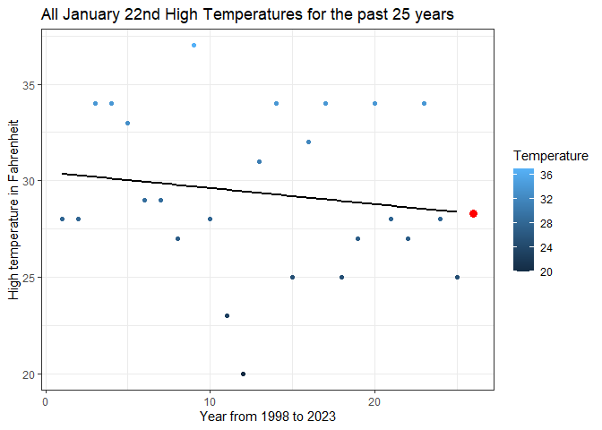
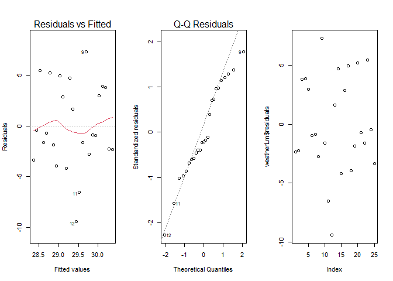

### Background

<br> 
For this simple linear model I chose to do some research on the
past 30 January 22nd's and get their high temperatures and record them
in excel. This means all these data points we have are actually january
22nd's from 1999 for example, or 2008.I used past years as my X value
for my linear model.

In other words I used past years' high temperatures on the same date
that I'm trying to predict in order to get this year's high temperature
for the same date.

This analysis will be based on a simple linear regression model
explained by:

$$
  \underbrace{\hat{Y}_i}_\text{Some Label} = \overbrace{b_0}^\text{est. y-int} + \overbrace{b_1}^\text{est. slope} \underbrace{X_i}_\text{Some Label}
$$ Where Y hat will be my prediction, b0 my Y intercept and b1 my slope.
As well as xi being the year I'm trying to predict for.

<br> <br>

##  {.tabset}

### Linear Model Graph

<br> 
The data which I worked with is visible below as a plotted graph.
Take a look at it to have a better idea on how these past high
temperatures behaved in previous years. Spoiler alert, my predicted
weather is shown as a red dot in the plot, try to guess the exact
rounded Predicted Temperature, I will reveal it at the end of the
analysis. 
<br> <br>

<!-- -->

<br> <br>

**Y hat Model Equation:** Y hat = 30.44 + -0.08 \* Year <br> **Slope:**
For each additional year, the high temperature is expected to change by
-0.08 degrees Fahrenheit.

As you can see, even though the observations are a little scattered
around the graph, we still found an interesting linear model. There's a
very small slope, indicating that through the pass of time, temperatures
in Jan 22nd have been falling a little each year. 
<br> <br>

### Data Used

<br> 
Here is the table of the high temperatures used and the years. The
years in the table being **year 1 = 1994** all the way to **year 30 =
2023.** 
<br>


```{=html}
<div class="datatables html-widget html-fill-item" id="htmlwidget-420fbf0149e9b48662cf" style="width:100%;height:auto;"></div>
<script type="application/json" data-for="htmlwidget-420fbf0149e9b48662cf">{"x":{"filter":"none","vertical":false,"data":[["1","2","3","4","5","6","7","8","9","10","11","12","13","14","15","16","17","18","19","20","21","22","23","24","25","26","27","28","29","30"],[1,2,3,4,5,6,7,8,9,10,11,12,13,14,15,16,17,18,19,20,21,22,23,24,25,26,27,28,29,30],[39,28,28,34,34,33,29,29,27,37,12,28,23,20,5,31,34,25,32,16,34,25,27,34,28,27,34,28,25,18]],"container":"<table class=\"display\">\n  <thead>\n    <tr>\n      <th> <\/th>\n      <th>Year<\/th>\n      <th>High<\/th>\n    <\/tr>\n  <\/thead>\n<\/table>","options":{"columnDefs":[{"className":"dt-right","targets":[1,2]},{"orderable":false,"targets":0},{"name":" ","targets":0},{"name":"Year","targets":1},{"name":"High","targets":2}],"order":[],"autoWidth":false,"orderClasses":false}},"evals":[],"jsHooks":[]}</script>
```

<br> <br>

## Measures of tendency

<br> Originally I had 30 years in my data points and I ended up with 25
by taking outliers. The process to do this was as follows. I took a
range based on the average temperature of the table and
Adding/Subtracting the sample standard deviation to it. The interval to
take in consideration ranged between **20 to 34 Fahrenheit** using the
**7.5 degrees standard deviation.**
<br> <br>


---------------------------------------------------------------
 min   Q1   median    Q3     max   mean     sd    n    missing 
----- ---- -------- ------- ----- ------- ------ ---- ---------
  5    25     28     33.75   39    27.47   7.45   30      0    
---------------------------------------------------------------

<br> <br>

## Linear Model Summary and fit {.tabset}

<br>

### Summary

<br> 
After doing this, I took out the outliers from my data set to
get a better fit. I got a small difference, temperature was hard to
measure even in the same day in different years. Take a look at my
linear model summary below. <br> <br>


---------------------------------------------------------------
     &nbsp;        Estimate   Std. Error   t value   Pr(>|t|)  
----------------- ---------- ------------ --------- -----------
 **(Intercept)**    30.44       1.747       17.43    9.508e-15 

    **Year**       -0.08308     0.1175     -0.7071    0.4866   
---------------------------------------------------------------


---------------------------------------------------------------
 Observations   Residual Std. Error    $R^2$    Adjusted $R^2$ 
-------------- --------------------- --------- ----------------
      25               4.236          0.02127      -0.02128    
---------------------------------------------------------------

Table: Fitting linear model: High ~ Year

<br> <br>

### Diagnostic Plots

<br> <br>


```r
par(mfrow=c(1,3))
plot(weatherLm,which=1:2)
plot(weatherLm$residuals)
```

<!-- -->

<br> <br>

In my opinion, diagnostic plots look good, the problem is probably in
the normality plot. There might be troubles in normality making the
model not a good fit for it's purpose.

<br> <br>

## Prediction

<br> 
Now to use this linear model with a predictive purpose I set the
**prediction to year "26"** which in the terms of this table would
**mean year 2024** because it's the next in line due to year "25" being
2023.

After running the prediction we get the so awaited prediction for High
Temperature in Monday Jan/22/2024 as a range. 
<br> <br>


-----------------------------------------------
 PredictedWeather   stdev   Interval_Predicted 
------------------ ------- --------------------
      28.28         7.45          20.55        

      28.28         7.45          35.45        
-----------------------------------------------

Table: Prediction for Monday 22nd in Farenheit

<br> <br>

## Conclusion

<br> After all the analysis we can conclude that a **High temperature
between 21 and 36 (Rounded) is expected.** This analysis is for scholar
purposes only and only works on January 22nd's, a more advanced model
would require live data Queries to make it work for any day.
Disregarding all this, let's wait for Monday to see if it worked :)

<br> <br>
